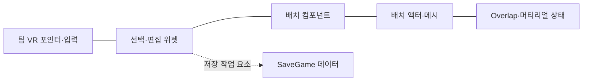
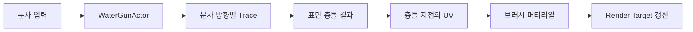

# 청소부들 VR | 오브젝트 선택·배치 상세 설명

[프로젝트 개요](README.md) · [시연 영상](https://youtu.be/SgpD5AwSxGM) · [전체 프로젝트 목록](../../README.md)

**VR에서 선택한 오브젝트를 공간에 배치하고 편집할 수 있도록, 선택 UI와 월드 액터의 상태를 연결한 작업**입니다. 본인 담당인 배치 기능을 먼저 설명하고, 함께 동작하는 VR 공통 조작과 차량 세척은 팀 구현으로 구분했습니다.

*녹색 차량 미리보기와 설치·삭제·취소·회전 조작, 하단 오브젝트 선택 UI가 보이는 기존 시연 화면입니다. 배경 환경과 세척 등 전체 프로젝트는 팀 결과입니다.*

## 목차

- [1. 담당 범위와 구성](#scope)
- [2. 차량·가구 선택 UI](#selection)
- [3. 선택한 오브젝트의 위치 지정·배치](#placement)
- [4. 회전·삭제·충돌 상태·머티리얼](#editing)
- [5. 저장 기능의 작업 범위](#save)
- [6. 팀 VR 조작 기반과 연동](#vr)
- [7. 팀 세척 시스템](#washing)
- [8. 변경 이력으로 보는 보완 과정](#iteration)
- [9. 원본 파일과 확인 범위](#evidence)

## 1. 담당 범위와 구성

Unreal Engine 5.2 기반 VR 팀 프로젝트입니다. 본인 역할은 기존 포트폴리오의 `오브젝트 배치 담당` 기록과 본인 Git 변경 이력을 함께 기준으로 삼았습니다.

| 구성 | 역할 | 기여 구분 |
|---|---|---|
| `WB_BuildSystemWidget` | 오브젝트 선택, 설치·삭제·회전·저장 UI | 본인 작업 중심, 팀 통합 수정 포함 |
| `ACBP_BuildingSystem` | 선택 메시·생성 액터·배치 상태와 위치·회전 처리 | 본인 배치 Blueprint |
| `BP_Car` 및 관련 배치 액터 | 메시 교체, Overlap 이벤트, 머티리얼 처리 | 본인 배치 작업 |
| `BP_Save` | 배치 정보 저장을 위한 SaveGame 데이터 | 본인 작업, 저장·복원 전체 검증과는 구분 |
| VR 캐릭터 Blueprint 연동 | 배치 UI·컴포넌트와 팀 캐릭터 연결 | 본인 연동 수정 + 팀 공통 기반 |
| VR 캐릭터·포인터·이동·잡기 C++ | VR 입력과 상호작용 기반 | 팀 구현 |
| 분사·Render Target, 전체 진행 UI | 세척과 작업 진행 표현 | 팀 구현 |

책임과 참조 관계를 요약한 도식입니다. 실제 Blueprint 실행 노드 순서를 옮긴 것은 아닙니다.

## 2. 차량·가구 선택 UI

### 작업 공간에 놓을 대상 선택

세척 대상인 차량과 주변 가구를 같은 배치 UI에서 선택하도록 구성했습니다. 위젯에는 다음 선택 항목과 메시·아이콘 참조가 있습니다.

| 선택 대상 | 위젯의 식별 요소 | 용도 |
|---|---|---|
| 차량 2종 | `Button_car1select`, `Button_car2Select` | 작업 대상 차량 선택 |
| 의자 2종 | `Button_Chair`, `Button_shortChair` | 주변 가구 선택 |
| 테이블 | `Button_Table` | 작업 공간의 가구 구성 |
| 파라솔 | `Button_Umbrella` | 작업 공간의 구조물 구성 |

위젯의 메시 변경·생성 참조와 배치 컴포넌트의 `meshchange`, `meshclass`, `NewMesh`를 확인했습니다. **선택 항목을 제공하는 UI와 월드에 배치할 메시를 다루는 컴포넌트**가 있으며, 양쪽에서 선택 메시와 생성 액터의 관련 변수·참조를 확인했습니다.

### 선택과 편집 상태를 구분하는 UI

위젯에는 `구조물`, `선택`, `설치`, `회전`, `삭제`, `저장`, `취소` 표기와 편집 버튼이 있습니다. `WidgetSwitcher`, `SetActiveWidgetIndex`, 버튼 표시·숨김 함수, `isbuilded` 상태도 함께 사용합니다.

선택과 편집을 다루는 UI 구성으로, 버튼 표시·숨김 함수와 WidgetSwitcher, 배치 상태 변수를 확인했습니다. 다만 상태별 실제 화면 전환·버튼 표시 조건은 전체 그래프 실행 검증 범위에 포함하지 않았습니다.

## 3. 선택한 오브젝트의 위치 지정·배치

### UI에서 고른 메시를 월드 액터로 관리

배치 작업은 `ACBP_BuildingSystem`을 중심으로 구성했습니다. 자산 정보에서 다음 역할별 요소를 확인할 수 있습니다.

| 역할 | 확인된 요소 |
|---|---|
| 선택한 메시 보관·교체 | `meshclass`, `NewMesh`, `MeshChange`, `SetStaticMesh` |
| 배치 대상 생성·참조 | `spawnMesh`, `Spawnedmesh`, Actor Spawn 참조 |
| 배치 위치 판정 | `LineTraceSingle`, `HitResult`, 위치·충돌 결과 |
| 위치 변경 | `K2_SetActorLocation` |
| 배치 상태 관리 | `isbuilding`, `ishit?`, `build` |

선택, 위치 지정, 설치는 서로 다른 책임입니다. 위젯이 입력 항목을 제공하고 배치 컴포넌트가 선택 메시·현재 액터·배치 상태를 다루며, 배치 액터가 화면에 보일 메시를 담당합니다. 본인 Git 이력에서도 이 컴포넌트와 위젯, 배치 액터가 함께 수정되었습니다.

### Trace 기반 공간 배치

시연에서 확인되는 선택·배치 흐름에 더해, 배치 Blueprint에는 `LineTraceSingle`의 충돌 결과와 액터 위치 변경 호출이 함께 남아 있습니다. 두 요소 사이의 정확한 데이터 연결은 전체 그래프 검증 대상입니다.

단, Trace의 최종 시작점·거리, 표면 정렬 방식, 그리드 스냅 간격까지 확인한 것은 아닙니다. 따라서 **좌표 스냅·표면 자동 정렬을 구현했다는 성과로 확대하지 않습니다.**

### C++ 초안과 Blueprint 구현 구분

원본에는 `BuildingSystem.cpp`도 있지만, 위치 미리보기·확정 배치 관련 구현은 주석 처리되어 있습니다. 현재 문서에서 설명하는 본인 배치 작업의 근거는 **활성 C++ 배치 클래스가 아니라 Blueprint 자산과 변경 이력**입니다.

## 4. 회전·삭제·충돌 상태·머티리얼

### 배치 방향 조정

위젯에는 상·하·좌·우 회전 버튼과 클릭 이벤트가 있고, 배치 컴포넌트에는 대응하는 회전 함수, 현재 회전 읽기, Rotator 구성, 액터 회전 설정 요소가 있습니다.

- UI: `btn_rotateUp`, `btn_rotateDown`, `btn_rotateLeft`, `btn_rotateRight`
- 배치: `rotateUp`, `rotateDown`, `rotateleft`, `rotateright`
- 회전 처리: `K2_GetActorRotation`, `MakeRotator`, `K2_SetActorRotation`

단순히 위치만 지정하는 데서 나아가 선택 대상의 방향을 조정하는 작업입니다. 2023년 9월 13일 본인 회전 작업 이력과도 연결됩니다. 정확한 회전 간격·축별 제한은 재현 검증 없이 수치로 적지 않았습니다.

### 삭제·취소와 편집 상태

위젯의 `Btn_delete`, 삭제·취소 표기와 `K2_DestroyActor` 참조, 배치 컴포넌트의 생성 액터 참조를 확인했습니다. 선택·배치뿐 아니라 필요 없는 배치 대상을 제거하는 편집 구성이 포함됩니다.

여기서 삭제·취소는 UI와 액터 처리 요소를 설명하는 것이며, 여러 단계의 실행 취소·다시 실행 이력 시스템을 뜻하지 않습니다.

### 겹침 상태와 메시 표현

`BP_Car`에는 `OnComponentBeginOverlap`, `OnComponentEndOverlap`, `isoverlap`, `MeshOverlap`이 있고, 배치 컴포넌트와 위젯에도 겹침 상태 참조가 있습니다. 또한 `SetStaticMesh`, `GetMaterial`, `SetMaterial`과 배치용 머티리얼 참조를 확인했습니다.

**배치 액터에서 발생한 겹침 상태와, UI·배치 기능에서 관리하는 상태를 함께 다루는 구조**입니다. 9월 21일 충돌·메시 이동, 9월 22일 머티리얼 변경 이력도 남아 있습니다.

다만 자산 이름·함수 참조만으로 모든 충돌에서 설치가 차단된다거나 특정 색이 항상 설치 가능·불가능을 뜻한다고 단정하지 않습니다. 메시별 충돌 설정과 최종 분기 검증이 추가로 필요한 부분입니다.

## 5. 저장 기능의 작업 범위

배치 결과를 저장하기 위한 데이터와 UI 작업도 존재합니다.

- `BP_Save`: 엔진 `SaveGame` 기반 데이터, `SavePositions`, `Rotation`, `SaveAll` 요소.
- `WB_BuildSystemWidget`: 저장 버튼, `CreateSaveGameObject`, `SaveGameToSlot` 참조.
- Git 이력: 9월 12–13일 저장 관련 작업 확인.

여기까지는 **배치 정보와 슬롯 저장을 다루는 작업 근거**입니다. 저장된 오브젝트 종류·위치·회전을 재실행 후 모두 복원하는지, 저장 실패·버전 변경을 처리하는지는 확인하지 못했습니다. 따라서 완성된 영속 월드·자동 저장 시스템으로 소개하지 않습니다.

## 6. 팀 VR 조작 기반과 연동

배치 UI는 팀의 VR 입력·캐릭터 기반 위에서 사용합니다. 프로젝트는 OpenXR을 활성화하고 Enhanced Input, Motion Controller, UMG 관련 구성을 사용합니다.

### VR 포인터와 위젯 입력

팀 C++에는 오른손·왼손 포인터 컴포넌트가 있습니다. 컨트롤러 입력의 시작·해제 시 손에 부착된 `UWidgetInteractionComponent`에 `LeftMouseButton`의 Press·Release를 전달합니다. 위젯의 히트 테스트는 엔진 컴포넌트에 맡기는 구조입니다.

본인 작업은 이 기반과 배치 위젯·컴포넌트를 연결하는 범위입니다. 포인터 C++ 자체나 별도의 자체 UI 레이캐스트 알고리즘을 본인 제작 기술로 적지 않습니다.

### 이동·잡기·손 표현

캐릭터가 Enhanced Input을 이동·잡기·손 애니메이션·포인터 컴포넌트로 분배하는 구성입니다.

- **이동:** 컨트롤러 방향 기준 연속 이동과 Yaw 회전. 텔레포트 실험 코드는 남아 있지만 해당 C++ 입력 바인딩은 주석 상태입니다.
- **노즐 조작:** 왼손 주변 Overlap으로 노즐을 찾아 손의 `GrabPoint`에 부착하고, 물총 가까이에서 총의 `Muzzle` 소켓으로 연결합니다. 범용 물체 잡기·던지기와는 구분합니다.
- **분사 방향 제스처:** 노즐을 잡은 손의 회전 변화를 감지해 노즐 회전과 가로·세로 분사 상태를 전환하는 코드가 있습니다.
- **손 표현:** 컨트롤러의 아날로그 입력값을 손 AnimInstance의 포즈 알파로 전달합니다. 최종 포즈 블렌딩은 AnimBlueprint 설정 영역입니다.

플레이어가 공간을 이동하고 도구를 조작하는 팀 기능이며, 오브젝트를 UI로 선택해 배치하는 본인 작업과 구분합니다.

공통 메뉴의 C++ `MenuWidget`은 버튼 이벤트를 Blueprint에서 확장할 수 있도록 제공합니다. 네이티브 기본 구현만으로 배치 화면 열기나 게임 시작 전체 흐름이 완성된 것으로 해석하지 않았습니다.

## 7. 팀 세척 시스템

차량 세척은 팀 구현입니다. 본인 배치 기능이 사용되는 프로젝트의 전체 맥락을 보여주기 위해, 활성 C++ 호출 흐름을 요약했습니다.

위 흐름은 팀 C++의 분사·세척 호출을 요약한 것입니다. 현재 소스를 VR 기기에서 실행해 재검증했다는 의미는 아닙니다.

### 분사 폭·방향 조절

`ShootComponent`에서 분사 입력을 받고 총 보유 상태를 확인해 `WaterGunActor::Shoot`를 호출합니다. 총에서는 노즐 위치·방향을 기준으로 `WideShot`이 여러 방향을 순회하고, `ShootWater`가 표면을 판정합니다.

`ChangeAngle`은 분사 각도를 단계적으로 변경하며, `shotRot`은 가로·세로 방향 상태를 전환합니다. 최종 Blueprint 설정값이나 물리적인 유체 시뮬레이션 성능을 주장하는 기능은 아닙니다.

### 충돌 위치를 텍스처 좌표로 변환

`ShootWater`는 월드 Line Trace 후 맞은 컴포넌트에 정밀 Trace를 수행합니다. 대상 액터의 `RenderTargetProcess`를 찾으면 `DrawCar`에 충돌 결과와 노즐 위치를 전달합니다.

`DrawCar`는 `FindCollisionUV`로 표면의 UV 좌표를 구하고, 브러시 머티리얼의 `DrawLocation`에 반영한 뒤 `DrawMaterialToRenderTarget`으로 두 Render Target을 갱신합니다. **월드에서 맞은 위치를 표면 텍스처 좌표와 연결하는 세척 경로**입니다.

브러시 크기·불투명도 조절 함수와 충돌 지점의 효과 처리도 있습니다. 일부 효과 액터는 미리 생성해 순환 참조하지만 다른 효과 생성 경로도 있으므로, 전체 이펙트 풀링이나 성능 향상 수치로 확대하지 않습니다.

### 구현 범위 구분

- `VertexPaintableComponent.cpp`의 버텍스 페인팅 코드는 주석 처리되어 있습니다. 활성 세척 경로와 혼동하지 않습니다.
- 체크리스트·완료 시간은 기존 팀 시연에서 확인되는 기능입니다. 진행률 산식이나 전체 완료 판정을 본인 구현으로 적지 않습니다.
- 세척 완성도·FPS·기기별 사용성에 대한 정량 결과는 이번 분석에서 측정하지 않았습니다.

## 8. 변경 이력으로 보는 보완 과정

| 본인 작업 이력 | 확인되는 보완 내용 |
|---|---|
| 2023.09.07–12 | 배치 위젯·배치 컴포넌트·관련 액터 작업 |
| 09.12–13 | SaveGame 관련 작업, 회전 기능 수정 |
| 09.14–18 | 머티리얼·위젯 수정, 버그 수정 기록 |
| 09.21–22 | 충돌·메시 이동, 머티리얼 변경 |
| 09.25 | 배치 메시 추가 |
| 10.04 | 위젯·배치 자산 후속 수정 |

이력에서 확인되는 강점은 **선택·배치의 초기 구현 이후에도 회전, 충돌, 메시 이동, 머티리얼, 선택 항목을 반복 보완한 점**입니다. 팀 캐릭터와 위젯 통합 수정도 포함되어 있어, 배치 기능을 팀 프로젝트에 연결한 과정으로 설명할 수 있습니다.

커밋 메시지만으로 오류의 정확한 재현 조건이나 수정 전후 효과를 모두 알 수는 없습니다. 별도 재현 자료가 없는 문제는 특정 버그 해결 사례나 성능 개선 수치로 꾸미지 않았습니다.

## 9. 원본 파일과 확인 범위

아래는 분석한 원본의 상대 경로입니다. 이 문서 저장소에 원본 코드나 에셋 파일을 포함한 것은 아닙니다.

| 원본 경로 | 확인 내용 |
|---|---|
| `PowerWash.uproject` | 엔진 버전·OpenXR 설정 |
| `Content/Dev/JJH/WB_BuildSystemWidget.uasset` | 선택·편집 버튼, 배치·저장 참조 |
| `Content/Dev/JJH/ACBP_BuildingSystem.uasset` | 배치 상태, 생성·Trace·위치·회전 요소 |
| `Content/Dev/JJH/BP_Car.uasset` 및 관련 액터 | 메시·Overlap·머티리얼 요소 |
| `Content/Dev/JJH/BP_Save.uasset` | SaveGame 기반 배치 정보 |
| `Source/PowerWash/Private/BuildingSystem.cpp` | 배치 C++ 초안의 주석 처리 상태 |
| `Source/PowerWash/Private/VRCharacter.cpp` 및 조작 컴포넌트 | 팀 VR 입력·캐릭터 구성 |
| `Source/PowerWash/Private/WidgetPointerComponent.cpp` 및 왼손 포인터 | 팀 위젯 입력 기반 |
| `Source/PowerWash/Private/WaterGunActor.cpp` | 분사 방향·충돌·세척 컴포넌트 호출 |
| `Source/PowerWash/Private/RenderTargetProcess.cpp` | UV·브러시·Render Target 처리 |

**확인 방법:** 기존 시연·기여 기록, C++ 정적 분석, Blueprint에 저장된 함수·변수·자산 참조, 본인 Git 변경 이력을 교차 확인했습니다. Blueprint 문자열·참조는 전체 실행 그래프나 기능 성공의 증명과 구분했습니다.

**검증 범위:** 현재 원본에는 미해결 병합 상태인 VR 캐릭터 자산이 있어 원본을 수정하지 않았습니다. 에디터 실행·재빌드·실기기 테스트는 수행하지 않았으며, 현재 작업 폴더를 시연 당시의 검증된 최종 빌드와 동일하다고 보지 않습니다.

[전체 프로젝트 목록으로 돌아가기](../../README.md)
