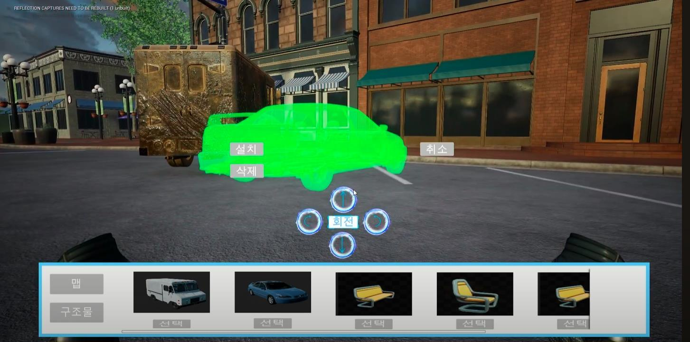

# 청소부들 VR | 오브젝트 선택·배치

> VR 공간에서 차량과 가구를 선택하고, 위치·방향을 조정해 작업 공간을 구성하는 배치 시스템

[프로젝트 상세 설명](DETAILS.md) · [시연 영상](https://youtu.be/SgpD5AwSxGM) · [전체 프로젝트 목록](../../README.md)

*오브젝트 배치는 본인 담당이며, VR 공통 조작·차량 세척·전체 진행 UI는 팀 결과입니다.*

## 프로젝트 정보

| 항목 | 내용 |
|---|---|
| 장르·형태 | 작업 공간 구성과 차량 세척을 결합한 VR 팀 프로토타입 |
| 엔진 | Unreal Engine 5.2 · 프로젝트 설정상 OpenXR 사용 |
| 본인 역할 | 오브젝트 선택 UI·배치 Blueprint, 회전·머티리얼·충돌 관련 보완, 팀 VR 캐릭터 연동 수정 |
| 본인 작업 이력 | 2023.09.06–10.04 · Git 기록 기준이며 전체 프로젝트 공식 기간과는 구분 |
| 본인 작업 기술 | Blueprint, UMG, ActorComponent, Line Trace, Overlap, Static Mesh·Material, Git |
| 팀 공통 기술 | C++, Enhanced Input, Motion Controller, Widget Interaction, Render Target |

## 핵심 작업

- **선택 UI:** 차량 2종, 의자 2종, 테이블, 파라솔을 고르는 위젯 구성.
- **배치:** 선택 메시와 생성 액터를 관리하고 Trace·위치 변경 요소로 공간 배치를 구성.
- **편집:** 상·하·좌·우 회전, 설치·삭제·취소 UI와 배치 상태 관리.
- **상태 표현:** Overlap 상태와 메시·머티리얼 변경을 다루는 배치 액터 구성.
- **반복 개선:** 위젯 수정 → 충돌·메시 이동 보완 → 머티리얼 변경 → 배치 메시 추가 이력.

저장 버튼과 SaveGame 데이터·저장 호출도 작업했습니다. 다만 실행 후 다시 불러오는 전체 동작은 이번 분석에서 검증하지 않아, 완료 기능과 분리해 [상세 설명](DETAILS.md#save)에 정리했습니다.

## 상세 페이지에서 다루는 내용

1. 본인 배치 Blueprint와 팀 VR 기반의 역할 구분
2. 차량·가구 선택 UI와 배치 상태
3. 위치 지정, 회전·삭제, 충돌·머티리얼 구성
4. 저장 기능의 확인 범위
5. 팀 VR 포인터·이동·잡기와 세척 파이프라인
6. Git 변경 이력과 원본 파일별 근거

이 문서는 기존 시연·기여 기록에 원본 C++와 Blueprint 자산 정보, Git 변경 이력을 더해 작성했습니다. Blueprint의 모든 실행 연결을 복원하거나 VR 기기에서 재검증한 결과는 아닙니다. 원본 코드·에셋은 배포하지 않습니다.
