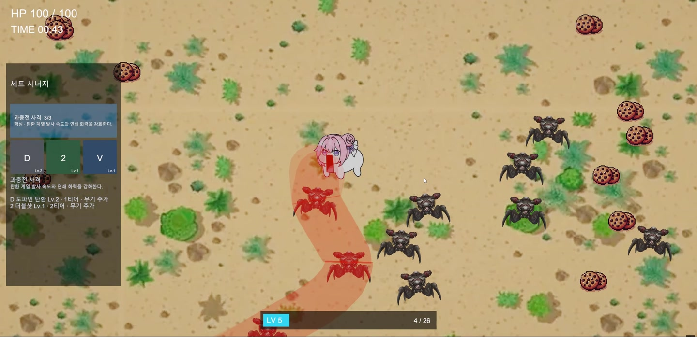
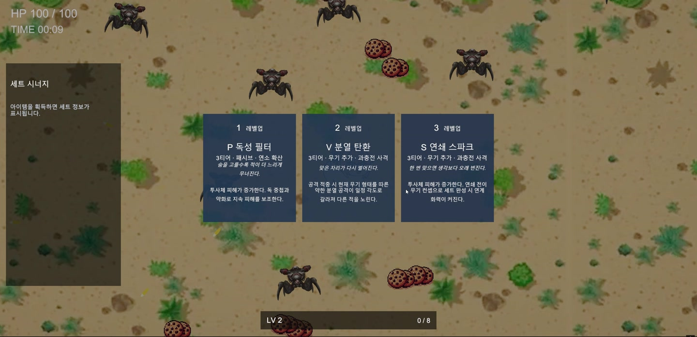
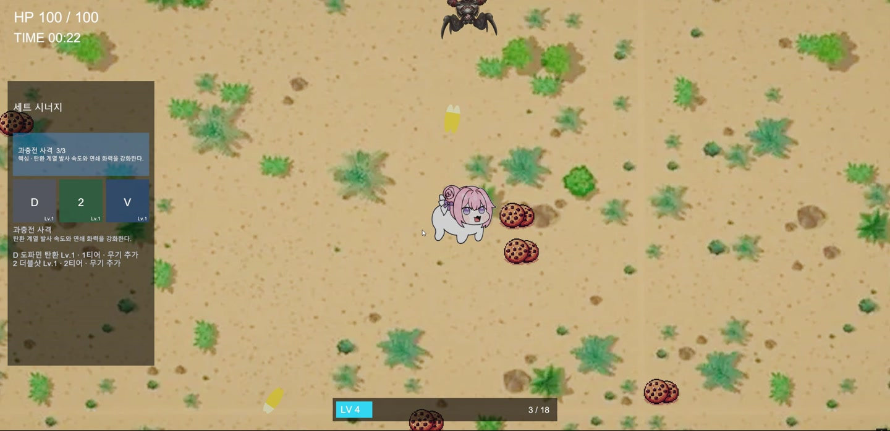
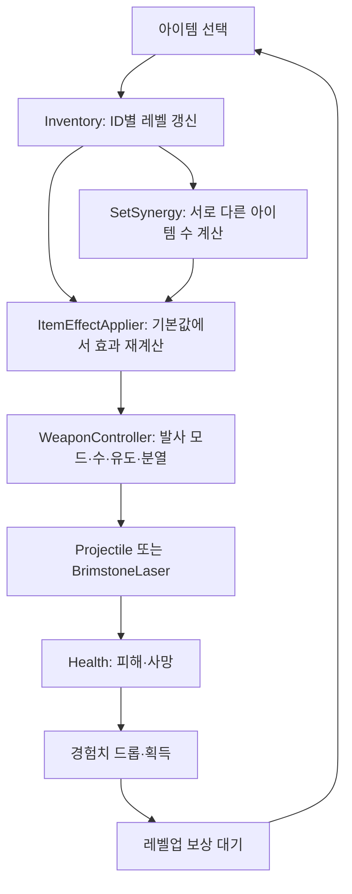

# Dopamin Survivor | 프로젝트 상세 설명

> 자동 전투의 성장 재미와, 아이템 조합으로 공격 방식이 바뀌는 재미를 연결한 Unity 2D 생존 슈터

[프로젝트 요약](README.md) · [전체 프로젝트](../../README.md)

## 목차

1. [플레이 방향과 실행 화면](#1-플레이-방향과-실행-화면)
2. [자동 전투와 성장 루프](#2-자동-전투와-성장-루프)
3. [혈사포와 아이템 조합](#3-혈사포와-아이템-조합)
4. [곡선 혈사포의 경로와 피해 판정](#4-곡선-혈사포의-경로와-피해-판정)
5. [분열 공격과 효과 전달](#5-분열-공격과-효과-전달)
6. [아이템·세트·보상 데이터](#6-아이템세트보상-데이터)
7. [컴포넌트 구성과 상태 갱신](#7-컴포넌트-구성과-상태-갱신)
8. [소스 안내](#9-소스-안내)

## 1. 플레이 방향과 실행 화면

뱀파이어 서바이벌류의 **이동·자동 공격 → 적 처치 → 경험치 획득 → 보상 선택 → 빌드 강화** 구조를 기반으로 합니다. 여기에 The Binding of Isaac의 혈사포와 아이템 시너지에서 착안한 공격 변형을 더했습니다.

이 프로젝트의 중심은 무기 개수 자체보다 **같은 공격이 조합에 따라 어떻게 달라지는가**입니다. 혈사포를 획득하면 주 공격이 레이저로 바뀌고, 다중 발사·유도·분열 아이템이 그 레이저의 동작을 바꿉니다.

## 2. 자동 전투와 성장 루프

### 이동·자동 조준·자동 발사

플레이어가 이동하는 동안 `AutoTargeting`이 같은 씬의 유효한 적 중 가장 가까운 대상을 고릅니다. 사망했거나 비활성화된 대상은 제외하며, 태그·레이어 조건을 적용합니다. 화면 안의 적만 고르는 별도 제한으로 설명하지는 않습니다.

`WeaponController`는 공격 간격을 채운 뒤 유효한 목표가 있을 때 발사합니다. 목표가 없을 때도 준비 상태를 유지하므로, 적이 생기면 준비된 공격을 사용할 수 있습니다. 혈사포 역시 이 자동 발사 흐름에 연결되어, 차징 시간을 가지며 발사됩니다.

### 처치·경험치·연속 레벨업

적 사망 시 경험치 획득 오브젝트를 만들고, 획득량을 플레이어 경험치에 반영합니다. 한 번에 여러 레벨을 올릴 만큼 경험치를 얻으면 반복 계산으로 처리하고, 보상 횟수를 별도로 쌓습니다.

보상 화면에서는 게임 시간을 멈추고 아이템을 선택합니다. 선택 후 대기 중인 보상이 있으면 이어서 제시하고, 모두 처리하면 이전 시간 배율로 복귀합니다. 버튼과 숫자키 선택 경로가 있습니다.

### 생존 상태와 보스 보상

`Health`와 접촉 피해, 플레이어 사망 시 게임오버 전환을 분리했습니다. `GameManager`에는 게임오버 후 현재 씬 재시작과 종료 입력이 있습니다.

보스 생성과 사망 시 보상 상자를 만드는 코드도 있습니다. 보스 상자는 일반 레벨업과 다른 티어 가중치를 사용합니다.

## 3. 혈사포와 아이템 조합

혈사포는 일반 탄환에 더해 독립적으로 발사되는 보조 무기가 아니라, **주 공격을 레이저 모드로 전환하는 아이템**입니다. 공격 수와 유도·분열 설정을 같은 무기 컨트롤러에서 계산하므로 기존 공격 변형을 레이저에도 전달할 수 있습니다.

### 조합별 변화

아래 표는 테스트용 강제 토글이 아닌 **실제 아이템 보유 상태를 기준으로 한 코드 동작**입니다.

| 조합 | 공격 변화 | 함께 알아야 할 규칙 |
|---|---|---|
| 혈사포 | 주 공격이 지속 피해 레이저로 전환 | 기본 공격과 별도의 레이저 간격 설정 사용 |
| 혈사포 + 더블샷 | 같은 방향의 평행 레이저 2줄 | 서로 다른 과충전 아이템 2종이므로 세트 유도도 활성화 |
| 혈사포 + 트리플샷 | 부채꼴 레이저 3줄 | 세트 유도도 활성화 |
| 혈사포 + 쿼드샷 | 부채꼴 레이저 4줄 | 세트 유도도 활성화 |
| 혈사포 + 유도 칩 | 부모 혈사포에 범용 유도 적용 | 분열을 추가하면 자식 레이저에도 유도 전달 |
| 혈사포 + 분열 탄환 | 명중 지점에서 작은 자식 레이저 발사 | 부모는 2종 세트 유도 적용, 자식은 세트 유도를 자동 상속하지 않음 |
| 혈사포 + 분열 탄환 + 유도 칩 | 부모·자식 레이저 모두 유도 | 자식은 다시 분열하지 않음 |
| 혈사포 + 다중 발사 + 분열 탄환 | 여러 부모 레이저가 각각 명중 후 분열 가능 | 각 부모당 분열 1회로 제한 |

### 다중 발사는 더하는 대신 우선순위를 적용

더블·트리플·쿼드샷을 함께 획득해도 발사 수를 합산하거나 곱하지 않습니다. **쿼드샷 → 트리플샷 → 더블샷 → 기본 1발** 순으로 가장 높은 설정을 선택합니다.

- 더블샷: 발사 시작점을 진행 방향의 좌우로 벌리고 방향은 동일하게 유지합니다.
- 트리플·쿼드샷: 발사 방향을 부채꼴로 분산합니다.
- 이 배치 규칙을 일반 투사체와 혈사포가 함께 사용합니다.

### ‘유도’도 획득 경로에 따라 다르게 처리

과충전 사격 세트의 예열 효과와 유도 칩은 부모 혈사포에서 비슷하게 보일 수 있지만, 분열까지 연결하면 차이가 납니다. **세트 유도는 부모에만, 유도 칩은 자식에도** 전달하도록 설정을 분리했습니다. 따라서 이미 유도되는 혈사포를 가진 상태에서도 유도 칩을 얻을 이유가 생깁니다.

혈사포 간격에는 기본값 2배의 추가 배율이 있습니다. 이는 계산된 혈사포 자체 간격을 늘리는 설정이며, 일반 탄환 대비 공격속도가 정확히 절반이라고 단정하는 수치는 아닙니다. 직렬화된 값은 씬·인스펙터 설정에 따라 달라질 수 있습니다.

## 4. 곡선 혈사포의 경로와 피해 판정

### 경로에 포함할 적 선택

레이저 생성 시 최초 목표를 시작점으로 유도 대상 목록을 정합니다. 다음 후보는 남은 거리, 탐색 반경, 진행 방향 등의 조건으로 거릅니다. 후보로 향하는 구간에서 맞힐 수 있는 적의 수를 우선 평가하고, 같은 조건에서는 가까운 대상을 선호합니다.

목록을 매 프레임 새로 탐색하는 방식은 아닙니다. **생성 시 선택한 목록을 유지하면서, 살아 있는 대상의 현재 위치를 경로에 반영**합니다. 따라서 일반 탄환의 주기적인 재탐색 유도와 구분됩니다.

### 직선을 곡선으로 연결

발사 원점과 선택한 적의 위치를 기준점으로 만들고, 구간별 접선과 제어점을 사용한 3차 베지어 곡선을 샘플링합니다. 마지막 끝점은 원래 발사 방향의 직선 끝점을 유지합니다.

이 점 목록을 `LineRenderer`에 전달해 적을 따라 휘는 레이저를 표현합니다. 굵기 변화와 사라지는 연출, 발사 시 화면 흔들림을 더해 일반 탄환과 다른 발사감을 구성했습니다.

### 표시 경로와 피해 경로 연결

피해 판정도 동일한 경로 점들을 선분으로 사용합니다. 적의 중심 위치와 각 선분 사이의 거리가 판정 폭 안에 들어오면 `초당 피해 × 프레임 경과 시간`을 적용합니다. 한 대상이 여러 선분에 걸쳐 있어도 같은 갱신에서 중복 적용하지 않습니다.

화면에 휘어 보이는 선과 별개로 직선 판정을 두지 않고 **공유된 경로 데이터**를 기준으로 삼은 구조입니다. 다만 렌더링 폭에는 맥동·페이드가 들어가고 판정은 대상 중심을 사용하므로, 픽셀 단위로 정확히 일치하는 충돌이나 콜라이더 전체 윤곽 판정으로 표현하지 않습니다.

## 5. 분열 공격과 효과 전달

### 공격 종류를 유지하는 분열

일반 탄환은 작은 탄환으로, 혈사포는 작은 레이저로 분열합니다. 혈사포의 자식은 명중 대상 근처의 경로 지점에서 해당 구간의 진행 방향을 기준으로 갈라집니다. 기본 설정은 자식 2개이며, 크기·길이·피해 관련 설정을 따로 전달합니다.

레이저 분열은 부모가 처음 처리한 유효 명중에서 발생합니다. 이는 코드의 대상 순회에서 먼저 처리한 적이며, 발사 지점에서 물리적으로 가장 가까운 적이라고 보장하지는 않습니다.

### 무한 분열과 즉시 재명중 방지

- 부모 레이저는 분열 발생 여부를 기록해 한 번만 자식을 만듭니다.
- 자식 레이저의 분열 기능을 끕니다.
- 분열을 일으킨 원래 적을 자식의 제외 대상으로 전달합니다.
- 일반 탄환에도 세대와 재분열 제한을 적용합니다.
- 자식 유도 여부는 부모의 최종 유도 결과를 그대로 복사하지 않고, 유도 칩 보유 설정으로 결정합니다.

이 제한들은 다중 발사·분열·유도를 동시에 사용했을 때 효과가 끝없이 확장되거나, 생성 즉시 같은 적에 다시 맞는 상황을 제어합니다. 피해 배율은 일반 탄환 피해와 레이저 초당 피해의 기준이 다르므로, 자식 피해를 단순히 ‘부모의 45%’라고 설명하지 않습니다.

## 6. 아이템·세트·보상 데이터

### 24개 아이템 정의와 6개 세트

`JIN_ItemCatalog`에는 24개 아이템 정의와 6개 세트가 있습니다. 현재 구조는 **C# 정적 카탈로그**이며, ScriptableObject나 데이터베이스 기반 구현으로 소개하지 않습니다.

아이템은 ID·티어·최대 레벨·세트 ID·효과 종류·능력치·설명·아이콘 문자를 가지고 있습니다. 인벤토리는 ID별 레벨을 관리하고 최대 레벨을 넘는 획득을 제한합니다.

| 세트 | 현재 효과 적용 코드에서 확인한 보너스 |
|---|---|
| 과충전 사격 | 공격속도·피해 증가, 혈사포 사용 시 예열 단계부터 부모 레이저 유도 |
| 생존 반격 | 최대 체력·피해 증가 |
| 질주 절단 | 이동속도·투사체 속도 증가 |
| 탐욕 증폭 | 경험치 배율·공격속도 증가 |
| 연소 확산 | 피해 증가 |
| 안정 제어 | 피해·최대 체력 증가 |

**24개 정의가 모두 고유한 공격 메커니즘 24종의 완성을 뜻하지는 않습니다.** 카드와 기획서에 등장하는 화염 장판·독·드론·방패 등의 표현은 실제 특수 효과 구현과 구분해야 합니다. 이 문서에서 상세 조합으로 설명한 것은 혈사포·다중 발사·유도·분열이며, 나머지는 확인된 능력치 적용 범위로 제한했습니다.

### 중복 강화와 세트 완성의 차이

같은 아이템을 다시 얻으면 해당 아이템 레벨이 오르지만, 세트의 아이템 종류 수는 늘어나지 않습니다. 서로 다른 아이템 2종은 예열, 3종은 핵심, 4종 이상은 과충전 단계로 처리합니다.

화면의 `3/3`은 이 장면에서 핵심 단계에 도달한 표시입니다. 전체 시스템에 4종 이상 과충전 단계가 없다는 의미는 아닙니다.

### 보상 후보 추첨

최대 레벨에 도달하지 않은 아이템으로 후보 목록을 만든 뒤, 티어 가중치와 해당 티어 내 무작위 선택을 사용합니다. 이미 뽑은 후보를 제거하므로 후보가 충분하면 서로 다른 3개를 제시합니다.

| 보상 출처 | 1티어 | 2티어 | 3티어 | 4티어 | 5티어 |
|---|---:|---:|---:|---:|---:|
| 레벨업 | 20 | 30 | 30 | 15 | 5 |
| 보스 상자 | 0 | 10 | 30 | 40 | 20 |

표는 **추첨 가중치**입니다. 선택 가능한 티어가 줄면 남은 후보에 따라 실제 확률이 달라지므로, 모든 상황에서 고정된 획득 확률이라고 표시하지 않습니다.

## 7. 컴포넌트 구성과 상태 갱신

### 변경 결과를 다시 계산하는 방식

아이템 획득과 세트 단계 변경 이벤트가 발생하면, 저장해 둔 기본 능력치에서 아이템 레벨과 세트 보너스를 다시 합산합니다. 현재 값에 계속 덧붙이는 방식이 아니므로, 같은 갱신이 반복될 때 보너스가 누적되는 문제를 피하도록 구성했습니다.

### 시작 시 필요한 컴포넌트 연결

`JIN_GameplayBootstrap`은 씬 로드 후 플레이어를 찾아 경험치·인벤토리·세트·효과 적용 컴포넌트를 확보하고 연결합니다. 보상 컨트롤러와 UI도 찾거나 생성하며, 기존 적의 경험치 드롭 구성도 보완합니다.

## 8. 소스 안내

원본 소스는 이 문서 저장소에 복사하지 않았습니다. 아래는 프로젝트 내부에서 해당 기능을 찾기 위한 상대 경로입니다.

| 기능 | 프로젝트 내부 파일 |
|---|---|
| 이동·자동 조준 | `Assets/Scripts/PlayerController.cs`, `AutoTargeting.cs` |
| 자동 발사·다중 발사 배치 | `Assets/Scripts/WeaponController.cs` |
| 일반 탄환의 유도·분열 | `Assets/Scripts/Projectile.cs` |
| 혈사포 경로·피해·자식 레이저 | `Assets/Scripts/JIN_BrimstoneLaser.cs` |
| 아이템 정의·보상 가중치 | `Assets/Scripts/JIN_ItemData.cs` |
| 아이템 레벨·획득 이벤트 | `Assets/Scripts/JIN_PlayerItemInventory.cs` |
| 세트 단계·최종 효과 적용 | `Assets/Scripts/JIN_SetSynergyController.cs`, `JIN_ItemEffectApplier.cs` |
| 경험치·보상 선택 | `Assets/Scripts/JIN_PlayerExperience.cs`, `JIN_LevelUpRewardController.cs` |
| 성장·세트 UI | `Assets/Scripts/JIN_GrowthUIController.cs`, `JIN_SetSynergyUIController.cs` |
| 보스 상자 | `Assets/Scripts/JIN_BossChestDropper.cs`, `JIN_BossRewardChest.cs` |
| 런타임 구성 | `Assets/Scripts/JIN_GameplayBootstrap.cs` |
| 작업·검증 기록 | `Assets/Tasks/`, `Assets/Checklists/`, `mds/` |

분석 기준: 2026-09-06 제공 프로젝트와 실행 녹화. 원작 게임의 명칭·그래픽 자산에 대한 권리는 각 권리자에게 있으며, 공식 제품이나 제휴를 의미하지 않습니다.

[프로젝트 요약](README.md) · [전체 프로젝트 목록](../../README.md) · [자료 출처와 권리 안내](../../NOTICE.md)
