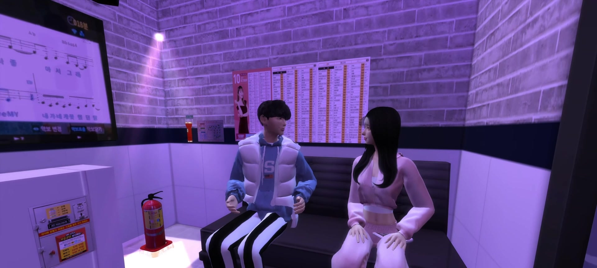
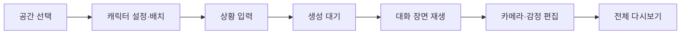
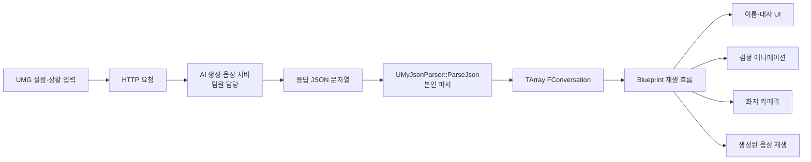

# K-현실고증 시뮬레이터 | 상세 설명

[← 전체 프로젝트 목록](../../README.md)

프로젝트 소개부터 기능별 구현과 검증 범위까지 한 페이지에서 읽을 수 있도록 정리했습니다.

## 목차

- [프로젝트 소개·역할·전체 기능](#section-1)
- [JSON 데이터 연동과 클라이언트 구조](#section-2)
- [사용자 화면과 대화 연출](#section-3)

---

<a id="section-1"></a>

## 프로젝트 소개·역할·전체 기능

사용자가 설정한 캐릭터와 상황을 AI 대화로 생성하고, Unreal Engine에서 음성·감정·카메라를 포함한 장면으로 재생·편집하는 숏폼 제작 도구입니다.



*실제 프로젝트 시연 영상 02:05의 장면을 잘라낸 이미지입니다. 전체 장면은 팀 결과이며, 제 담당은 Unreal 클라이언트입니다.*

### 프로젝트 정보

| 항목 | 내용 |
|---|---|
| 개발 기간 | 2024.06–2024.12 |
| 개발 인원 | 2명: Unreal 클라이언트 1명, AI 서버 1명 |
| 본인 역할 | Unreal 클라이언트 개발 |
| 개발 환경 | Unreal Engine 5.4, C++, Blueprint, UMG, HTTP/JSON 연동 |
| 실행 결과 | Windows 실행 패키지와 시연 영상 |
| 수상 | 2024 메타버스 개발자 경진대회 우수상, 팀 수상 |
| 시연 | [K-현실고증 시뮬레이터 영상](https://youtu.be/DKNxsU4mA8I) |

프로젝트 기간은 전체 제작 기간입니다. 확인된 소스 활동 기록은 2024년 8–11월이며 두 기록을 같은 의미로 사용하지 않습니다. [원본 프로젝트 저장소](https://github.com/Acdok/MyProject3)와 이 설명 문서의 정리 시점은 다를 수 있습니다.

### 담당 범위

| 구분 | 담당 내용 |
|---|---|
| 본인 | 대화 JSON의 C++ 구조체 변환과 Blueprint 노출, UMG 제작 흐름, 화자·감정·카메라 연출, 대화별 편집과 다시보기 |
| 팀원 | Python/FastAPI AI 생성 서버, AI 호출·프롬프트 처리, 현재 C++ HTTP 요청·응답 콜백 코드의 대부분 |
| 공동 | 요청·응답 규격 조율, 음성을 포함한 전체 생성·재생 흐름 통합 |
| 팀 결과 | Windows 실행 패키지, 전체 시연, 수상 |

AI 서버나 TTS 생성 기능을 직접 개발한 프로젝트로 설명하지 않습니다. 캐릭터·환경·애니메이션 자산을 직접 제작했다는 의미도 아닙니다.

### 주요 구현

- 서버의 `conversation` 배열을 `FConversation` 배열로 변환하고 Blueprint에서 사용할 수 있도록 노출했습니다.
- 초기 파일 기반 JSON 로딩을 런타임 응답 문자열 파싱으로 바꿨습니다.
- 로비, 공간·캐릭터 설정, 상황 입력, 생성 대기, 재생, 편집·다시보기로 이어지는 15개 Widget Blueprint 흐름을 연결했습니다.
- 같은 화자·감정·대사 데이터를 대화 UI, 카메라, 감정 애니메이션이 사용하도록 구성했습니다.
- 생성된 결과의 카메라 구도와 감정을 대화 단위로 수정하고 전체 장면을 다시 재생할 수 있게 했습니다.

### 사용자 흐름



AI가 생성한 텍스트를 표시하는 데서 끝나지 않고, 사용자가 생성 결과를 장면 단위로 다듬는 클라이언트 흐름을 구현했습니다.

### 기술 문서

- [JSON 데이터 연동과 클라이언트 구조](data-flow.md): `FConversation`, 파서, 비동기 응답의 실제 동작과 현재 한계
- [사용자 화면과 대화 연출](client-experience.md): 15개 UMG 자산, 데이터와 연출의 대응, 편집·다시보기, 확인 가능한 실행 범위

문서의 `Source/`, `Content/` 경로는 원래 Unreal 프로젝트 루트 기준입니다. 이 기술 문서 저장소에 해당 프로젝트 전체 소스가 포함되어 있다는 뜻은 아닙니다.

### 구현 상태와 한계

| 확인한 범위 | 아직 완료 성과로 주장하지 않는 범위 |
|---|---|
| JSON 파싱과 Blueprint 데이터 노출 | 필수 필드·빈 배열·잘못된 감정 값에 대한 종합 검증 |
| 설정·생성·재생·편집·다시보기 시연 | 모든 캐릭터·상황 조합의 회귀 테스트 |
| Windows 실행 패키지 존재 | 자동 배포, 상용 출시, 다수 사용자 운영 |
| 실제 요청·응답 실행 기록 | 평균 응답 시간, 안정성·TTS 성공률의 반복 측정 |

현재 구현을 설명하는 문서이며, 개선 계획을 완료 기능으로 포함하지 않았습니다.

---

<a id="section-2"></a>

## JSON 데이터 연동과 클라이언트 구조

[프로젝트 개요](README.md) · [사용자 화면과 대화 연출](client-experience.md)

### 해결한 문제

서버가 반환하는 대화는 문자열이지만, Unreal 장면에서는 화자 이름, 감정, 대사를 서로 다른 요소가 사용합니다. UI와 연출마다 JSON을 다시 해석하지 않도록 대화 한 항목을 `FConversation`으로 묶고, 배열을 Blueprint에 전달했습니다.

### 실제 데이터 흐름



도식은 데이터의 소비 관계를 요약한 것입니다. HTTP 요청과 응답 콜백은 현재 같은 `UMyJsonParser` 클래스에 있지만, 작성 이력상 해당 통신 코드의 대부분은 팀원 범위입니다. 클래스 하나에 들어 있다고 해서 모두 개인 구현으로 합산하지 않습니다.

### 데이터 계약

| 서버 필드 | Unreal 필드 | 소비하는 기능 |
|---|---|---|
| `이름` | `FConversation::Name` | 화자 이름 표시, 화자 캐릭터·카메라 선택 |
| `감정` | `FConversation::Emotion` | 감정 표현 선택과 편집 |
| `대화내용` | `FConversation::Message` | 대사 표시와 대화 순서 관리 |

아래는 형식 설명용 예시이며 실제 사용자 입력이나 실행 로그가 아닙니다.

```json
{
  "conversation": [
    { "이름": "캐릭터 A", "감정": "normal", "대화내용": "예시 대사" }
  ]
}
```

`FConversation`은 `USTRUCT(BlueprintType)`이며 각 문자열 필드는 `BlueprintReadWrite`로 노출합니다. `Conversations` 배열은 `BlueprintReadOnly`, `ParseJson`은 `BlueprintCallable`로 선언합니다. C++은 문자열을 명시적인 데이터 타입으로 바꾸고, Blueprint는 변환된 결과를 장면 연출에 사용합니다.

### 파서의 처리 순서

현재 `ParseJson(FString JsonString)`의 동작은 다음과 같습니다.

1. 전달받은 문자열로 JSON Reader를 생성합니다.
2. 역직렬화와 루트 객체 유효성을 확인합니다.
3. `TryGetArrayField`로 `conversation` 배열을 찾습니다.
4. 배열을 찾았을 때 기존 `Conversations`를 비웁니다.
5. 배열의 객체마다 `이름`, `감정`, `대화내용`을 읽어 구조체를 추가합니다.

초기 파일 로딩 코드는 현재 소스에서 주석 처리되어 있습니다. 외부에서 생성한 응답 문자열을 인자로 받는 방식으로 바꿔, 미리 준비한 파일이 아니라 실행 중 수신한 데이터를 장면에 반영할 수 있게 했습니다.

#### 공통 구조체를 두는 의미

이 구조에서는 UI가 서버 필드명을 직접 알 필요가 없습니다. 화자·감정·대사를 하나의 항목으로 관리하므로 서로 다른 배열의 순서가 어긋나는 설계도 피할 수 있습니다. 다만 구조체를 도입했다는 사실만으로 서버 응답이 항상 유효하거나 모든 연출의 동기화가 자동 보장되는 것은 아닙니다.

### 비동기 응답의 현재 형태

현재 통신 흐름은 요청을 보낸 즉시 응답을 반환하는 동기식 API가 아닙니다.

| 시점 | 코드 동작 |
|---|---|
| 요청 함수 진입 | `LastResponse`를 비우고 요청 데이터를 구성 |
| 요청 전송 | `SendPostRequest`에서 HTTP 요청 시작 |
| 요청 함수 반환 | 콜백 완료를 기다리지 않고 현재 `LastResponse` 반환 |
| 응답 도착 | `OnResponseReceived`가 성공 여부에 따라 `LastResponse` 갱신 |

따라서 `SendRequestAndGetResponse`의 반환값을 곧바로 최종 서버 응답으로 취급할 수 없습니다. 클라이언트에서는 생성 대기 UI와 응답 확인 흐름을 연결했지만, C++ 함수명과 실제 비동기 동작 사이에는 개선 여지가 있습니다.

### 현재 구현의 경계

아래는 소스 구조에서 확인한 보완 지점입니다. 별도 재현 실험으로 발생 빈도를 측정한 장애 목록은 아닙니다.

| 항목 | 현재 상태 | 후속 개선 방향 |
|---|---|---|
| 응답 완료 통지 | 문자열 상태인 `LastResponse`를 콜백에서 갱신 | 완료·실패 Delegate로 결과를 명시적으로 전달 |
| 필수 필드 | 배열 존재를 확인하지만 항목 문자열은 `GetStringField`로 읽음 | 필수 문자열 필드·타입·빈 값 검증 |
| 오래된 데이터 | `conversation` 배열을 찾은 뒤에만 기존 배열을 비움 | 실패 시 이전 데이터의 유지·폐기 정책 명시 |
| 감정 값 | 문자열과 애니메이션 선택의 연결 | 허용 키·기본 감정·알 수 없는 값 처리 정책 정의 |
| HTTP 실패 | 성공 여부와 응답 포인터 확인 중심 | 상태 코드, 타임아웃, 사용자 오류 표시와 재시도 정책 보완 |
| 설정·로그 | 환경 설정 및 대화 데이터 관리 개선 여지 | 서버·음성 경로를 설정으로 분리하고 민감한 원문 로그 노출 최소화 |

재시도·오류 복구·스키마 검증을 이미 완료했다고 설명하지 않습니다. 응답 시간도 반복 측정 결과가 없어 평균값이나 성능 개선율을 제시하지 않습니다.

### 코드 근거

경로는 원래 Unreal 프로젝트 루트 기준입니다.

| 파일 | 확인 지점 |
|---|---|
| `Source/MyProject3/MyJsonParser.h` | `FConversation`, Blueprint 노출, `Conversations`, `ParseJson` 선언 |
| `Source/MyProject3/MyJsonParser.cpp` | JSON 문자열 역직렬화, `conversation` 순회, 필드 변환 |
| 같은 파일의 `SendRequestAndGetResponse` | 요청 데이터 구성, 즉시 반환하는 `LastResponse` |
| 같은 파일의 `SendPostRequest`·`OnResponseReceived` | 비동기 요청과 응답 상태 갱신. 팀원 구현 범위 |
| `Content/UI/WBP_HUD.uasset` | 클라이언트 상태·재생 UI 연결 자산 |
| `Content/K-Character/MasterCharacter.uasset` | 캐릭터 기반 대화 연출 자산 |

원본 코드를 대량 복사하지 않고 데이터 계약과 동작 원리를 설명했습니다. Blueprint 세부 구현은 자산과 기존 시연·역할 기록으로 확인하며, C++ 파일만으로 Blueprint의 모든 분기를 검증했다고 주장하지 않습니다.

---

<a id="section-3"></a>

## 사용자 화면과 대화 연출

[프로젝트 개요](README.md) · [JSON 데이터 연동](data-flow.md)

### 제작 흐름을 연결하는 UI

공간, 캐릭터, 상황 입력, 생성 결과가 따로 떨어진 기능으로 보이지 않도록 제작 순서에 맞춰 화면을 연결했습니다. 생성 결과는 재생만 하는 것이 아니라 카메라와 감정을 수정하고 다시 볼 수 있습니다.


*기존 프로젝트 포트폴리오에서 추출한 상황 입력 UI입니다. 화면 구성은 Unreal 클라이언트 범위이며 대화 생성 서버는 팀원 담당입니다.*

#### 15개 Widget Blueprint 자산

아래 경로는 원래 Unreal 프로젝트 루트 기준입니다. 실제 파일명에 포함된 `Charcter` 표기는 원본 이름을 유지했습니다.

| 흐름 | 자산 경로 |
|---|---|
| 시작 | `Content/UI/WBP_Lobby.uasset` |
| 공간 선택 | `Content/UI/WBP_SelectMap.uasset` |
| 튜토리얼 | `Content/UI/WBP_Tutorial1.uasset`, `WBP_Tutorial2.uasset`, `WBP_Tutorial3.uasset` |
| 캐릭터 설정 | `Content/UI/WBP_EditCharacter.uasset` |
| 캐릭터 슬롯·목록 | `Content/UI/CharacterSlot/Interface/WBP_CharacterSlot.uasset`, `WBP_CharcterInventory.uasset` |
| 상황 입력 | `Content/UI/WBP_Description.uasset` |
| 제작·재생 HUD | `Content/UI/WBP_HUD.uasset` |
| 대화 표시·확인 | `Content/UI/WBP_Chatting.uasset`, `WBP_ChatLog.uasset`, `WBP_FullChat.uasset` |
| 결과 편집 | `Content/UI/WBP_EditMode.uasset` |
| 다시보기 | `Content/UI/WBP_Replay.uasset` |

15는 자산 개수입니다. 모든 화면을 같은 규모의 독립 시스템으로 계산하거나 개발 생산성 수치로 사용하지 않습니다.

### 설정에서 재생까지

| 단계 | 사용자 작업 | 클라이언트의 처리 |
|---|---|---|
| 공간·캐릭터 설정 | 공간과 캐릭터 프리셋 선택, 이름·배경·음성 설정 | 선택 정보를 유지하고 캐릭터를 배치·미리보기 |
| 상황 입력 | 생성하고 싶은 상황 입력 | 요청에 필요한 설정을 정리 |
| 생성 대기 | 외부 응답을 기다림 | 대기 상태 UI와 응답 확인 흐름 연결 |
| 대화 재생 | 생성한 장면 확인 | 공통 대화 배열을 기준으로 UI·캐릭터·카메라 연결 |
| 편집 | 대화별 감정과 구도 변경 | 변경한 연출값을 해당 대화에 적용 |
| 다시보기 | 편집 UI를 숨기고 처음부터 보기 | 전체 대화 순서에 따라 결과 재생 |

음성 프리셋 선택과 생성된 음성의 재생은 클라이언트와 서버가 맞춘 흐름입니다. 음성을 합성하는 모델·서버의 내부 처리를 본인 구현으로 설명하지 않습니다.

### 같은 대화 데이터의 여러 소비자

`FConversation` 한 항목의 화자·감정·대사를 공통 기준으로 사용합니다.

| 기준 데이터 | 연결 결과 |
|---|---|
| 현재 대화 항목과 화자 이름 | 이름·대사 UI 갱신, 화자 캐릭터 선택 |
| 화자 캐릭터 | 카메라 대상과 이동·회전의 기준 |
| 감정 문자열·편집값 | 감정 애니메이션 선택 |
| 대사와 대화 순서 | 자막·음성 재생 흐름 |

이 구조의 의미는 UI·카메라·애니메이션이 서로 다른 서버 응답을 해석하는 대신 같은 대화 항목을 참고한다는 점입니다. 구체적인 재생 타이밍과 음성 준비 상태는 별도 동기화 문제이며, 모든 경우의 타이밍을 정량 검증한 것은 아닙니다.

### 생성 결과의 편집


*기존 포트폴리오에서 추출한 편집 UI입니다. 화면의 그래픽 자산 자체에 대한 제작 소유권을 주장하지 않습니다.*

자동 생성된 장면이 원하는 표현과 다를 때 사용자가 보정할 수 있도록 다음 조작을 연결했습니다.

- 대화별 카메라 구도 변경
- 줌 인·줌 아웃과 좌우 회전 액션
- 일반·지루함·화남·슬픔·놀람·행복의 감정 편집 항목
- 변경한 카메라·감정값 유지
- 대화 로그·전체 대화 확인
- 편집 UI 표시 전환과 전체 다시보기

여기서 편집값 저장은 재생·다시보기를 위한 연출값 관리입니다. 임의의 외부 파일 저장 형식이나 여러 세션 사이의 영구 프로젝트 저장 기능까지 완료했다는 의미로 확장하지 않습니다.

#### 감정값의 주의점

화면의 한국어 감정 이름과 내부 키가 완전히 같은 표기는 아닙니다. 예를 들어 UI의 `놀람`과 내부 키 `embarrassed`의 대응이 있습니다. 또한 정의한 감정군 밖의 문자열을 받는 경우를 고려해야 합니다. 따라서 “모든 생성 감정을 정확히 매칭했다”는 표현 대신, 현재 매핑과 향후 검증 필요성을 구분합니다.

### 영상으로 확인할 수 있는 범위

| 영상 구간 | 확인할 기능 |
|---|---|
| [00:00](https://youtu.be/DKNxsU4mA8I?t=0) | 카메라·감정 편집 패널과 대화 화면 |
| [00:35](https://youtu.be/DKNxsU4mA8I?t=35) | 캐릭터 프리셋·이름·배경·음성 설정 |
| [01:05](https://youtu.be/DKNxsU4mA8I?t=65) | 상황 설명 입력 |
| [01:15](https://youtu.be/DKNxsU4mA8I?t=75) | 생성 대기 UI |
| [01:25 이후](https://youtu.be/DKNxsU4mA8I?t=85) | 화자 전환·자막·감정·카메라 구도 변화 |
| [03:45 이후](https://youtu.be/DKNxsU4mA8I?t=225) | 편집 패널 없는 연속 장면 재생 |

영상은 기능이 동작하는 예시이며 모든 입력 조합의 테스트 보고서는 아닙니다.

### 패키지와 후속 검증

팀 결과물로 Windows 실행 패키지와 실행 기록이 남아 있습니다. 공개 배포·운영 기록이나 서버 환경의 자동 설치까지 확인된 것은 아니므로 “상용 출시” 또는 “자동 배포”로 표현하지 않습니다.

후속 검증에서는 정상 응답, 빈 배열, 잘못된 JSON, 서버 응답 실패를 분리하고, 각 상태에서 UI가 어떻게 복구되는지 확인할 계획입니다. 편집 후 다시보기, 음성 준비 지연, 여러 캐릭터 조합도 같은 조건으로 반복 측정해야 합니다. 이 항목들은 현재 완료된 테스트 성과가 아닙니다.

---

[← 전체 프로젝트 목록](../../README.md)
