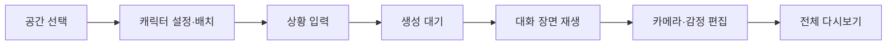

# K-현실고증 시뮬레이터

유튜브 **‘K-현실고증’ 측과 협업해 제작한 숏폼 제작 도구**입니다. 사용자가 설정한 캐릭터와 상황을 AI 대화로 생성하고, Unreal Engine에서 음성·감정·카메라를 포함한 장면으로 재생·편집합니다.

## 프로젝트 정보

| 항목 | 내용 |
|---|---|
| 프로젝트 형태 | 기업 협업 프로젝트 |
| 협업 대상 | 유튜브 ‘K-현실고증’ 측 |
| 개발 기간 | 2024.06–2024.12 |
| 개발 인원 | 2명: Unreal 클라이언트 1명, AI 서버 1명 |
| 본인 역할 | Unreal 클라이언트 개발 |
| 개발 환경 | Unreal Engine 5.4, C++, Blueprint, UMG, HTTP/JSON 연동 |
| 실행 결과 | Windows 실행 패키지와 시연 영상 |
| 수상 | 2024 메타버스 개발자 경진대회 우수상, 팀 수상 |
| 시연 | [K-현실고증 시뮬레이터 영상](https://youtu.be/DKNxsU4mA8I) |

프로젝트 기간은 전체 제작 기간입니다.  [원본 프로젝트 저장소](https://github.com/Acdok/MyProject3)

## 담당 범위

| 구분 | 담당 내용 |
|---|---|
| 본인 | 대화 JSON의 C++ 구조체 변환과 Blueprint 노출, UMG 제작 흐름, 화자·감정·카메라 연출, 대화별 편집과 다시보기 |
| 팀원 | Python/FastAPI AI 생성 서버, AI 호출·프롬프트 처리, 현재 C++ HTTP 요청·응답 콜백 코드의 대부분 |
| 공동 | 요청·응답 규격 조율, 음성을 포함한 전체 생성·재생 흐름 통합 |
| 팀 결과 | Windows 실행 패키지, 전체 시연, 수상 |

## 주요 구현

- 서버의 `conversation` 배열을 `FConversation` 배열로 변환하고 Blueprint에서 사용할 수 있도록 노출했습니다.
- 초기 파일 기반 JSON 로딩을 런타임 응답 문자열 파싱으로 바꿨습니다.
- 로비, 공간·캐릭터 설정, 상황 입력, 생성 대기, 재생, 편집·다시보기로 이어지는 15개 Widget Blueprint 흐름을 연결했습니다.
- 같은 화자·감정·대사 데이터를 대화 UI, 카메라, 감정 애니메이션이 사용하도록 구성했습니다.
- 생성된 결과의 카메라 구도와 감정을 대화 단위로 수정하고 전체 장면을 다시 재생할 수 있게 했습니다.

## 사용자 흐름

AI가 생성한 텍스트를 표시하는 데서 끝나지 않고, 사용자가 생성 결과를 장면 단위로 다듬는 클라이언트 흐름을 구현했습니다.

## 기술 문서

- [JSON 데이터 연동과 클라이언트 구조](data-flow.md): `FConversation`, 파서, 비동기 응답의 실제 동작과 현재 한계
- [사용자 화면과 대화 연출](client-experience.md): 15개 UMG 자산, 데이터와 연출의 대응, 편집·다시보기, 확인 가능한 실행 범위

문서의 `Source/`, `Content/` 경로는 원래 Unreal 프로젝트 루트 기준입니다. 이 기술 문서 저장소에 해당 프로젝트 전체 소스가 포함되어 있다는 뜻은 아닙니다.

## 구현 상태와 한계

| 확인한 범위 | 아직 완료 성과로 주장하지 않는 범위 |
|---|---|
| JSON 파싱과 Blueprint 데이터 노출 | 필수 필드·빈 배열·잘못된 감정 값에 대한 종합 검증 |
| 설정·생성·재생·편집·다시보기 시연 | 모든 캐릭터·상황 조합의 회귀 테스트 |
| Windows 실행 패키지 존재 | 자동 배포, 상용 출시, 다수 사용자 운영 |
| 실제 요청·응답 실행 기록 | 평균 응답 시간, 안정성·TTS 성공률의 반복 측정 |

현재 구현을 설명하는 문서이며, 개선 계획을 완료 기능으로 포함하지 않았습니다.
