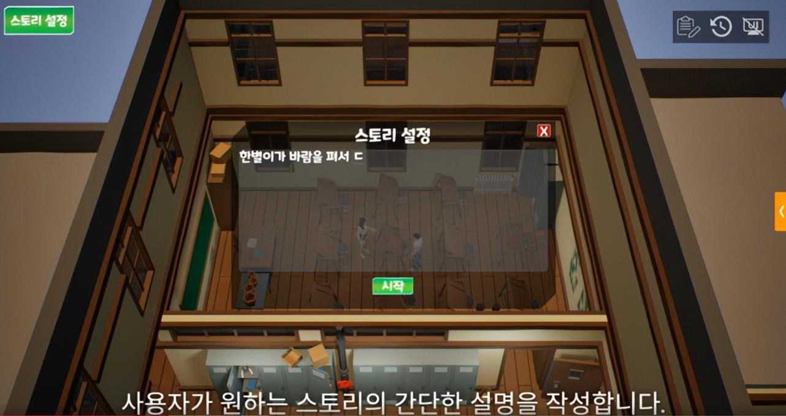
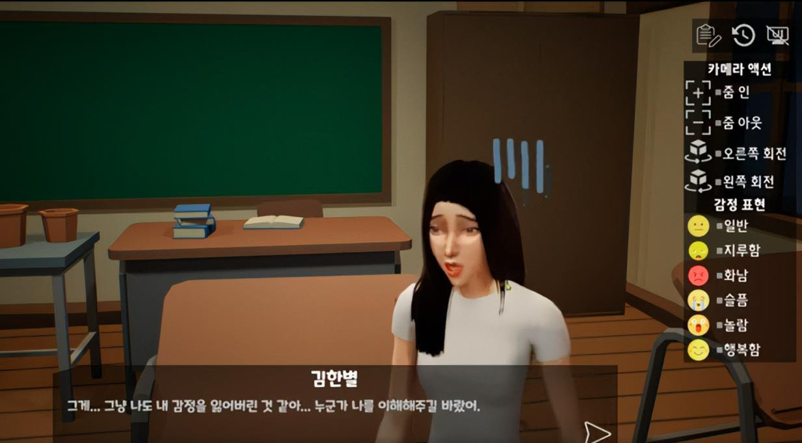

# 사용자 화면과 대화 연출

[프로젝트 개요](README.md) · [JSON 데이터 연동](data-flow.md)

## 제작 흐름을 연결하는 UI

공간, 캐릭터, 상황 입력, 생성 결과가 따로 떨어진 기능으로 보이지 않도록 제작 순서에 맞춰 화면을 연결했습니다. 생성 결과는 재생만 하는 것이 아니라 카메라와 감정을 수정하고 다시 볼 수 있습니다.

*기존 프로젝트 포트폴리오에서 추출한 상황 입력 UI입니다. 화면 구성은 Unreal 클라이언트 범위이며 대화 생성 서버는 팀원 담당입니다.*

### 15개 Widget Blueprint 자산

아래 경로는 원래 Unreal 프로젝트 루트 기준입니다. 실제 파일명에 포함된 `Charcter` 표기는 원본 이름을 유지했습니다.

| 흐름 | 자산 경로 |
|---|---|
| 시작 | `Content/UI/WBP_Lobby.uasset` |
| 공간 선택 | `Content/UI/WBP_SelectMap.uasset` |
| 튜토리얼 | `Content/UI/WBP_Tutorial1.uasset`, `WBP_Tutorial2.uasset`, `WBP_Tutorial3.uasset` |
| 캐릭터 설정 | `Content/UI/WBP_EditCharacter.uasset` |
| 캐릭터 슬롯·목록 | `Content/UI/CharacterSlot/Interface/WBP_CharacterSlot.uasset`, `WBP_CharcterInventory.uasset` |
| 상황 입력 | `Content/UI/WBP_Description.uasset` |
| 제작·재생 HUD | `Content/UI/WBP_HUD.uasset` |
| 대화 표시·확인 | `Content/UI/WBP_Chatting.uasset`, `WBP_ChatLog.uasset`, `WBP_FullChat.uasset` |
| 결과 편집 | `Content/UI/WBP_EditMode.uasset` |
| 다시보기 | `Content/UI/WBP_Replay.uasset` |

15는 자산 개수입니다. 모든 화면을 같은 규모의 독립 시스템으로 계산하거나 개발 생산성 수치로 사용하지 않습니다.

## 설정에서 재생까지

| 단계 | 사용자 작업 | 클라이언트의 처리 |
|---|---|---|
| 공간·캐릭터 설정 | 공간과 캐릭터 프리셋 선택, 이름·배경·음성 설정 | 선택 정보를 유지하고 캐릭터를 배치·미리보기 |
| 상황 입력 | 생성하고 싶은 상황 입력 | 요청에 필요한 설정을 정리 |
| 생성 대기 | 외부 응답을 기다림 | 대기 상태 UI와 응답 확인 흐름 연결 |
| 대화 재생 | 생성한 장면 확인 | 공통 대화 배열을 기준으로 UI·캐릭터·카메라 연결 |
| 편집 | 대화별 감정과 구도 변경 | 변경한 연출값을 해당 대화에 적용 |
| 다시보기 | 편집 UI를 숨기고 처음부터 보기 | 전체 대화 순서에 따라 결과 재생 |

음성 프리셋 선택과 생성된 음성의 재생은 클라이언트와 서버가 맞춘 흐름입니다. 음성을 합성하는 모델·서버의 내부 처리를 본인 구현으로 설명하지 않습니다.

## 같은 대화 데이터의 여러 소비자

`FConversation` 한 항목의 화자·감정·대사를 공통 기준으로 사용합니다.

| 기준 데이터 | 연결 결과 |
|---|---|
| 현재 대화 항목과 화자 이름 | 이름·대사 UI 갱신, 화자 캐릭터 선택 |
| 화자 캐릭터 | 카메라 대상과 이동·회전의 기준 |
| 감정 문자열·편집값 | 감정 애니메이션 선택 |
| 대사와 대화 순서 | 자막·음성 재생 흐름 |

이 구조의 의미는 UI·카메라·애니메이션이 서로 다른 서버 응답을 해석하는 대신 같은 대화 항목을 참고한다는 점입니다. 구체적인 재생 타이밍과 음성 준비 상태는 별도 동기화 문제이며, 모든 경우의 타이밍을 정량 검증한 것은 아닙니다.

## 생성 결과의 편집

*기존 포트폴리오에서 추출한 편집 UI입니다. 화면의 그래픽 자산 자체에 대한 제작 소유권을 주장하지 않습니다.*

자동 생성된 장면이 원하는 표현과 다를 때 사용자가 보정할 수 있도록 다음 조작을 연결했습니다.

- 대화별 카메라 구도 변경
- 줌 인·줌 아웃과 좌우 회전 액션
- 일반·지루함·화남·슬픔·놀람·행복의 감정 편집 항목
- 변경한 카메라·감정값 유지
- 대화 로그·전체 대화 확인
- 편집 UI 표시 전환과 전체 다시보기

