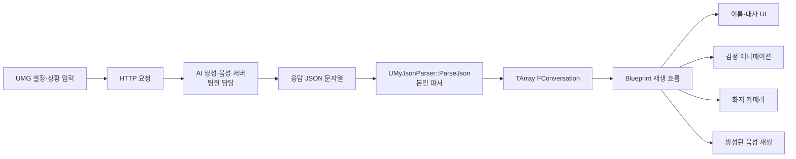

# JSON 데이터 연동과 클라이언트 구조

[프로젝트 개요](README.md) · [사용자 화면과 대화 연출](client-experience.md)

## 해결한 문제

서버가 반환하는 대화는 문자열이지만, Unreal 장면에서는 화자 이름, 감정, 대사를 서로 다른 요소가 사용합니다. UI와 연출마다 JSON을 다시 해석하지 않도록 대화 한 항목을 `FConversation`으로 묶고, 배열을 Blueprint에 전달했습니다.

## 실제 데이터 흐름



도식은 데이터의 소비 관계를 요약한 것입니다. HTTP 요청과 응답 콜백은 현재 같은 `UMyJsonParser` 클래스에 있지만, 작성 이력상 해당 통신 코드의 대부분은 팀원 범위입니다. 클래스 하나에 들어 있다고 해서 모두 개인 구현으로 합산하지 않습니다.

## 데이터 계약

| 서버 필드 | Unreal 필드 | 소비하는 기능 |
|---|---|---|
| `이름` | `FConversation::Name` | 화자 이름 표시, 화자 캐릭터·카메라 선택 |
| `감정` | `FConversation::Emotion` | 감정 표현 선택과 편집 |
| `대화내용` | `FConversation::Message` | 대사 표시와 대화 순서 관리 |

아래는 형식 설명용 예시이며 실제 사용자 입력이나 실행 로그가 아닙니다.

```json
{
  "conversation": [
    { "이름": "캐릭터 A", "감정": "normal", "대화내용": "예시 대사" }
  ]
}
```

`FConversation`은 `USTRUCT(BlueprintType)`이며 각 문자열 필드는 `BlueprintReadWrite`로 노출합니다. `Conversations` 배열은 `BlueprintReadOnly`, `ParseJson`은 `BlueprintCallable`로 선언합니다. C++은 문자열을 명시적인 데이터 타입으로 바꾸고, Blueprint는 변환된 결과를 장면 연출에 사용합니다.

## 파서의 처리 순서

현재 `ParseJson(FString JsonString)`의 동작은 다음과 같습니다.

1. 전달받은 문자열로 JSON Reader를 생성합니다.
2. 역직렬화와 루트 객체 유효성을 확인합니다.
3. `TryGetArrayField`로 `conversation` 배열을 찾습니다.
4. 배열을 찾았을 때 기존 `Conversations`를 비웁니다.
5. 배열의 객체마다 `이름`, `감정`, `대화내용`을 읽어 구조체를 추가합니다.

초기 파일 로딩 코드는 현재 소스에서 주석 처리되어 있습니다. 외부에서 생성한 응답 문자열을 인자로 받는 방식으로 바꿔, 미리 준비한 파일이 아니라 실행 중 수신한 데이터를 장면에 반영할 수 있게 했습니다.

### 공통 구조체를 두는 의미

이 구조에서는 UI가 서버 필드명을 직접 알 필요가 없습니다. 화자·감정·대사를 하나의 항목으로 관리하므로 서로 다른 배열의 순서가 어긋나는 설계도 피할 수 있습니다. 다만 구조체를 도입했다는 사실만으로 서버 응답이 항상 유효하거나 모든 연출의 동기화가 자동 보장되는 것은 아닙니다.

## 비동기 응답의 현재 형태

현재 통신 흐름은 요청을 보낸 즉시 응답을 반환하는 동기식 API가 아닙니다.

| 시점 | 코드 동작 |
|---|---|
| 요청 함수 진입 | `LastResponse`를 비우고 요청 데이터를 구성 |
| 요청 전송 | `SendPostRequest`에서 HTTP 요청 시작 |
| 요청 함수 반환 | 콜백 완료를 기다리지 않고 현재 `LastResponse` 반환 |
| 응답 도착 | `OnResponseReceived`가 성공 여부에 따라 `LastResponse` 갱신 |

따라서 `SendRequestAndGetResponse`의 반환값을 곧바로 최종 서버 응답으로 취급할 수 없습니다. 클라이언트에서는 생성 대기 UI와 응답 확인 흐름을 연결했지만, C++ 함수명과 실제 비동기 동작 사이에는 개선 여지가 있습니다.

## 현재 구현의 경계

아래는 소스 구조에서 확인한 보완 지점입니다. 별도 재현 실험으로 발생 빈도를 측정한 장애 목록은 아닙니다.

| 항목 | 현재 상태 | 후속 개선 방향 |
|---|---|---|
| 응답 완료 통지 | 문자열 상태인 `LastResponse`를 콜백에서 갱신 | 완료·실패 Delegate로 결과를 명시적으로 전달 |
| 필수 필드 | 배열 존재를 확인하지만 항목 문자열은 `GetStringField`로 읽음 | 필수 문자열 필드·타입·빈 값 검증 |
| 오래된 데이터 | `conversation` 배열을 찾은 뒤에만 기존 배열을 비움 | 실패 시 이전 데이터의 유지·폐기 정책 명시 |
| 감정 값 | 문자열과 애니메이션 선택의 연결 | 허용 키·기본 감정·알 수 없는 값 처리 정책 정의 |
| HTTP 실패 | 성공 여부와 응답 포인터 확인 중심 | 상태 코드, 타임아웃, 사용자 오류 표시와 재시도 정책 보완 |
| 설정·로그 | 환경 설정 및 대화 데이터 관리 개선 여지 | 서버·음성 경로를 설정으로 분리하고 민감한 원문 로그 노출 최소화 |

재시도·오류 복구·스키마 검증을 이미 완료했다고 설명하지 않습니다. 응답 시간도 반복 측정 결과가 없어 평균값이나 성능 개선율을 제시하지 않습니다.

## 코드 근거

경로는 원래 Unreal 프로젝트 루트 기준입니다.

| 파일 | 확인 지점 |
|---|---|
| `Source/MyProject3/MyJsonParser.h` | `FConversation`, Blueprint 노출, `Conversations`, `ParseJson` 선언 |
| `Source/MyProject3/MyJsonParser.cpp` | JSON 문자열 역직렬화, `conversation` 순회, 필드 변환 |
| 같은 파일의 `SendRequestAndGetResponse` | 요청 데이터 구성, 즉시 반환하는 `LastResponse` |
| 같은 파일의 `SendPostRequest`·`OnResponseReceived` | 비동기 요청과 응답 상태 갱신. 팀원 구현 범위 |
| `Content/UI/WBP_HUD.uasset` | 클라이언트 상태·재생 UI 연결 자산 |
| `Content/K-Character/MasterCharacter.uasset` | 캐릭터 기반 대화 연출 자산 |

원본 코드를 대량 복사하지 않고 데이터 계약과 동작 원리를 설명했습니다. Blueprint 세부 구현은 자산과 기존 시연·역할 기록으로 확인하며, C++ 파일만으로 Blueprint의 모든 분기를 검증했다고 주장하지 않습니다.
