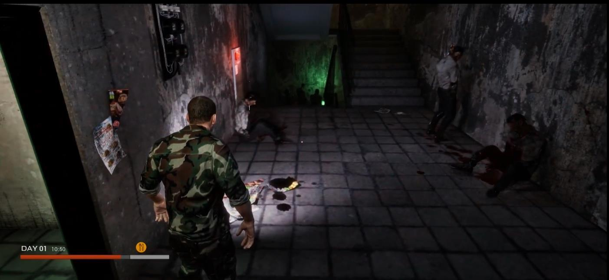

# KZG — A Trail of Survival | 상세 설명

[← 전체 프로젝트 목록](../../README.md)

프로젝트 소개부터 기능별 구현과 검증 범위까지 한 페이지에서 읽을 수 있도록 정리했습니다.

## 목차

- [프로젝트 소개·역할·전체 기능](#section-1)
- [KZG | 인벤토리·아이템·컨테이너·UMG](#section-2)
- [KZG | 건설·시설물·낮과 밤·세션 UI](#section-3)
- [KZG | 반복 상호작용 입력 수정](#section-4)

---

<a id="section-1"></a>

## 프로젝트 소개·역할·전체 기능

> 인벤토리·컨테이너·건설·시간·세션 UI를 생존 플레이로 연결한 Unreal Engine 팀 프로젝트.


화면 전체는 7인 팀의 결과물입니다. 아래 문서는 제가 담당한 Blueprint 시스템·UI와 C++ 입력 수정에 초점을 맞춥니다.

| 항목 | 내용 |
|---|---|
| 장르 | 3인칭 좀비 생존 |
| 기간 / 인원 | 2023.10–12 / 7인 팀 |
| 개발 환경 | Unreal Engine 5, Blueprint, UMG, ActorComponent, DataTable |
| 네트워크 연동 | Online Subsystem Steam, Advanced Sessions, 팀 RPC·Replication 기반 |
| 결과 | 메타버스 아카데미 성과공유회 장려상 — 팀 수상 |
| 시연 | [KZG 최종 시연 영상](https://youtu.be/0tP8uwXulIc) |

개발 저장소 기준 엔진은 UE 5.2이며, 이후 로컬 프로젝트 변환본은 5.3입니다. 이 문서의 구현 설명은 개발 당시 자산과 변경 이력을 기준으로 합니다.

### 상세 문서

- [인벤토리·아이템·컨테이너·UMG](inventory-and-interaction.md)
- [건설·시설물·낮과 밤·세션 UI](survival-and-session.md)
- [반복 상호작용 입력 수정과 검증 범위](input-fix-and-validation.md)
- [전체 프로젝트 목록](../../README.md)

### 담당 범위

| 구분 | 내용 |
|---|---|
| 본인 구현 | DataTable·인벤토리 컴포넌트, 슬롯 이동·사용·드롭, 컨테이너 UMG, Trace·Interface 피드백 |
| 본인 구현 | 건설 선택·Preview·시설물 배치, 날짜·시간 HUD, 세션 생성·검색·참가 UI |
| 본인 수정·연동 | 기존 C++ 캐릭터의 상호작용 입력 시작/종료 분리, Guard 상태 및 종료 RPC 추가 |
| 팀 기반·팀 결과 | 공통 캐릭터, 좀비 AI·전투, 핵심 생존 수치, 공통 네트워크, 아트·레벨·전체 플레이 |
| 외부 기반 | Advanced Sessions 플러그인, 엔진의 Online Subsystem 및 Sun Position 기능 |

### 기능별 한눈에 보기

| 기능 | 주요 구현 요소 | 플레이에서의 역할 |
|---|---|---|
| 아이템 정의 | `FItemStruct`, `ItemData` | 이름·효과·최대 스택·썸네일 등 규칙 관리 |
| 소지 상태 | `FSlotStruct` | Item ID와 수량 관리 |
| 인벤토리 로직 | `AC_Inventory` | 스택 추가, 빈 슬롯 생성, 이동, 소비, 제거·드롭 |
| 컨테이너 | Player, Box, Loot Box, Airdrop Box | 같은 컴포넌트를 각 보관 주체에 적용 |
| UI 갱신 | `OnInventoryUpdate`, Grid·Slot·Action Menu | 상태 변경을 UMG 표시와 연결 |
| 조작 | Drag & Drop, 사용, 하나/전체 버리기 | 슬롯 기반 조작을 공통 로직에 전달 |
| 상호작용 | Trace, `Interact_interface`, Custom Depth | 대상 탐색·강조·입력 안내 |
| 건설 | `WB_Build`, `AC_BuildingSystem` | 침대·물탱크 선택, 미리보기, 시설물 생성 |
| 시간 | `BP_Day`, Timeline, Sun Position | 태양·조명 변화와 날짜·시간 HUD |
| 세션 | `MultiGameInstance`, `WB_Menu`, `WB_ServerSlot` | Steam 호스트 생성·검색·참가 |
| 입력 보완 | Started/Completed, 복제 Guard | 길게 누를 때 상호작용 중복 처리 방지 |

### 설계의 중심

아이템의 **공통 정의**, 각 컨테이너의 **보유 상태**, 상태를 보여 주는 **화면**을 나누었습니다. 여러 종류의 상자를 만들 때 인벤토리 로직을 각각 다시 구성하는 대신, 같은 컴포넌트와 슬롯 규격을 사용하도록 연결했습니다.

이 접근은 데이터 중심 게임플레이 설계 경험입니다. DataTable을 사용했다는 사실을 SQL 쿼리·관계형 데이터베이스 운영 경험으로 표현하지 않습니다.

### 영상으로 확인할 부분

| 구간 | 확인할 화면 |
|---|---|
| [01:30](https://youtu.be/0tP8uwXulIc?t=90) 이후 | DAY·시간 HUD |
| [02:25](https://youtu.be/0tP8uwXulIc?t=145) 전후 | 플레이어·컨테이너 인벤토리 |
| [02:40](https://youtu.be/0tP8uwXulIc?t=160) 이후 | 시설물 안내와 상호작용 |
| [06:15](https://youtu.be/0tP8uwXulIc?t=375) 전후 | 보급 상자 인벤토리·아이템 획득 |

건설 Preview와 세션 메뉴는 자산에서 확인한 기능이며 위 영상의 대표 장면으로 대체 증명하지 않습니다.

---

<a id="section-2"></a>

## KZG | 인벤토리·아이템·컨테이너·UMG

[프로젝트 개요](README.md) · [건설·시간·세션](survival-and-session.md)

### 1. 아이템 규칙과 슬롯 상태 분리


기존 프로젝트 자료의 ItemData 화면입니다. 필드 정의와 보유 수량을 분리하는 구조를 설명하기 위한 자료입니다.

| 데이터 | 보관 내용 | 역할 |
|---|---|---|
| `FItemStruct` | 이름·설명, 아이템 클래스, 사용 효과, Stack Size, Thumbnail | 아이템 종류에 공통인 규칙 |
| `ItemData` DataTable | 아이템별 정의 행 | Item ID로 참조할 규칙 데이터 |
| `FSlotStruct` | Item ID, Quantity | 특정 인벤토리 슬롯에 들어 있는 상태 |

예를 들어 같은 물 아이템이 플레이어와 보급 상자에 들어 있어도, 설명·썸네일 같은 정의는 공유하고 수량은 각 슬롯에 보관합니다. UI와 아이템 사용 로직은 이 정의와 상태를 조합해서 동작합니다. 이는 구조 설명을 위한 예시이며 실제 아이템 밸런스 수치를 임의로 제시하지 않습니다.

### 2. AC_Inventory에 공통 동작 모으기

`Content/DEV/JJH/Inventory/AC_Inventory.uasset`에는 다음 역할의 함수와 이벤트가 있습니다.

| 함수·이벤트 | 담당 동작 |
|---|---|
| `FindSlot` | 기존 슬롯 탐색 |
| `AddToStack` | 기존 스택에 수량 추가 |
| `CreateNewStack` | 새로운 슬롯 스택 구성 |
| `AddToInventory` | 아이템 획득 처리 진입점 |
| `TransferSlots` | 슬롯 사이 이동 처리 |
| `ConsumeItem` | 아이템 사용·소비 처리 |
| 제거·드롭 함수군 | 일부/전체 수량 제거와 월드 드롭 |
| `OnInventoryUpdate` | 변경 후 화면 갱신 알림 |

컴포넌트를 Player·Box·Loot Box·Airdrop Box에 적용해 보관 주체는 달라도 같은 슬롯 규격과 처리 함수를 사용합니다. 각 액터에 로직을 복제하기보다 공통 컴포넌트를 재사용하는 것이 이 구조의 핵심입니다.

### 3. 데이터 변경과 표시 분리

```text
아이템 획득 / 슬롯 이동 / 사용 / 드롭
    ↓
AC_Inventory의 공통 처리
    ↓
슬롯 상태 변경 + OnInventoryUpdate
    ↓
WB_InventoryGrid → WB_InventorySlot 표시 갱신
```

위 도식은 주요 책임 관계를 요약한 것입니다. 네트워크 호출 순서나 모든 예외 분기의 완전한 실행 그래프는 아닙니다.

- `WB_InventoryGrid`: 변경 이벤트를 받아 슬롯 위젯을 갱신합니다.
- `WB_InventorySlot`: 슬롯 데이터 표시와 Drag & Drop 조작을 담당합니다.
- `WB_ActionMenu`: 사용·하나 버리기·전체 버리기를 공통 처리 함수에 연결합니다.
- `BP_DragDropInventory`, `WB_Drag`: 드래그 중 전달되는 슬롯 정보와 시각 표현에 사용합니다.

이벤트를 경계로 두면 슬롯 변경 로직과 UMG 표현의 책임을 구분해서 읽을 수 있습니다. 이벤트 사용만으로 프레임 성능이 개선됐다고 주장하지는 않습니다.

### 4. 플레이어와 컨테이너 사이 이동


플레이어와 항공보급상자 화면입니다. 화면 전체는 팀 플레이 결과이며, 본인 담당은 인벤토리 컴포넌트와 컨테이너 UI·슬롯 처리 연결입니다.

컨테이너는 보관 기능을 제공하는 액터와 표시할 UMG를 조합합니다. `BP_Box`, `BP_lootbox`, `BP_AirdropBox`에서 공통 인벤토리를 사용하며, 슬롯 이동은 `TransferSlots`와 갱신 이벤트에 연결합니다.

확인한 조작 범위는 슬롯 이동, 아이템 사용, 일부/전체 버리기입니다. 동시 접근 시 충돌 해결, 모든 네트워크 조건의 수량 보존, 서버 권한 검증이 완결됐다고 확대하지 않습니다.

### 5. 아이템 효과 연동

사용 가능한 아이템은 데이터의 효과 정의와 효과 Blueprint를 연결합니다. `Inventory/items/Effects`에는 허기·스태미나·회복·아이템 생성 관련 효과 자산이 있습니다.

본인 기여는 **아이템 사용에서 해당 효과를 호출하고 소비·UI로 연결하는 부분**입니다. 캐릭터의 허기·스태미나 핵심 C++ 시스템 전체를 단독 구현한 것은 아닙니다.

### 6. 대상 탐색과 피드백

상호작용은 대상 종류에 따라 UI가 달라도 공통 진입점을 사용할 수 있도록 구성했습니다.

1. Line/Sphere Trace로 대상을 찾습니다.
2. `Interact_interface`의 `InteractWith`를 상호작용 진입점으로 사용합니다.
3. Custom Depth와 `M_OutLine`으로 대상의 윤곽선을 표시합니다.
4. `WB_DisplayMessage`로 입력 안내·결과 메시지를 표시합니다.
5. 해당 액터의 인벤토리 또는 시설물 기능에 진입합니다.

상호작용·소비·드롭·제거에는 팀 멀티플레이 구조와 연결되는 `Server_*` 이벤트 경로가 존재합니다. 이 문서가 설명하는 범위는 본인 Blueprint 시스템의 연동이며, 네트워크 기반 전체의 소유권 주장이 아닙니다.

### 소스·자산을 읽는 순서

아래 경로는 원본 프로젝트 기준의 위치이며, 이 문서 저장소에 원본 자산이 포함되어 있다는 의미는 아닙니다.

1. `Content/DEV/JJH/Inventory/FItemStruct.uasset`, `FSlotStruct.uasset`, `ItemData.uasset`
2. `Content/DEV/JJH/Inventory/AC_Inventory.uasset`
3. `Content/DEV/JJH/Inventory/ui/WB_InventoryGrid.uasset`, `WB_InventorySlot.uasset`, `WB_ActionMenu.uasset`
4. `Content/DEV/JJH/BP_Box.uasset`, `BP_lootbox.uasset`, `BP_AirdropBox.uasset`
5. `Content/DEV/JJH/Inventory/Interact_interface.uasset`, `Content/DEV/JJH/M_OutLine.uasset`

Blueprint 자산·작성 이력과 기존 실행 화면을 바탕으로 설명했습니다. 함수 존재와 구조 확인을 전체 예외 처리·현재 빌드 통과 증명으로 사용하지 않습니다.

---

<a id="section-3"></a>

## KZG | 건설·시설물·낮과 밤·세션 UI

[프로젝트 개요](README.md) · [인벤토리](inventory-and-interaction.md) · [입력 수정](input-fix-and-validation.md)

### 1. 건설 선택에서 시설물 생성까지

최종 Player에 연결된 경로는 다음과 같습니다.

```text
WB_Build에서 침대·물탱크 선택
    → AC_BuildingSystem
    → 자원 처리 / 카메라 Trace 기반 Preview
    → 시설물 생성과 상호작용 연결
```

UI는 무엇을 지을지 선택하고, 컴포넌트는 배치 위치·미리보기·생성 처리를 담당하도록 연결했습니다. 인벤토리의 자원 처리와 시설물 액터를 이어 주는 게임플레이 기능입니다.

#### 최종 경로와 별도 프로토타입 구분

프로젝트에는 `WB_BuildSystemWidget → ACBP_BuildingSystem → BP_Building`이라는 별도 건축 프로토타입도 있습니다. 이 경로에서는 Mesh 선택·회전, 커스텀 충돌 기반 겹침 상태와 재질 피드백을 다뤘습니다.

이 프로토타입의 모든 기능을 최종 `AC_BuildingSystem` 경로에 통합한 것으로 소개하지 않습니다. 동일한 건설 주제라도 **최종 연결 경로와 별도 실험 경로**를 나눠 기록합니다.

### 2. 날짜·시간을 조명과 HUD에 연결



DAY·시간 HUD가 포함된 팀 플레이 화면입니다. 건설 배치 Preview를 보여 주는 이미지는 아닙니다.

`BP_Day`는 날짜·위치·Time Zone 값을 Sun Position에 사용하고, Timeline으로 인게임 시간을 진행시킵니다. 시간 상태는 두 곳으로 전달됩니다.

| 소비자 | 사용 목적 |
|---|---|
| Directional Light·Sky·대기 표현 | 시간에 따른 태양·장면 조명 변화 |
| `WB_PlayerHUD` | Day와 Time 표시 |

Actor Replication과 일부 시간 상태의 복제 경로도 구성했습니다. 다만 동기 오차를 측정하거나 모든 클라이언트에서 장시간 동일하게 유지되는지 정량 검증한 결과는 이 문서에 포함하지 않습니다.

### 3. 시설물과 시간 관련 기능

| 자산 | 연결한 기능 | 구분 |
|---|---|---|
| `BP_Bed`, `BP_Bed1` | 침대 상호작용으로 시간 진행 | 본인 Blueprint 범위 |
| `BP_WaterSpawner` | Timer로 물 아이템을 인벤토리에 추가 | 일주기와는 별도 Timer 경로 |
| `BP_AIRSPAWN` | Solar Time 조건을 보급 이벤트와 연결 | 조건 연동은 본인, 비행기 이동·낙하 C++은 팀원 |

시간을 보여 주는 데서 끝나지 않고 시설물·보급 조건과 연결한 경험입니다. 모든 기능을 하나의 통합 시간 스케줄러로 구현한 것은 아닙니다.

### 4. Steam 세션 진입 UI

세션 작업의 목표는 플레이어가 직접 호스트를 만들거나 검색된 방에 참가할 수 있게 하는 것이었습니다.

| 단계 | 확인한 구성 |
|---|---|
| 엔진 설정 | Steam Net Driver, Online Subsystem Steam |
| 진입 관리자 | 프로젝트 GameInstance로 `MultiGameInstance` 지정 |
| 호스트 생성 | Advanced Sessions의 `CreateAdvancedSession`, Listen Server |
| 검색·표시·참가 | `BP_Session`, `WB_Menu`, `WB_ServerSlot` |

본인이 작성한 것은 외부 플러그인을 이용한 프로젝트 설정과 세션 UI·흐름의 연결입니다. Advanced Sessions 자체나 Steam 서비스, 팀 공통 네트워크를 개발한 것은 아닙니다.

### 5. 구조상 얻은 경험

- UMG에서 입력받은 선택을 게임플레이 컴포넌트와 연결했습니다.
- 시간 상태를 조명과 HUD가 함께 소비하도록 구성했습니다.
- 엔진·외부 플러그인이 제공하는 세션 기능을 사용자 화면으로 연결했습니다.
- 같은 주제의 프로토타입과 최종 경로를 구분해서 유지·설명하는 필요성을 확인했습니다.

### 확인 범위와 다음 검증

건설 Preview·시설물 배치와 세션 메뉴는 자산 구조로 확인했습니다. 공개 영상에는 시설물 상호작용과 시간 HUD가 중심이며 세션 화면·건설 Preview를 뚜렷하게 보여 주지는 않습니다.

향후 보강할 검증은 아래와 같습니다. **현재 완료한 테스트가 아니라 추가할 검증 항목**입니다.

- 건설 자원이 부족한 경우와 배치 취소 시 상태 복구
- 시간 진행·침대 상호작용의 다중 클라이언트 동기화
- 세션 검색 결과 없음·참가 실패·호스트 종료 시 UI 복구
- 물 생성 Timer의 반복 실행과 컨테이너 용량 초과 처리

### 원본 프로젝트의 관련 위치

- `Content/DEV/JJH/WB_Build.uasset`, `AC_BuildingSystem.uasset`
- `Content/DEV/JJH/WB_BuildSystemWidget.uasset`, `ACBP_BuildingSystem.uasset`, `BP_Building.uasset`
- `Content/DEV/JJH/BP_Day.uasset`, `WB_PlayerHUD.uasset`
- `Content/DEV/JJH/BP_Bed.uasset`, `BP_Bed1.uasset`, `BP_WaterSpawner.uasset`, `BP_AIRSPAWN.uasset`
- `Content/DEV/JJH/MultiGameInstance.uasset`, `BP_Session.uasset`, `WB_Menu.uasset`, `WB_ServerSlot.uasset`
- `Config/DefaultEngine.ini` — 설정 항목의 존재만 설명하며 내부 설정 파일 원문은 게시하지 않습니다.

---

<a id="section-4"></a>

## KZG | 반복 상호작용 입력 수정

[프로젝트 개요](README.md) · [인벤토리·상호작용](inventory-and-interaction.md)

### 문제

상호작용 입력이 `Triggered`에 연결되어 있어, 키를 길게 누르는 동안 같은 입력의 처리 경로가 반복 진입할 수 있었습니다. 한 번 누른 행동과 누르고 있는 상태를 구분할 필요가 있었습니다.

### 변경

본인의 2023-10-30 `PlayerDebug` 변경 이력을 기준으로 확인한 수정입니다.

1. 입력 시작은 `Started`에 연결했습니다.
2. 입력 종료는 `Completed`와 별도 종료 Server RPC에 연결했습니다.
3. 처리 중에는 `bIsInteractionInput` Guard로 재진입을 차단했습니다.
4. 종료 이벤트에서 상태를 `false`로 되돌렸습니다.
5. 상태 변수에 `Replicated`와 `DOREPLIFETIME` 등록을 추가했습니다.

```text
Started → 기존 Server/Multicast 경로 → Guard 확인 → 상호작용 처리
                                                ↓
                                       처리 중 상태 = true
Completed → 종료 Server/Multicast 경로 → 처리 중 상태 = false
```

#### 핵심 로직 발췌

아래는 실제 변경의 Guard와 종료 상태만 발췌해 정리한 것입니다. 완전한 함수·독립 실행 예제가 아닙니다.

```cpp
// 상호작용 진입부
if (bIsInteractionInput) return;
// 각 처리 분기에 들어갈 때
bIsInteractionInput = true;

// Multicast_InteractionUnputEnd_Implementation()
bIsInteractionInput = false;
```

`Unput`은 원본 함수명의 철자입니다. 문서에서 임의로 다른 API인 것처럼 고치지 않았습니다.

### 이 수정에서 보여 주고 싶은 점

Blueprint 시스템을 팀 C++ 기반과 연결하면서 발생한 입력 문제를, 화면에서만 우회하지 않고 입력 이벤트와 상태의 경계에서 보완했습니다. 단순히 RPC를 추가한 사실보다 **시작·처리 중·종료를 구분한 것**이 핵심입니다.

기존 상호작용 RPC·Multicast, 캐릭터·전투·네트워크 기반은 팀원이 작성한 부분입니다. 제 기여는 이 입력 보완과 본인 Blueprint 시스템의 연동입니다.

### 근거와 검증 범위

| 항목 | 상태 |
|---|---|
| Started/Completed 바인딩 변경 | 해당 커밋의 C++ diff로 확인 |
| 종료 RPC·Multicast, Guard 상태 추가 | 해당 커밋의 헤더·구현 diff로 확인 |
| 복제 등록 | `UPROPERTY(Replicated)`, `DOREPLIFETIME` 확인 |
| 실제 인벤토리·컨테이너 UI | 기존 실행 화면·공개 시연으로 확인 |
| 모든 네트워크 조건에서 입력 문제 해소 | 별도의 전체 회귀 결과를 제시하지 않음 |

복제 플래그가 있다는 사실만으로 서버 권한 검증·악성 입력 방지·모든 동시성 문제가 해결됐다고 주장하지 않습니다.

#### 추가 회귀 테스트 항목

다음은 향후 검증을 명확히 하기 위한 체크리스트이며 완료 기록이 아닙니다.

- 한 번 누르기 / 길게 누르기 / 빠르게 반복 누르기
- 대상이 없는 상태에서 누른 뒤 다른 대상으로 전환
- 처리 도중 메뉴 열기·포커스 상실·입력 취소 시 상태 복구
- Listen Server 호스트와 원격 클라이언트의 동일 동작
- 지연·연결 해제·재접속에서 Guard가 남는지 확인
- 인벤토리 동시 접근 시 슬롯 수량과 UI 상태 일치

### 원본 프로젝트 위치

- `Source/KZG/Private/KZGCharacter.cpp`
- `Source/KZG/Public/KZGCharacter.h`

이 문서 저장소는 설명을 위한 별도 기록입니다. 원본 프로젝트 전체·팀 저장소 변경 이력·로그 파일을 복제해서 게시하지 않습니다.

---

[← 전체 프로젝트 목록](../../README.md)
