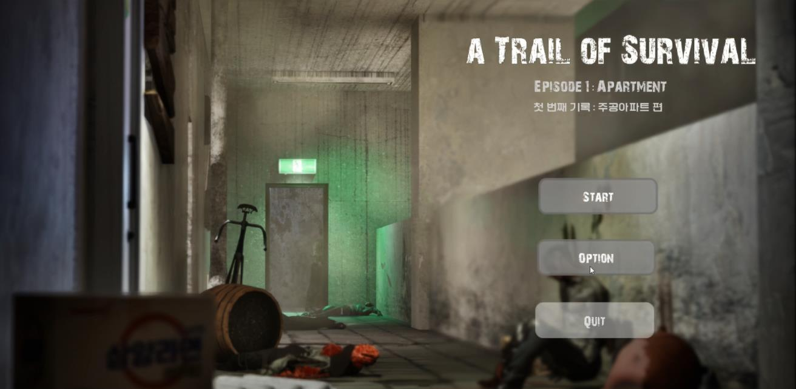

# KZG — A Trail of Survival

> 인벤토리·컨테이너·건설·시간·세션 UI를 생존 플레이로 연결한 Unreal Engine 팀 프로젝트.

화면 전체는 7인 팀의 결과물입니다. 아래 문서는 제가 담당한 Blueprint 시스템·UI와 C++ 입력 수정에 초점을 맞춥니다.

| 항목 | 내용 |
|---|---|
| 장르 | 3인칭 좀비 생존 |
| 기간 / 인원 | 2023.10–12 / 7인 팀 |
| 개발 환경 | Unreal Engine 5, Blueprint, UMG, ActorComponent, DataTable |
| 네트워크 연동 | Online Subsystem Steam, Advanced Sessions, 팀 RPC·Replication 기반 |
| 결과 | 메타버스 아카데미 성과공유회 장려상 — 팀 수상 |
| 시연 | [KZG 최종 시연 영상](https://youtu.be/0tP8uwXulIc) |

개발 저장소 기준 엔진은 UE 5.2이며, 이후 로컬 프로젝트 변환본은 5.3입니다. 이 문서의 구현 설명은 개발 당시 자산과 변경 이력을 기준으로 합니다.

## 상세 문서

- [인벤토리·아이템·컨테이너·UMG](inventory-and-interaction.md)
- [건설·시설물·낮과 밤·세션 UI](survival-and-session.md)
- [반복 상호작용 입력 수정과 검증 범위](input-fix-and-validation.md)
- [전체 프로젝트 목록](../../README.md)

## 담당 범위

| 구분 | 내용 |
|---|---|
| 본인 구현 | DataTable·인벤토리 컴포넌트, 슬롯 이동·사용·드롭, 컨테이너 UMG, Trace·Interface 피드백 |
| 본인 구현 | 건설 선택·Preview·시설물 배치, 날짜·시간 HUD, 세션 생성·검색·참가 UI |
| 본인 수정·연동 | 기존 C++ 캐릭터의 상호작용 입력 시작/종료 분리, Guard 상태 및 종료 RPC 추가 |
| 팀 기반·팀 결과 | 공통 캐릭터, 좀비 AI·전투, 핵심 생존 수치, 공통 네트워크, 아트·레벨·전체 플레이 |
| 외부 기반 | Advanced Sessions 플러그인, 엔진의 Online Subsystem 및 Sun Position 기능 |

## 기능별 한눈에 보기

| 기능 | 주요 구현 요소 | 플레이에서의 역할 |
|---|---|---|
| 아이템 정의 | `FItemStruct`, `ItemData` | 이름·효과·최대 스택·썸네일 등 규칙 관리 |
| 소지 상태 | `FSlotStruct` | Item ID와 수량 관리 |
| 인벤토리 로직 | `AC_Inventory` | 스택 추가, 빈 슬롯 생성, 이동, 소비, 제거·드롭 |
| 컨테이너 | Player, Box, Loot Box, Airdrop Box | 같은 컴포넌트를 각 보관 주체에 적용 |
| UI 갱신 | `OnInventoryUpdate`, Grid·Slot·Action Menu | 상태 변경을 UMG 표시와 연결 |
| 조작 | Drag & Drop, 사용, 하나/전체 버리기 | 슬롯 기반 조작을 공통 로직에 전달 |
| 상호작용 | Trace, `Interact_interface`, Custom Depth | 대상 탐색·강조·입력 안내 |
| 건설 | `WB_Build`, `AC_BuildingSystem` | 침대·물탱크 선택, 미리보기, 시설물 생성 |
| 시간 | `BP_Day`, Timeline, Sun Position | 태양·조명 변화와 날짜·시간 HUD |
| 세션 | `MultiGameInstance`, `WB_Menu`, `WB_ServerSlot` | Steam 호스트 생성·검색·참가 |
| 입력 보완 | Started/Completed, 복제 Guard | 길게 누를 때 상호작용 중복 처리 방지 |

## 설계의 중심

아이템의 **공통 정의**, 각 컨테이너의 **보유 상태**, 상태를 보여 주는 **화면**을 나누었습니다. 여러 종류의 상자를 만들 때 인벤토리 로직을 각각 다시 구성하는 대신, 같은 컴포넌트와 슬롯 규격을 사용하도록 연결했습니다.

이 접근은 데이터 중심 게임플레이 설계 경험입니다. DataTable을 사용했다는 사실을 SQL 쿼리·관계형 데이터베이스 운영 경험으로 표현하지 않습니다.

## 영상으로 확인할 부분

| 구간 | 확인할 화면 |
|---|---|
| [01:30](https://youtu.be/0tP8uwXulIc?t=90) 이후 | DAY·시간 HUD |
| [02:25](https://youtu.be/0tP8uwXulIc?t=145) 전후 | 플레이어·컨테이너 인벤토리 |
| [02:40](https://youtu.be/0tP8uwXulIc?t=160) 이후 | 시설물 안내와 상호작용 |
| [06:15](https://youtu.be/0tP8uwXulIc?t=375) 전후 | 보급 상자 인벤토리·아이템 획득 |

건설 Preview와 세션 메뉴는 자산에서 확인한 기능이며 위 영상의 대표 장면으로 대체 증명하지 않습니다.
