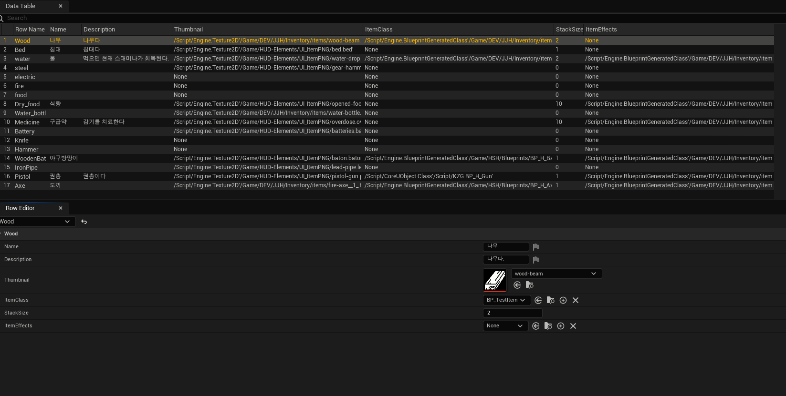
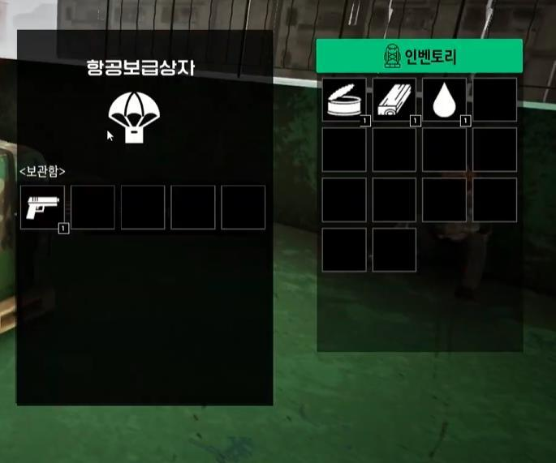

# KZG | 인벤토리·아이템·컨테이너·UMG

[프로젝트 개요](README.md) · [건설·시간·세션](survival-and-session.md)

## 1. 아이템 규칙과 슬롯 상태 분리



기존 프로젝트 자료의 ItemData 화면입니다. 필드 정의와 보유 수량을 분리하는 구조를 설명하기 위한 자료입니다.

| 데이터 | 보관 내용 | 역할 |
|---|---|---|
| `FItemStruct` | 이름·설명, 아이템 클래스, 사용 효과, Stack Size, Thumbnail | 아이템 종류에 공통인 규칙 |
| `ItemData` DataTable | 아이템별 정의 행 | Item ID로 참조할 규칙 데이터 |
| `FSlotStruct` | Item ID, Quantity | 특정 인벤토리 슬롯에 들어 있는 상태 |

예를 들어 같은 물 아이템이 플레이어와 보급 상자에 들어 있어도, 설명·썸네일 같은 정의는 공유하고 수량은 각 슬롯에 보관합니다. UI와 아이템 사용 로직은 이 정의와 상태를 조합해서 동작합니다. 이는 구조 설명을 위한 예시이며 실제 아이템 밸런스 수치를 임의로 제시하지 않습니다.

## 2. AC_Inventory에 공통 동작 모으기

`Content/DEV/JJH/Inventory/AC_Inventory.uasset`에는 다음 역할의 함수와 이벤트가 있습니다.

| 함수·이벤트 | 담당 동작 |
|---|---|
| `FindSlot` | 기존 슬롯 탐색 |
| `AddToStack` | 기존 스택에 수량 추가 |
| `CreateNewStack` | 새로운 슬롯 스택 구성 |
| `AddToInventory` | 아이템 획득 처리 진입점 |
| `TransferSlots` | 슬롯 사이 이동 처리 |
| `ConsumeItem` | 아이템 사용·소비 처리 |
| 제거·드롭 함수군 | 일부/전체 수량 제거와 월드 드롭 |
| `OnInventoryUpdate` | 변경 후 화면 갱신 알림 |

컴포넌트를 Player·Box·Loot Box·Airdrop Box에 적용해 보관 주체는 달라도 같은 슬롯 규격과 처리 함수를 사용합니다. 각 액터에 로직을 복제하기보다 공통 컴포넌트를 재사용하는 것이 이 구조의 핵심입니다.

## 3. 데이터 변경과 표시 분리

```text
아이템 획득 / 슬롯 이동 / 사용 / 드롭
    ↓
AC_Inventory의 공통 처리
    ↓
슬롯 상태 변경 + OnInventoryUpdate
    ↓
WB_InventoryGrid → WB_InventorySlot 표시 갱신
```

위 도식은 주요 책임 관계를 요약한 것입니다. 네트워크 호출 순서나 모든 예외 분기의 완전한 실행 그래프는 아닙니다.

- `WB_InventoryGrid`: 변경 이벤트를 받아 슬롯 위젯을 갱신합니다.
- `WB_InventorySlot`: 슬롯 데이터 표시와 Drag & Drop 조작을 담당합니다.
- `WB_ActionMenu`: 사용·하나 버리기·전체 버리기를 공통 처리 함수에 연결합니다.
- `BP_DragDropInventory`, `WB_Drag`: 드래그 중 전달되는 슬롯 정보와 시각 표현에 사용합니다.

이벤트를 경계로 두면 슬롯 변경 로직과 UMG 표현의 책임을 구분해서 읽을 수 있습니다. 이벤트 사용만으로 프레임 성능이 개선됐다고 주장하지는 않습니다.

## 4. 플레이어와 컨테이너 사이 이동



플레이어와 항공보급상자 화면입니다. 화면 전체는 팀 플레이 결과이며, 본인 담당은 인벤토리 컴포넌트와 컨테이너 UI·슬롯 처리 연결입니다.

컨테이너는 보관 기능을 제공하는 액터와 표시할 UMG를 조합합니다. `BP_Box`, `BP_lootbox`, `BP_AirdropBox`에서 공통 인벤토리를 사용하며, 슬롯 이동은 `TransferSlots`와 갱신 이벤트에 연결합니다.

확인한 조작 범위는 슬롯 이동, 아이템 사용, 일부/전체 버리기입니다. 동시 접근 시 충돌 해결, 모든 네트워크 조건의 수량 보존, 서버 권한 검증이 완결됐다고 확대하지 않습니다.

## 5. 아이템 효과 연동

사용 가능한 아이템은 데이터의 효과 정의와 효과 Blueprint를 연결합니다. `Inventory/items/Effects`에는 허기·스태미나·회복·아이템 생성 관련 효과 자산이 있습니다.

본인 기여는 **아이템 사용에서 해당 효과를 호출하고 소비·UI로 연결하는 부분**입니다. 캐릭터의 허기·스태미나 핵심 C++ 시스템 전체를 단독 구현한 것은 아닙니다.

## 6. 대상 탐색과 피드백

상호작용은 대상 종류에 따라 UI가 달라도 공통 진입점을 사용할 수 있도록 구성했습니다.

1. Line/Sphere Trace로 대상을 찾습니다.
2. `Interact_interface`의 `InteractWith`를 상호작용 진입점으로 사용합니다.
3. Custom Depth와 `M_OutLine`으로 대상의 윤곽선을 표시합니다.
4. `WB_DisplayMessage`로 입력 안내·결과 메시지를 표시합니다.
5. 해당 액터의 인벤토리 또는 시설물 기능에 진입합니다.


