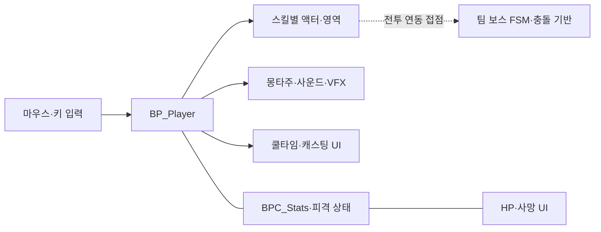

# LostArk 모작 | 플레이어 전투 상세 설명

[프로젝트 개요](README.md) · [시연 영상](https://youtu.be/kG_SeeEKs6A) · [전체 프로젝트 목록](../../README.md)

**마우스로 목표를 정하고, 스킬의 준비·실행·후속 상태를 화면 피드백과 연결한 플레이어 전투 작업**입니다. 제 담당은 Blueprint 중심의 플레이어 기능이며, 보스·하우징 C++와 전체 장면은 팀 구현입니다.

*플레이어 스킬·HP·피해 수치와 팀 보스·맵이 함께 보이는 기존 시연 화면입니다.*

## 목차

- [1. 담당 범위와 구조](#scope)
- [2. 마우스 조작·이동·회피](#input)
- [3. 스킬별 구성](#skills)
- [4. 쿨타임·캐스팅·애니메이션](#casting)
- [5. HP·피격·사망·피해 표시](#feedback)
- [6. 팀 보스와 하우징](#team)
- [7. 변경 이력으로 보는 보완 과정](#iteration)
- [8. 원본 파일과 확인 범위](#evidence)

## 1. 담당 범위와 구조

Unreal Engine 5.2 기반 팀 프로젝트입니다. 기존 포트폴리오의 `플레이어 담당` 기록과 본인의 Git 변경 이력을 함께 기준으로 삼았습니다.

| 구성 | 역할 | 기여 구분 |
|---|---|---|
| `BP_Player` | 공격 방향·위치, 스킬 입력·상태, 캐스팅·피격·사망 | 본인 플레이어 담당 중심, 팀 통합 수정 포함 |
| 스킬별 Actor Blueprint | 공격 영역·타격·시각 효과 구성 | 본인 플레이어 스킬 작업 |
| `BPC_Stats` | 체력과 감소 처리, 플레이어 상태 데이터 | 본인 작업 이력 확인 |
| `WB_Player`, HP·캐스팅·피해 위젯 | 스킬 상태와 전투 결과 표시 | 본인 작업 이력 확인 |
| `BP_TopDownController` | Top Down 이동 입력 기반과 상태 연동 | 엔진 템플릿 기반 + 프로젝트 수정 |
| `ABoss`, `UBossFSM`, 하우징 클래스 | 보스 전투·오브젝트 배치·결과 전달 | 팀 C++ 구현 |

주요 책임·참조 관계를 요약한 도식입니다. 실제 Blueprint 실행 순서를 옮긴 것은 아니며, 점선의 팀 보스 연동은 전체 그래프·런타임 검증이 추가로 필요한 접점입니다.

## 2. 마우스 조작·이동·회피

### 마우스 위치를 전투 목표로 사용

아이소메트릭 화면에서는 캐릭터의 이동 방향과 스킬을 사용할 위치를 플레이어가 쉽게 지정할 수 있어야 합니다. 캐릭터 쪽에는 커서 히트 결과와 회전 계산, 위치 지정 스킬의 영역 액터를 사용하는 구성이 있습니다.

- 2023-06-28~29: 좌클릭 시 시선 방향 처리 작업.
- 2023-07-03: 스킬 입력 시 마우스 위치의 범위 표시·공격, 스킬 회전 작업.
- `BP_Player`에서 `GetHitResultUnderCursorByChannel`, `FindLookAtRotation`, `K2_SetActorRotation` 및 위치·영역 액터 참조를 확인했습니다.

이 경험의 핵심은 **화면의 커서 위치를 캐릭터 회전과 스킬 목표로 연결한 것**입니다. 엔진의 히트 테스트 기능을 활용한 구현이며 별도의 경로 탐색 알고리즘을 제작한 것은 아닙니다.

### 이동 기반과 회피

`BP_TopDownController`에는 `IA_SetDestination_Click/Touch`, `CachedDestination`, `SimpleMoveToLocation`, `AddMovementInput`, `StopMovement`가 있습니다. Top Down 입력 기반 위에 플레이어 전투 상태와 이동 제한을 연동한 프로젝트입니다.

설정에는 SpaceBar의 `Teleport`, X의 `Flash` 입력이 등록되어 있고, 플레이어에는 해당 입력 이벤트와 `spaceCooldown`, `escapeCooldown`, `LaunchCharacter` 등의 상태·호출이 남아 있습니다. 6월 30일 순간이동, 7월 17일 탈출기 작업 이력도 확인했습니다.

입력 이름만으로 무적 시간·이동 거리·모든 키의 최종 스킬 배치를 확정하지는 않습니다.

## 3. 스킬별 구성

플레이어 캐릭터가 입력과 사용 상태를 맡고, 개별 액터가 영역·타격·효과를 구성하는 방식입니다. 아래 이름은 플레이어 자산의 주석·참조와 스킬 자산, 작성 이력을 함께 확인한 항목입니다.

| 스킬 | 주요 구성 | 세부 내용 |
|---|---|---|
| 블레이즈 | `BP_Blaze`, `BP_Blazeunder`, `AM_Blaze1` | 플레이어가 스킬 관련 액터·몽타주를 각각 참조하고 쿨타임 상태를 가짐. `BP_Blaze`에 Overlap·데미지 최소/최대값·`ApplyDamage` 참조가 있음 |
| 아이스 애로우 | `BP_IceArrowArea`, `BP_IceArrowmesh`, `AM_icearrow` | 영역·메시 관련 자산을 각각 참조. 플레이어에 `IceArrowSpawnActor`, `icearrowrefresh`, 쿨타임 상태가 있음 |
| 종말의 날 | `BP_MeteorArea`, `BP_meteorcast`, `BP_Meteor`, `BP_MeteorMesh` | 영역·캐스팅·메시 관련 자산을 각각 참조. 플레이어의 `MeteorFall`, 캐스팅 위젯·몽타주 참조와 대응 |
| 천벌 | `BP_Thunder`, `BP_Thunder2`, `BP_Thunder3`, `AM_Thunder` | 여러 스킬 액터·캐스팅 위젯·사운드를 참조. 7월 20일 이펙트·메인 UI 작업 이력이 있음 |
| 익스플로전 | `BP_Explosion`, `Explosion_Montage`, `WB_ExplosionCasting` | 캐스팅 진행 화면과 공격 액터를 구분. 액터에는 Sphere Overlap·데미지 범위·효과 참조가 있음 |
| 리액트 | `BP_React/2/3`, `BP_Reactattack` 계열 | 플레이어가 리액트 관련 자산을 각각 참조하고 공격 자산에 Overlap·데미지 값이 있음. 7월 12일 스킬 및 7월 20일 데미지·사운드 작업 이력이 있음 |
| 돌풍 | `BP_DolPoong`, `BP_Dolpoongvfx`, `AM_Dolpoong` | 공격·VFX 관련 액터를 각각 참조하며 `BP_DolPoong`에 카운터용 충돌 요소가 있음. 플레이어 주석은 `돌풍(카운터)`로 구분 |

이외에 `BP_PlayerAttack`은 기본 공격 액터입니다. Box Overlap, 공격 최소·최대값, 난수 함수와 `ApplyDamage` 참조를 포함합니다.

### 타격과 효과의 구분

블레이즈·익스플로전·메테오·리액트·천벌 등의 공격 액터에는 충돌 이벤트와 데미지 관련 값이 있고, 플레이어는 몽타주·사운드·VFX를 별도로 참조합니다. 문서에서는 이 자산·속성을 **판정 관련 요소, 피해 관련 값, 시각·청각 표현**으로 나누어 설명합니다. 별도 자산의 존재만으로 실행 순서나 완전한 설계 분리를 단정하지 않습니다.

개별 스킬의 정확한 히트 횟수·크리티컬 확률·수치 밸런스는 이번 정적 확인만으로 재현하지 않았습니다. `_2`, `_3` 같은 자산 변형의 수를 실제 연타 수로 해석하지 않습니다.

## 4. 쿨타임·캐스팅·애니메이션

### 사용 가능 상태와 UI

스킬은 입력을 받았다고 매번 다시 실행되는 기능이 아니라, 실행 가능 상태와 화면 표시를 함께 관리해야 합니다. `BP_Player`에는 `blazeCool`, `icearrowcool`, `meteorcool`, `Thundercool`, `explosioncool`, `reactcool`, `dolpoongcool`과 대응 수치가 있습니다.

`WB_Player`에도 스킬별 아이콘·쿨타임·수치 바인딩이 있습니다. 예를 들어 `blazeimage`, `blazefunc`, `blazecool`, `blazenum`처럼 같은 스킬의 상태와 표시 항목을 구분합니다. 7월 17일 쿨타임·딜레이 작업 이력이 이 구성을 뒷받침합니다.

여기서의 재사용 대기 관리와 UMG 바인딩은 Blueprint 중심 구현입니다. GAS나 데이터 기반 공통 어빌리티 프레임워크를 사용했다고 소개하지 않습니다.

### 캐스팅 진행과 취소

캐스팅 스킬은 준비 중이라는 정보를 보여 주고, 이동·취소 상황을 처리해야 합니다.

| 구성 | 확인한 역할·근거 |
|---|---|
| `iscasting`, `canclecasting`, `castingmoved` | 플레이어의 캐스팅·취소·이동 관련 상태 |
| `explosioncasting`, `meteorcastiong`, `Thundercasting` | 스킬별 캐스팅 이벤트·상태 이름 |
| `WB_ExplosionCasting`, `WB_meteorcasting`, `WB_Thundercasting` | 스킬별 준비 과정 표시 위젯 |
| `SetPercent`, `RemoveFromParent` | 익스플로전 캐스팅 위젯의 진행 표시·제거 호출 |
| 2023-07-18 변경 | `캐스팅, 캐스팅 캔슬` 작업 기록 |

`StopAnimMontage`, `StopMovementImmediately`도 플레이어 자산에서 확인했습니다. 다만 모든 취소 분기가 어떤 순서로 상태를 복구하는지는 실행 그래프·실기기 검증이 추가로 필요한 영역입니다.

### 몽타주와 리타기팅

6월 30일 리타기팅, 7월 6일·18일 애니메이션 작업 이력이 있습니다. 플레이어는 스킬별 Montage와 `PlayMontageCallbackProxy`의 완료·중단·Notify 콜백을 참조합니다. 스킬 동작, 효과·사운드와 캐릭터 상태를 맞추는 작업으로 정리할 수 있습니다.

`ABP_Player`에는 속도·Idle/Move·Slot 구성이 있습니다. 애니메이션 자산 원본 제작과 엔진의 리타기팅 기능 개발을 개인 성과로 주장하지 않습니다.

## 5. HP·피격·사망·피해 표시

### 스탯과 피격 상태

`BPC_Stats`에는 체력·최대 체력, `DecreaseHealth`, 사망 상태 및 HP 위젯 관련 값이 있습니다. `BP_Player`에는 `ReceiveAnyDamage`, 해당 컴포넌트, 피격·사망 애니메이션, `WB_HP`, `WB_Die` 참조가 있습니다.

HP 감소를 숫자만 바꾸는 작업으로 끝내지 않고, 플레이어의 피격 반응·이동 제한·사망 표시와 연결한 것이 담당 범위입니다. 7월 7일 HP, 7월 13일 경직과 사망 시 이동 제한, 7월 17일 사망 관련 버그 수정 이력이 있습니다.

### 전투 UI의 역할 분리

| 위젯·액터 | 화면에서 전달하는 정보 |
|---|---|
| `WB_Player` | 스킬 아이콘과 쿨타임·수치, 플레이어 상태 |
| `WB_HP` | HP 표시. 캐릭터 상단 체력바 작업은 6월 29일 이력으로도 확인 |
| 캐스팅 위젯 3종 | 준비 중인 스킬의 진행도 |
| `BP_Dmg`, `WB_damage`, `WB_damage_2` | 피해 수치와 크리티컬 관련 시각 표현 |
| `WB_Die` | `토벌 실패`, 시작 지점 이동 안내 문구와 화면 애니메이션 |

`BP_Dmg`에는 WidgetComponent, `damagetext`, `critical`, Timeline·보간 값이 있고, 피해 위젯에는 텍스트 설정·색상·애니메이션·제거 호출이 있습니다. 타격 결과를 읽기 쉬운 숫자와 움직임으로 표현하는 구성입니다.

사망 위젯의 안내 문구만으로 실제 재시작·레벨 복구 로직을 증명하지는 않습니다. 피해 표시와 실제 피해 계산 역시 서로 다른 책임으로 구분합니다.

## 6. 팀 보스와 하우징

아래 내용은 프로젝트 전체를 이해하기 위한 **팀 구현 설명**입니다. 제 개인 구현 목록에는 포함하지 않습니다.

### 보스 전투 기반

`ABoss`는 `UBossFSM`, 무기 및 여러 Box·Sphere 피해 영역, 카운터 충돌체를 구성합니다. `UBossFSM` C++에서는 Idle·Move·Attack01/02·SkillAttack01/02·Counter·Groggy 처리를 확인했습니다. 상태 목록에 SkillAttack03/04·Die도 있지만 해당 C++ 함수 본문은 비어 있습니다.

공유 충돌 프로필과 자산 참조가 플레이어·보스의 연동 접점을 보여 줍니다. 실제 피해 전달·HP·사망 분기를 확정하려면 보스와 플레이어 Blueprint 실행 그래프를 함께 확인해야 합니다.

플레이어 스킬 자산에는 `EnemyAttack`, `Counterattack` 이름도 있으나, 이를 동일 이름의 C++ 함수라고 해석하지 않습니다. 보스 Blueprint와 C++ 상태·충돌 기반을 함께 사용하는 프로젝트입니다.

### 하우징 기능

| 기능 | 팀 C++에서 확인한 구현 |
|---|---|
| 오브젝트 목록 | `FObjData`·DataTable을 읽고 4열·8칸 선택 UI에 데이터 전달 |
| 생성·배치 | 선택 클래스 이름과 등록 Actor 클래스를 대조해 생성. 커서 역투영·LineTrace로 이동 |
| 배치 제한 | 벽걸이/바닥 조건과 겹침 상태를 검사하고 머티리얼 색으로 피드백 |
| 기존 오브젝트 편집 | 선택·이동 재개·삭제, 일반 20°·미세 5° 회전 |
| 결과 장면 전달 | 클래스 이름·위치·회전을 GameInstance 배열에 모으고 결과 GameMode에서 재생성 |

마지막 항목은 실행 중 메모리 기반 데이터 전달입니다. 파일 저장·재실행 복구·관계형 데이터베이스 기능이 아닙니다. 데이터 수집·재생성 함수의 실제 호출 시점은 Blueprint 연동에 맡겨져 있습니다.

영상의 보스 등장·전투 결과 시네마틱은 팀 결과로 소개합니다. C++의 대화·카메라 마커 골격만으로 시네마틱 시스템 전체가 확인됐다고 확대하지 않습니다.

## 7. 변경 이력으로 보는 보완 과정

| 날짜 | 본인 작업 기록 | 연결되는 기술 주제 |
|---|---|---|
| 2023-06-28~30 | 좌클릭 방향·상단 HP·순간이동·리타기팅 | 기본 조작과 캐릭터 표현 |
| 2023-07-03~07 | 위치 지정 공격·스킬 회전·투사체·충돌·HP | 스킬 입력에서 실제 타격까지 연결 |
| 2023-07-13 | 경직, 사망 시 움직임 제한 | 피격·사망 관련 이동 처리 보완 |
| 2023-07-17 | 스킬 쿨·딜레이·탈출기·사망 버그 수정 | 재사용 대기와 상태 전환 보완 |
| 2023-07-18 | 캐스팅·캐스팅 취소 | 준비 동작을 중단할 때의 처리 |
| 2023-07-20 | 나이아가라·사운드·리액트 피해, 천벌 효과·메인 UI | 스킬 결과와 시각·청각 피드백 연결 |
| 2023-07-30 | 데미지, 데미지 버그 수정 | 피해 처리·표시 후속 보완 |

기능 추가와 함께 **피격·사망 관련 이동 처리, 재사용 대기, 캐스팅 취소 동작을 반복 보완한 개발 기록**입니다. 커밋 제목은 작업 의도의 근거이며, 모든 재현 조건에서 해결됐다는 회귀 테스트 결과를 뜻하지 않습니다.

## 8. 원본 파일과 확인 범위

아래 경로는 원본 Unreal 프로젝트 기준입니다. 이 문서 저장소에 해당 소스·에셋을 배포한다는 의미는 아닙니다.

| 읽을 부분 | 원본 상대 경로 |
|---|---|
| 엔진·입력 | `LostArk.uproject`, `Config/DefaultInput.ini` |
| 플레이어 | `Content/JH/Blueprints/BP_Player.uasset` |
| 이동 입력 기반 | `Content/TopDown/Blueprints/BP_TopDownController.uasset` |
| 스탯·기본 공격 | `Content/JH/Blueprints/BPC_Stats.uasset`, `Content/JH/Blueprints/BP_PlayerAttack.uasset` |
| 스킬 예시 | `Content/JH/Blueprints/BP_Blaze.uasset`, `Content/JH/Blueprints/BP_Meteor.uasset`, `Content/JH/Blueprints/BP_DolPoong.uasset` |
| 애니메이션 | `Content/JH/Animations/ABP_Player.uasset`, `Content/JH/Animations/RTG_Player.uasset` |
| 전투 UI | `Content/JH/Blueprints/WB_Player.uasset`, `Content/JH/Blueprints/WB_HP.uasset`, `Content/JH/Blueprints/WB_Die.uasset` |
| 캐스팅·피해 표시 | `Content/JH/Blueprints/WB_ExplosionCasting.uasset`, `Content/JH/Blueprints/BP_Dmg.uasset`, `Content/JH/Blueprints/WB_damage.uasset` |
| 팀 보스 | `Source/LostArk/Private/Boss.cpp`, `Source/LostArk/Private/BossFSM.cpp` |
| 팀 하우징·UI | `Source/LostArk/Private/HousingGameMode.cpp`, `Source/LostArk/Private/AssignObj.cpp`, `Source/LostArk/Private/AssignSettingUI.cpp` |
| 팀 결과 전달 | `Source/LostArk/Private/LostArkGameInstance.cpp`, `Source/LostArk/Private/EndCinemaGameMode.cpp` |

### 이번 문서의 확인 기준

- 기존 공개 시연·역할 기록, 원본 C++·설정, Blueprint의 직렬화된 함수·속성·주석·참조와 Git 이력을 교차 확인했습니다.
- Blueprint 실행 핀 전체를 해석한 것은 아니며, 자산 참조만으로 세부 실행 순서·완료 상태를 단정하지 않았습니다.
- 현재 플레이어 파일에는 미커밋 변경이 있고 일부 후속 작업은 다른 참조에 남아 있어, 현재 파일과 과거 커밋의 상태를 구분했습니다.
- 최신 빌드·플레이 테스트 및 정량 성능 측정은 수행하지 않았습니다. 원본 자산·효과·음원과 팀 코드의 소유권은 별개입니다.

[← 프로젝트 개요](README.md) · [전체 프로젝트 목록](../../README.md)
