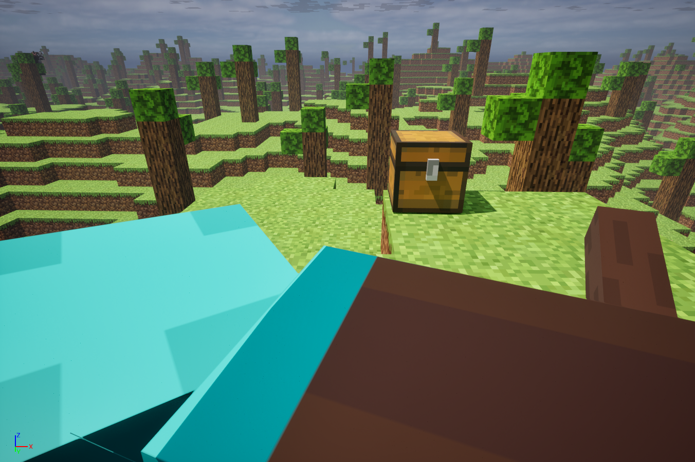
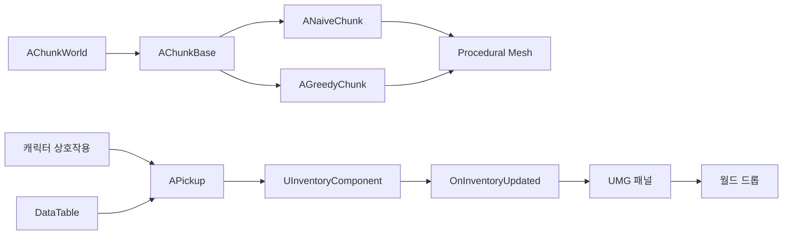
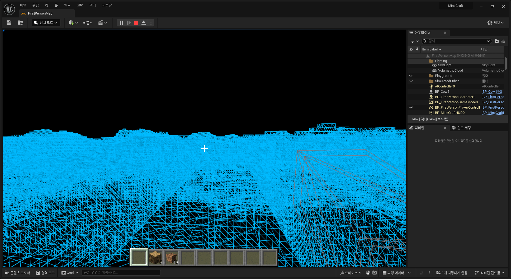
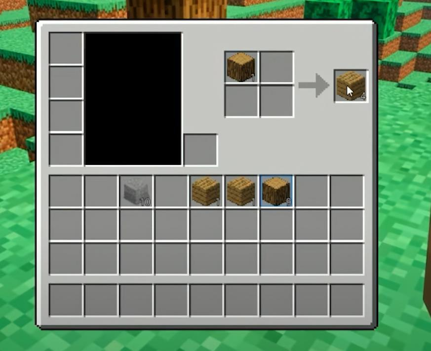
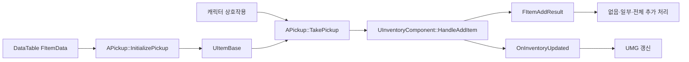

# Minecraft 모작 — Unreal Engine 복셀 샌드박스 | 상세 설명

[← 전체 프로젝트 목록](../../README.md)

프로젝트 소개부터 기능별 구현과 검증 범위까지 한 페이지에서 읽을 수 있도록 정리했습니다.

## 목차

- [프로젝트 소개·역할·전체 기능](#section-1)
- [복셀 월드와 Greedy Meshing](#section-2)
- [아이템·인벤토리·UMG](#section-3)

---

<a id="section-1"></a>

## 프로젝트 소개·역할·전체 기능

청크 기반 지형 생성, Greedy Meshing, 런타임 블록 수정과 아이템·인벤토리 UI를 C++ 중심으로 구현한 1인 프로젝트입니다.



*프로젝트의 실제 복셀 월드 실행 화면입니다. Minecraft를 참고한 학습용 모작이며 Mojang Studios 또는 Microsoft와 관련이 없습니다.*

### 프로젝트 정보

| 항목 | 내용 |
|---|---|
| 개발 형태 | 1인 개인 프로젝트 |
| 장르 | 1인칭 복셀 샌드박스 |
| 환경 | Unreal Engine 5, C++, Blueprint |
| 주요 기술 | FastNoiseLite, Procedural Mesh, Greedy Meshing, DataTable, UMG, Enhanced Input |
| 본인 구현 | 복셀 월드·메시 생성, 런타임 블록 수정, 상호작용, 아이템·인벤토리·UI |
| 시연 | [Minecraft 모작 영상](https://youtu.be/L7N0lZDtYAo) |

개발 기간은 확인 가능한 근거가 부족해 기재하지 않았습니다. 원본 소스의 공개 링크는 별도로 제공하지 않습니다. 이 문서의 경로는 원래 Unreal 프로젝트 루트 기준입니다.

### 주요 구현

- FastNoiseLite의 Perlin Noise·fBm을 2D 높이 또는 3D 밀도로 해석하여 청크의 블록 배열을 생성했습니다.
- `AChunkBase`에 공통 생성·메시 적용 흐름을 두고 `ANaiveChunk`와 `AGreedyChunk`를 분리했습니다.
- 가시 면 마스크에서 블록 종류와 법선이 같은 연속 영역을 하나의 Quad로 병합했습니다.
- `ModifyVoxel`에서 블록 배열을 수정한 뒤 해당 청크의 메시 데이터를 다시 생성·적용했습니다.
- DataTable 아이템 정의와 `UItemBase` 런타임 상태, `UInventoryComponent`의 스택·슬롯 처리를 연결했습니다.
- 인벤토리 변경 델리게이트로 UMG를 갱신하고, 드래그한 아이템을 월드 Pickup으로 드롭하는 C++ 경로를 구현했습니다.

### 구조



월드·메시와 아이템·UI는 서로 다른 책임을 가진 흐름입니다. 영상에 보이는 모든 제작·상자 기능을 위 C++ 경로 하나로 구현했다고 단정하지 않습니다. 별도 Blueprint 인벤토리 자산과 C++ 구현이 공존합니다.

### 상세 문서

- [복셀 월드와 Greedy Meshing](voxel-world.md): 청크 생성, 블록 배열, 가시 면 병합, 메시 갱신, 좌표·경계의 한계
- [아이템·인벤토리·UMG](inventory-ui.md): DataTable과 런타임 모델, 스택 추가 결과, 델리게이트 갱신, 드래그·드롭

### 구현 상태

| 확인한 구현 | 아직 완료하지 않은 확장 |
|---|---|
| 시작 시 설정 범위의 청크 생성 | 플레이어 위치 기반 스트리밍·생성 큐·청크 풀링 |
| Naive·Greedy 메시 생성 | 동일 조건의 정량 성능 비교 |
| 블록 수정 후 청크 전체 메시 재생성 | Dirty 영역 갱신·비동기 메시 생성 |
| C++ 아이템·인벤토리·UMG 경로 | 별도 Blueprint 경로와의 완전한 단일화 검증 |
| 전용 서버 빌드 타깃 구성 | 서버 권한형 블록·인벤토리 동기화 |
| 실행 중 월드 변경 | Seed·수정 Delta 기반 복셀 월드 Save/Load |

나아질 수 있는 구조와 실제 완료 상태를 구분합니다. 성능 배수·FPS 보장, 청크 경계 완전 해결, 네트워크 완성 등의 표현은 사용하지 않습니다.

---

<a id="section-2"></a>

## 복셀 월드와 Greedy Meshing

[프로젝트 개요](README.md) · [아이템·인벤토리·UMG](inventory-ui.md)

### 청크 단위로 데이터를 관리하는 구조

각 블록을 독립 Actor로 만드는 대신 `TArray<EBlock>`에 블록 종류를 저장하고 청크 단위로 메시를 생성합니다. 월드 배치, 블록 데이터, 메시 생성 결과를 구분하여 Naive·Greedy 구현이 공통 적용 경로를 사용하도록 했습니다.

| 구성 요소 | 역할 | 원본 프로젝트의 상대 경로 |
|---|---|---|
| `AChunkWorld` | 청크 배치, 생성 방식과 크기·재질 전달 | `Source/MineCraft/World/Worlds/ChunkWorld.cpp` |
| `AChunkBase` | 초기화·데이터 생성·메시 생성·적용 순서 | `Source/MineCraft/World/Chunk/ChunkBase.cpp` |
| `ANaiveChunk` | 가시 면을 개별 Quad로 만드는 기준 방식 | `Source/MineCraft/World/Chunk/NaiveChunk.cpp` |
| `AGreedyChunk` | 지형 데이터와 연속 면 병합 | `Source/MineCraft/World/Chunk/GreedyChunk.cpp` |
| `FChunkMeshData` | 정점·삼각형·법선·UV·색 데이터 | `Source/MineCraft/World/Util/ChunkMeshData.h` |
| `UVoxelFunctionLibrary` | 월드·청크·로컬 복셀 좌표 변환 | `Source/MineCraft/Player/VoxelFunctionLibrary.cpp` |

#### 초기 생성 순서

`AChunkWorld::BeginPlay`는 `GenerationType`에 따라 2D 또는 3D 생성 함수를 호출합니다. 반복문 안에서 `SpawnActorDeferred`로 청크를 만들고 `Size`, `Frequency`, `Material`, `GenerationType`을 설정한 뒤 `FinishSpawningActor`를 호출합니다.

여기서 Deferred Spawn은 생성 전 속성을 주입하는 방식입니다. 작업 스레드에서 청크를 비동기 생성하거나 프레임별 생성량을 나누는 스트리밍 기능을 뜻하지 않습니다. 현재는 시작 시 설정 범위를 동기적으로 생성합니다.

`AChunkBase`의 공통 순서는 다음과 같습니다.

```text
Noise 설정
  → Setup: 블록 저장 공간 준비
  → GenerateHeightMap: 2D/3D 데이터 생성
  → GenerateMesh: Naive 또는 Greedy 메시 구성
  → ApplyMesh: Procedural Mesh Section에 반영
```

### Noise를 블록으로 변환

FastNoiseLite를 Perlin Noise·fBm으로 설정합니다. 청크 위치를 블록 단위로 변환한 오프셋과 청크 내부 좌표를 더해 Noise를 샘플링합니다.

| 생성 방식 | 현재 데이터 해석 |
|---|---|
| 2D 높이 | X/Y Noise를 청크 높이 범위로 변환하고 Stone·Dirt·Grass·Air의 층을 배치 |
| 3D 밀도 | X/Y/Z Noise가 0 이상이면 Air, 음수이면 Stone으로 설정 |

블록 저장 인덱스는 `Z * Size * Size + X * Size + Y`입니다. 공간 좌표를 1차원 배열로 변환하며, 각 축의 유효 범위는 청크 크기 안으로 제한합니다.

현재 Greedy 청크에는 나무·석탄을 확률적으로 추가하는 경로도 있습니다. 해당 경로는 `FMath` 난수를 사용하므로 Noise 설정만 같다고 전체 월드의 나무·자원 배치까지 항상 동일하다고 보장하지 않습니다. 난수 시드와 생성 조건을 통제한 재현성 검증은 후속 범위입니다.

### Naive와 Greedy의 차이

두 방식 모두 이웃 블록을 검사해 숨은 면을 제외합니다. Greedy만 숨은 면을 제거하는 것은 아닙니다.

| 방식 | 메시 생성 단위 |
|---|---|
| Naive | 노출된 블록 면마다 Quad 생성 |
| Greedy | 노출된 면 중 블록 종류와 법선이 같은 직사각형 영역을 하나의 Quad로 병합 |

따라서 Greedy의 추가 작업은 남은 가시 면의 연속 영역을 찾는 것입니다. 블록 종류가 다르거나 법선 방향이 다르면 같은 평면에 있어도 병합하지 않습니다.

### Greedy Meshing 처리 과정



*실제 프로젝트의 메시 디버그 화면입니다. 알고리즘 구조를 설명하기 위한 자료이며 Naive 대비 성능 향상 수치를 보여주는 전후 비교는 아닙니다.*

#### 1. 축별 가시 면 마스크

X/Y/Z 중 하나를 주축으로 선택하고 나머지 두 축으로 2D 마스크를 구성합니다. 현재 블록과 주축 방향의 이웃 블록을 비교합니다.

| 현재 블록 / 이웃 블록 | 마스크 |
|---|---|
| 둘 다 Air 또는 둘 다 불투명 | 면 없음 |
| 현재만 불투명 | 현재 블록 종류와 양의 법선 |
| 이웃만 불투명 | 이웃 블록 종류와 음의 법선 |

소스는 `Air`가 아닌 블록을 불투명으로 취급합니다. 투명 블록과 반투명 재질 사이의 면 처리까지 일반화한 구현은 아닙니다.

#### 2. 폭과 높이 확장

유효한 마스크에서 시작해 같은 `Block`·`Normal`을 가진 항목만 가로로 확장합니다. 이후 구한 폭 전체가 다음 행에서도 같은지 검사하며 세로로 확장합니다. `CompareMask`가 블록 종류와 법선의 일치를 판단합니다.

#### 3. Quad 생성과 마스크 제거

찾은 직사각형의 네 모서리로 정점 4개와 삼각형 2개를 추가합니다. 법선 방향에 맞게 인덱스 순서를 구성하고 처리한 영역을 마스크에서 지운 뒤 다음 영역을 찾습니다.

`CreateQuad`에서는 다음 데이터를 함께 만듭니다.

- 블록 단위 좌표를 Unreal 좌표로 변환한 정점
- 앞·뒤 방향을 구분하는 삼각형 인덱스
- 법선
- 병합한 폭·높이에 대응하는 UV
- 블록·면 방향의 텍스처 인덱스를 담은 Vertex Color Alpha

이론상 넓은 동일 평면에서는 생성 Quad 수가 줄어들 수 있지만, 현재 문서에는 같은 지형·빌드·하드웨어에서 측정한 전후 수치를 싣지 않았습니다.

### 런타임 블록 수정

`AChunkBase::ModifyVoxel`은 청크 내부 좌표의 유효 범위를 먼저 검사합니다. 유효하면 블록 데이터를 수정하고 전체 메시 데이터를 비운 뒤 다시 생성·적용합니다.

```text
ModifyVoxel(청크 내부 좌표, 블록 종류)
  → ModifyVoxelData
  → ClearMesh
  → GenerateMesh
  → ApplyMesh
```

이 경로는 수정한 블록을 화면에 즉시 반영하기 위한 단순한 구조입니다. 수정 부분의 메시만 교체하는 Dirty 영역 갱신이 아니라 해당 청크 전체 재생성입니다.

`UVoxelFunctionLibrary`는 월드 좌표에서 블록·청크·로컬 좌표를 계산합니다. 음수 좌표 보정 코드가 있지만 정확한 음수 경계에서도 올바르다는 회귀 검증이 완료된 것은 아닙니다. 특히 정수 나눗셈 뒤 음수 축을 추가 보정하는 방식이므로 원점과 청크 경계에 대한 테스트가 필요합니다.

### 현재 한계와 다음 검증

| 현재 상태 | 후속 작업 |
|---|---|
| `GetBlock`이 청크 밖을 Air로 반환 | 이웃 청크 데이터 조회, 경계 블록 변경 시 인접 청크 갱신 |
| 시작 시 고정 범위 동기 생성 | 플레이어 위치 기반 로딩·언로딩과 생성 예산 관리 |
| 수정 청크 전체 메시 재생성 | Dirty 영역 분리와 비동기 생성 가능성 검토 |
| 음수 좌표 보정 존재 | 원점·음수 블록·정확한 청크 경계 사례 테스트 |
| 실행 중 월드 데이터 | Seed와 수정 복셀 Delta의 저장·복원 설계 |
| 알고리즘 구현·디버그 화면 | 같은 입력에서 생성 시간·정점·삼각형·프레임 비용 비교 |

예를 들어 성능을 비교하려면 Noise뿐 아니라 나무·자원 난수, 청크 수·크기, 재질·충돌 설정, 빌드 모드도 같아야 합니다. 이 조건의 벤치마크를 새로 수행하기 전에는 최적화 배수나 FPS 보장으로 표현하지 않습니다.

---

<a id="section-3"></a>

## 아이템·인벤토리·UMG

[프로젝트 개요](README.md) · [복셀 월드와 Greedy Meshing](voxel-world.md)

### 설명 범위

이 문서는 C++ 소스에서 확인되는 아이템·인벤토리 경로를 설명합니다. 프로젝트에는 별도 Blueprint 인벤토리·제작·보관함 자산도 있습니다. 시연의 모든 UI가 아래 C++ 경로 하나로 동작한다고 단정하지 않습니다.



*기존 포트폴리오에서 추출한 실제 실행 UI입니다. 화면의 존재와 각 C++ 클래스의 연결 검증은 구분합니다.*

### 데이터 정의와 런타임 상태 분리

`FItemData`를 DataTable 행으로 두고 표시 정보, 스택 규칙, 아이콘·메시 등의 데이터를 관리합니다. `UItemBase`는 실행 중 아이템 인스턴스와 수량, 소유 인벤토리를 담당합니다.

| 데이터 | 주요 내용 | 목적 |
|---|---|---|
| `FItemData` | ID, 블록·아이템 분류 | 공통 아이템 정의 |
| `FItemStatistics` | 방어·공격·회복 수치 | 아이템 속성 |
| `FItemTextData` | 이름·설명·상호작용·사용 문구 | 화면 표시 |
| `FItemNumericData` | 최대 스택, 스택 가능 여부 | 수량 규칙 |
| `FItemAssetData` | 아이콘, Static Mesh | UI·월드 표현 |
| `UItemBase` | 수량, 복사·Pickup 상태, `OwningInventory` | 실행 중 상태 |

데이터 정의와 실행 상태를 구분하면 월드 Pickup과 UI가 같은 아이템 정보를 참고할 수 있습니다. 다만 현재 구조체에 사용·전투 속성이 정의되어 있다는 사실과 각 아이템의 사용 효과 구현 완료는 별개입니다. 현재 기본 `UItemBase::Use`는 비어 있으므로 모든 소비·장비 효과를 완료한 것으로 설명하지 않습니다.

### 획득 흐름



`APickup::InitializePickup`은 행 ID로 DataTable을 조회하고 `UItemBase`에 데이터를 채웁니다. 월드 메시와 상호작용 이름·수량·아이콘도 같은 정의를 사용합니다.

`TakePickup`은 인벤토리의 추가 결과를 보고 반응합니다.

| 추가 결과 | Pickup 측 처리 |
|---|---|
| 추가 없음 | 월드 아이템 유지 |
| 일부 추가 | 남은 수량과 상호작용 표시 갱신 |
| 전체 추가 | 월드 Pickup 제거 |

추가 성공 여부를 단순 Boolean 대신 실제 추가 수량과 결과 종류로 돌려주어 월드 표현을 갱신할 수 있게 했습니다.

### 스택과 슬롯 처리

`HandleAddItem`은 스택 가능 여부에 따라 경로를 나눕니다.

1. 스택 불가 아이템은 빈 슬롯이 있는지 확인한 뒤 한 개를 추가합니다.
2. 스택 가능 아이템은 같은 ID의 미완성 스택을 먼저 찾습니다.
3. 기존 스택의 남은 용량만큼 채우고 잔여 수량을 계산합니다.
4. 잔여 수량이 있고 슬롯이 남으면 새 아이템 인스턴스를 추가합니다.
5. 추가한 수량에 따라 없음·일부·전체 결과를 반환합니다.

#### 큰 수량을 추가할 때의 한계

현재 잔여 수량은 새 스택 하나를 만드는 경로로 전달되며, 여러 빈 슬롯에 반복 분배하는 루프는 없습니다. `UItemBase::SetQuantity`는 최대 스택으로 수량을 제한합니다. 이 둘을 함께 보면 큰 잔여 수량을 추가할 때 실제 저장 수량과 “전체 추가” 반환값의 일치 여부를 검증해야 합니다.

따라서 “모든 수량과 슬롯 조합을 완전히 처리한다”는 표현은 사용하지 않습니다. 다음 검증에는 최대 스택을 넘는 입력, 기존 부분 스택 여러 개, 남은 슬롯 하나, 가득 찬 인벤토리 등을 포함해야 합니다.

### 델리게이트 기반 UI 갱신

`UInventoryComponent`는 데이터 변경 후 `OnInventoryUpdated`를 방송합니다. 패널은 초기화 시 이 이벤트에 `RefreshInventory`를 등록합니다.

```text
아이템 추가·제거·분리
  → InventoryContents 변경
  → OnInventoryUpdated
  → UInventroyPanel::RefreshInventory
  → 슬롯 재생성·용량 표시 갱신
```

원본 클래스명은 `UInventroyPanel`입니다. 현재 패널 갱신은 기존 자식을 지운 뒤 전체 아이템의 슬롯 위젯을 다시 만드는 방식입니다. 데이터 측에서 UMG의 구체적인 위젯 함수를 호출하지 않도록 분리했지만, UI를 부분 갱신하거나 위젯을 풀링하는 최적화는 완료한 기능이 아닙니다.

`UInventoryItemSlot`은 아이콘과 수량을 표시하고 툴팁을 연결합니다. 드래그 시작 시 `UItemDragDropOperation`에 원본 아이템과 소유 인벤토리를 전달하며 전용 드래그 시각 요소를 만듭니다.

### 상호작용과 월드 드롭

캐릭터는 일정 간격으로 시점 방향의 Line Trace를 실행하고 `IInteractionInterface` 구현 여부를 확인합니다. 현재 소스의 기본 검사 간격은 0.1초, 거리는 225cm입니다. 이 값은 구현 설정이며 최적값으로 검증한 성능 수치는 아닙니다.

상호작용 데이터에는 이름·행동 문구·수량·아이콘·소요 시간이 포함됩니다. 즉시 처리와 Timer를 사용하는 지연 처리를 같은 인터페이스 경로에서 구분합니다.

드롭은 `UMainMenu::NativeOnDrop`에서 캐릭터의 `DropItem`을 호출하는 C++ 경로로 확인할 수 있습니다. 캐릭터는 소유 인벤토리의 아이템인지 확인하고 수량을 제거한 뒤 앞쪽 위치에 `APickup`을 생성하여 드롭 정보를 전달합니다. 임의의 모든 UI 영역이 같은 방식으로 아이템을 떨어뜨린다고 일반화하지 않습니다.

### 클래스·파일 근거

모든 경로는 원래 Unreal 프로젝트 루트 기준입니다.

| 파일 | 확인한 책임 |
|---|---|
| `Source/MineCraft/Data/ItemDataStructs.h` | DataTable 행과 데이터 그룹 |
| `Source/MineCraft/Items/ItemBase.h`·`.cpp` | 런타임 아이템, 수량 제한, 복사·소유권 |
| `Source/MineCraft/Components/InventoryComponent.h`·`.cpp` | 스택·슬롯·추가 결과·델리게이트 |
| `Source/MineCraft/World/Pickup.cpp` | DataTable 초기화, 획득 결과, 월드 표시 |
| `Source/MineCraft/Interfaces/InteractionInterface.h` | 상호작용 데이터와 호출 계약 |
| `Source/MineCraft/MineCraftCharacter.cpp` | Trace·상호작용·Timer·월드 드롭 |
| `Source/MineCraft/UserInterfaces/InventroyPanel.cpp` | 이벤트 구독과 슬롯 전체 재구성 |
| `Source/MineCraft/UserInterfaces/InventoryItemSlot.cpp` | 아이콘·수량·툴팁·드래그 |
| `Source/MineCraft/UserInterfaces/ItemDragDropOperation.h` | 드래그 아이템·원본 인벤토리 전달 |
| `Source/MineCraft/UserInterfaces/MainMenu.cpp` | 메뉴 드롭을 캐릭터 월드 드롭에 연결 |

### 추가로 필요한 검증

- 큰 잔여 수량의 여러 슬롯 분배와 실제 추가 수량 반환값을 일치시키는 처리
- DataTable 행 누락·잘못된 DragDrop Operation 등 유효하지 않은 입력 검사
- `UItemBase` 복사 시 필요한 속성이 모두 유지되는지 확인
- 이벤트 중복 방송·전체 위젯 재생성 비용 측정
- 별도 Blueprint 인벤토리·제작·상자 경로와 C++ 경로의 역할 정리
- 서버 권한형 아이템 획득·드롭·인벤토리 동기화

전용 서버 타깃이나 별도 저장 관련 자산이 존재한다는 이유만으로 멀티플레이 인벤토리, 복셀 월드 영구 저장, 모든 UI 경로의 통합을 완료했다고 기재하지 않습니다.

---

[← 전체 프로젝트 목록](../../README.md)
