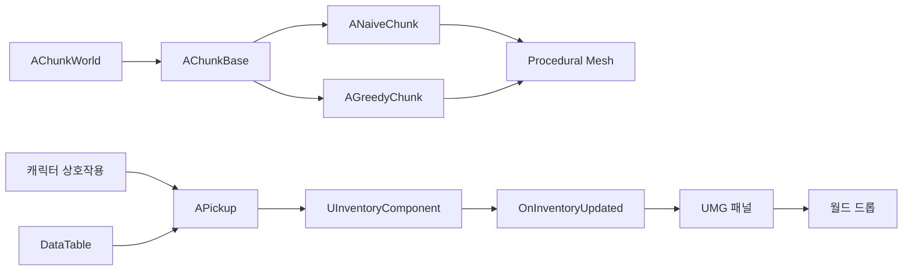

# Minecraft 모작 — Unreal Engine 복셀 샌드박스

청크 기반 지형 생성, Greedy Meshing, 런타임 블록 수정과 아이템·인벤토리 UI를 C++ 중심으로 구현한 1인 프로젝트입니다.

*프로젝트의 실제 복셀 월드 실행 화면입니다. Minecraft를 참고한 학습용 모작이며 Mojang Studios 또는 Microsoft와 관련이 없습니다.*

## 프로젝트 정보

| 항목 | 내용 |
|---|---|
| 개발 형태 | 1인 개인 프로젝트 |
| 장르 | 1인칭 복셀 샌드박스 |
| 환경 | Unreal Engine 5, C++, Blueprint |
| 주요 기술 | FastNoiseLite, Procedural Mesh, Greedy Meshing, DataTable, UMG, Enhanced Input |
| 본인 구현 | 복셀 월드·메시 생성, 런타임 블록 수정, 상호작용, 아이템·인벤토리·UI |
| 시연 | [Minecraft 모작 영상](https://youtu.be/L7N0lZDtYAo) |

개발 기간은 확인 가능한 근거가 부족해 기재하지 않았습니다. 원본 소스의 공개 링크는 별도로 제공하지 않습니다. 이 문서의 경로는 원래 Unreal 프로젝트 루트 기준입니다.

## 주요 구현

- FastNoiseLite의 Perlin Noise·fBm을 2D 높이 또는 3D 밀도로 해석하여 청크의 블록 배열을 생성했습니다.
- `AChunkBase`에 공통 생성·메시 적용 흐름을 두고 `ANaiveChunk`와 `AGreedyChunk`를 분리했습니다.
- 가시 면 마스크에서 블록 종류와 법선이 같은 연속 영역을 하나의 Quad로 병합했습니다.
- `ModifyVoxel`에서 블록 배열을 수정한 뒤 해당 청크의 메시 데이터를 다시 생성·적용했습니다.
- DataTable 아이템 정의와 `UItemBase` 런타임 상태, `UInventoryComponent`의 스택·슬롯 처리를 연결했습니다.
- 인벤토리 변경 델리게이트로 UMG를 갱신하고, 드래그한 아이템을 월드 Pickup으로 드롭하는 C++ 경로를 구현했습니다.

## 구조

월드·메시와 아이템·UI는 서로 다른 책임을 가진 흐름입니다. 영상에 보이는 모든 제작·상자 기능을 위 C++ 경로 하나로 구현했다고 단정하지 않습니다. 별도 Blueprint 인벤토리 자산과 C++ 구현이 공존합니다.

## 상세 문서

- [복셀 월드와 Greedy Meshing](voxel-world.md): 청크 생성, 블록 배열, 가시 면 병합, 메시 갱신, 좌표·경계의 한계
- [아이템·인벤토리·UMG](inventory-ui.md): DataTable과 런타임 모델, 스택 추가 결과, 델리게이트 갱신, 드래그·드롭

## 구현 상태

| 확인한 구현 | 아직 완료하지 않은 확장 |
|---|---|
| 시작 시 설정 범위의 청크 생성 | 플레이어 위치 기반 스트리밍·생성 큐·청크 풀링 |
| Naive·Greedy 메시 생성 | 동일 조건의 정량 성능 비교 |
| 블록 수정 후 청크 전체 메시 재생성 | Dirty 영역 갱신·비동기 메시 생성 |
| C++ 아이템·인벤토리·UMG 경로 | 별도 Blueprint 경로와의 완전한 단일화 검증 |
| 전용 서버 빌드 타깃 구성 | 서버 권한형 블록·인벤토리 동기화 |
| 실행 중 월드 변경 | Seed·수정 Delta 기반 복셀 월드 Save/Load |

나아질 수 있는 구조와 실제 완료 상태를 구분합니다. 성능 배수·FPS 보장, 청크 경계 완전 해결, 네트워크 완성 등의 표현은 사용하지 않습니다.
