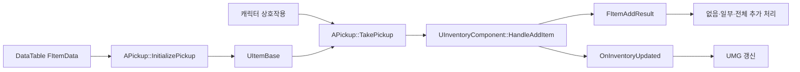

# 아이템·인벤토리·UMG

[프로젝트 개요](README.md) · [복셀 월드와 Greedy Meshing](voxel-world.md)

## 설명 범위

이 문서는 C++ 소스에서 확인되는 아이템·인벤토리 경로를 설명합니다. 프로젝트에는 별도 Blueprint 인벤토리·제작·보관함 자산도 있습니다. 시연의 모든 UI가 아래 C++ 경로 하나로 동작한다고 단정하지 않습니다.


*기존 포트폴리오에서 추출한 실제 실행 UI입니다. 화면의 존재와 각 C++ 클래스의 연결 검증은 구분합니다.*

## 데이터 정의와 런타임 상태 분리

`FItemData`를 DataTable 행으로 두고 표시 정보, 스택 규칙, 아이콘·메시 등의 데이터를 관리합니다. `UItemBase`는 실행 중 아이템 인스턴스와 수량, 소유 인벤토리를 담당합니다.

| 데이터 | 주요 내용 | 목적 |
|---|---|---|
| `FItemData` | ID, 블록·아이템 분류 | 공통 아이템 정의 |
| `FItemStatistics` | 방어·공격·회복 수치 | 아이템 속성 |
| `FItemTextData` | 이름·설명·상호작용·사용 문구 | 화면 표시 |
| `FItemNumericData` | 최대 스택, 스택 가능 여부 | 수량 규칙 |
| `FItemAssetData` | 아이콘, Static Mesh | UI·월드 표현 |
| `UItemBase` | 수량, 복사·Pickup 상태, `OwningInventory` | 실행 중 상태 |

데이터 정의와 실행 상태를 구분하면 월드 Pickup과 UI가 같은 아이템 정보를 참고할 수 있습니다. 다만 현재 구조체에 사용·전투 속성이 정의되어 있다는 사실과 각 아이템의 사용 효과 구현 완료는 별개입니다. 현재 기본 `UItemBase::Use`는 비어 있으므로 모든 소비·장비 효과를 완료한 것으로 설명하지 않습니다.

## 획득 흐름



`APickup::InitializePickup`은 행 ID로 DataTable을 조회하고 `UItemBase`에 데이터를 채웁니다. 월드 메시와 상호작용 이름·수량·아이콘도 같은 정의를 사용합니다.

`TakePickup`은 인벤토리의 추가 결과를 보고 반응합니다.

| 추가 결과 | Pickup 측 처리 |
|---|---|
| 추가 없음 | 월드 아이템 유지 |
| 일부 추가 | 남은 수량과 상호작용 표시 갱신 |
| 전체 추가 | 월드 Pickup 제거 |

추가 성공 여부를 단순 Boolean 대신 실제 추가 수량과 결과 종류로 돌려주어 월드 표현을 갱신할 수 있게 했습니다.

## 스택과 슬롯 처리

`HandleAddItem`은 스택 가능 여부에 따라 경로를 나눕니다.

1. 스택 불가 아이템은 빈 슬롯이 있는지 확인한 뒤 한 개를 추가합니다.
2. 스택 가능 아이템은 같은 ID의 미완성 스택을 먼저 찾습니다.
3. 기존 스택의 남은 용량만큼 채우고 잔여 수량을 계산합니다.
4. 잔여 수량이 있고 슬롯이 남으면 새 아이템 인스턴스를 추가합니다.
5. 추가한 수량에 따라 없음·일부·전체 결과를 반환합니다.

### 큰 수량을 추가할 때의 한계

현재 잔여 수량은 새 스택 하나를 만드는 경로로 전달되며, 여러 빈 슬롯에 반복 분배하는 루프는 없습니다. `UItemBase::SetQuantity`는 최대 스택으로 수량을 제한합니다. 이 둘을 함께 보면 큰 잔여 수량을 추가할 때 실제 저장 수량과 “전체 추가” 반환값의 일치 여부를 검증해야 합니다.

따라서 “모든 수량과 슬롯 조합을 완전히 처리한다”는 표현은 사용하지 않습니다. 다음 검증에는 최대 스택을 넘는 입력, 기존 부분 스택 여러 개, 남은 슬롯 하나, 가득 찬 인벤토리 등을 포함해야 합니다.

## 델리게이트 기반 UI 갱신

`UInventoryComponent`는 데이터 변경 후 `OnInventoryUpdated`를 방송합니다. 패널은 초기화 시 이 이벤트에 `RefreshInventory`를 등록합니다.

```text
아이템 추가·제거·분리
  → InventoryContents 변경
  → OnInventoryUpdated
  → UInventroyPanel::RefreshInventory
  → 슬롯 재생성·용량 표시 갱신
```

원본 클래스명은 `UInventroyPanel`입니다. 현재 패널 갱신은 기존 자식을 지운 뒤 전체 아이템의 슬롯 위젯을 다시 만드는 방식입니다. 데이터 측에서 UMG의 구체적인 위젯 함수를 호출하지 않도록 분리했지만, UI를 부분 갱신하거나 위젯을 풀링하는 최적화는 완료한 기능이 아닙니다.

`UInventoryItemSlot`은 아이콘과 수량을 표시하고 툴팁을 연결합니다. 드래그 시작 시 `UItemDragDropOperation`에 원본 아이템과 소유 인벤토리를 전달하며 전용 드래그 시각 요소를 만듭니다.

## 상호작용과 월드 드롭

캐릭터는 일정 간격으로 시점 방향의 Line Trace를 실행하고 `IInteractionInterface` 구현 여부를 확인합니다. 현재 소스의 기본 검사 간격은 0.1초, 거리는 225cm입니다. 이 값은 구현 설정이며 최적값으로 검증한 성능 수치는 아닙니다.

상호작용 데이터에는 이름·행동 문구·수량·아이콘·소요 시간이 포함됩니다. 즉시 처리와 Timer를 사용하는 지연 처리를 같은 인터페이스 경로에서 구분합니다.

드롭은 `UMainMenu::NativeOnDrop`에서 캐릭터의 `DropItem`을 호출하는 C++ 경로로 확인할 수 있습니다. 캐릭터는 소유 인벤토리의 아이템인지 확인하고 수량을 제거한 뒤 앞쪽 위치에 `APickup`을 생성하여 드롭 정보를 전달합니다. 임의의 모든 UI 영역이 같은 방식으로 아이템을 떨어뜨린다고 일반화하지 않습니다.

## 클래스·파일 근거

모든 경로는 원래 Unreal 프로젝트 루트 기준입니다.

| 파일 | 확인한 책임 |
|---|---|
| `Source/MineCraft/Data/ItemDataStructs.h` | DataTable 행과 데이터 그룹 |
| `Source/MineCraft/Items/ItemBase.h`·`.cpp` | 런타임 아이템, 수량 제한, 복사·소유권 |
| `Source/MineCraft/Components/InventoryComponent.h`·`.cpp` | 스택·슬롯·추가 결과·델리게이트 |
| `Source/MineCraft/World/Pickup.cpp` | DataTable 초기화, 획득 결과, 월드 표시 |
| `Source/MineCraft/Interfaces/InteractionInterface.h` | 상호작용 데이터와 호출 계약 |
| `Source/MineCraft/MineCraftCharacter.cpp` | Trace·상호작용·Timer·월드 드롭 |
| `Source/MineCraft/UserInterfaces/InventroyPanel.cpp` | 이벤트 구독과 슬롯 전체 재구성 |
| `Source/MineCraft/UserInterfaces/InventoryItemSlot.cpp` | 아이콘·수량·툴팁·드래그 |
| `Source/MineCraft/UserInterfaces/ItemDragDropOperation.h` | 드래그 아이템·원본 인벤토리 전달 |
| `Source/MineCraft/UserInterfaces/MainMenu.cpp` | 메뉴 드롭을 캐릭터 월드 드롭에 연결 |

## 추가로 필요한 검증

- 큰 잔여 수량의 여러 슬롯 분배와 실제 추가 수량 반환값을 일치시키는 처리
- DataTable 행 누락·잘못된 DragDrop Operation 등 유효하지 않은 입력 검사
- `UItemBase` 복사 시 필요한 속성이 모두 유지되는지 확인
- 이벤트 중복 방송·전체 위젯 재생성 비용 측정
- 별도 Blueprint 인벤토리·제작·상자 경로와 C++ 경로의 역할 정리
- 서버 권한형 아이템 획득·드롭·인벤토리 동기화

전용 서버 타깃이나 별도 저장 관련 자산이 존재한다는 이유만으로 멀티플레이 인벤토리, 복셀 월드 영구 저장, 모든 UI 경로의 통합을 완료했다고 기재하지 않습니다.
