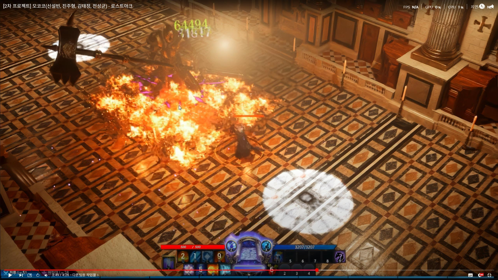

# LostArk 모작 — 플레이어 전투

원본 프로젝트 분석을 반영한 상세 문서는 아래 페이지로 확장했습니다. 이 주소는 기존 링크를 위한 영상 요약으로 남겨 둡니다.

**[소스 분석 기반 프로젝트 상세 설명 →](../lostark-clone/DETAILS.md)** · [프로젝트 개요](../lostark-clone/README.md)

> 비상업적 학습용 모작 프로젝트입니다. 원작 IP와 상표의 권리는 각 권리자에게 있습니다.

[시연 영상 보기](https://youtu.be/kG_SeeEKs6A)

*보스 전투 시연 화면입니다. 플레이어 기능은 본인 담당 기록에 포함되며, 보스·맵·시네마틱과 전체 화면은 팀 결과입니다.*

## 개요

하우징 조작과 아이소메트릭 보스 전투를 한 흐름에서 시연한 학습용 프로젝트입니다. 영상에서는 오브젝트 조작, 플레이어 스킬과 피격, 피해 수치·전투 효과, 보스 등장 및 결과 연출을 확인할 수 있습니다.

## 역할

과거 기여 기록에서 확인되는 본인 역할은 **플레이어 담당**입니다.

- 스킬 사용 조건과 플레이어 피격 상태 구성
- 피해 수치 표시와 전투 효과를 플레이어·보스전 흐름에 연결

## 영상에서 확인되는 기능

| 기능 | 기여 구분 |
|---|---|
| 오브젝트 선택·이동·회전·회수 하우징 | 팀 결과 |
| 스킬 슬롯·체력·피해 수치가 표시되는 보스 전투 | 본인 플레이어 기능이 포함된 팀 결과 |
| 보스 등장과 전투 결과 카메라 컷·시네마틱 | 팀 결과 |

## 근거와 상세 문서

- 공개 근거: 위 시연 영상과 과거 포트폴리오의 `플레이어 담당` 기록
- 원본 C++·설정, Blueprint의 함수·속성·참조와 Git 작성 이력을 추가 확인했습니다. 스킬별 구성·쿨타임·캐스팅·피격·UI 및 팀 연동은 [확장한 상세 설명](../lostark-clone/DETAILS.md)에 정리했습니다.
- 하우징·보스·시네마틱을 본인 단독 구현으로 표현하지 않습니다.
- 정량 성능, 네트워크 구현, 사용 에셋의 제작 소유권은 확인되지 않았습니다.
