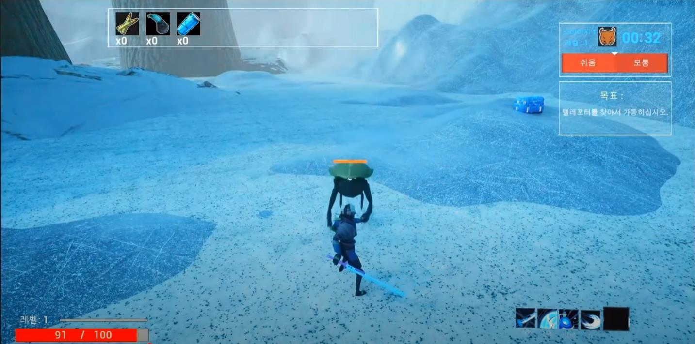

# Risk of Risk — 전투·목표 진행 프로토타입

> `Risk of Rain 2`를 참고한 비상업적 학습용 모작 프로젝트입니다. 원작 IP와 상표의 권리는 각 권리자에게 있습니다.

[시연 영상 보기](https://youtu.be/wRpARYSkSx0)

*필드 전투 시연 화면입니다. 적·보스 AI, 게임 시스템과 UI는 본인 담당 기록에 포함되며, 전체 장면은 팀 결과입니다.*

## 개요

캐릭터·스킬과 난이도를 선택한 뒤 설원 필드에서 적을 상대하고, 아이템을 획득하며 텔레포터 목표와 보스전으로 진행하는 프로토타입입니다.

## 역할

과거 기여 기록에서 확인되는 본인 역할은 **적·보스 AI, 게임 시스템, UI 담당**입니다.

- 적·보스 전투를 플레이 진행에 연결
- 상자 개방·아이템 획득과 텔레포터 목표 구성에 참여
- 체력·스킬 HUD를 전투 상태와 연결

여기서 AI는 생성형 AI가 아니라 게임 내 적·보스 행동을 뜻합니다.

## 영상에서 확인되는 기능

- 캐릭터·스킬 구성과 난이도 선택 후 필드로 이어지는 시작 흐름
- 적 전투, 상자 개방과 아이템 획득, 텔레포터 목표 진행
- 추적 레이저와 원형 범위 공격을 사용하는 보스
- 체력·스킬 HUD와 최대 체력 변화

## 근거와 한계

- 공개 근거: 위 시연 영상과 과거 포트폴리오의 역할 기록
- 프로젝트 소스를 별도로 감사하지 않아 AI 상태 구조, HP Component 내부 설계나 구체 알고리즘은 기재하지 않았습니다.
- 영상만으로 시간에 따른 난이도 상승, 스테이지 완료 조건이나 전체 게임 밸런스를 단정하지 않습니다.
- 정량 성능·AI 품질·네트워크 동작은 검증되지 않았습니다.
