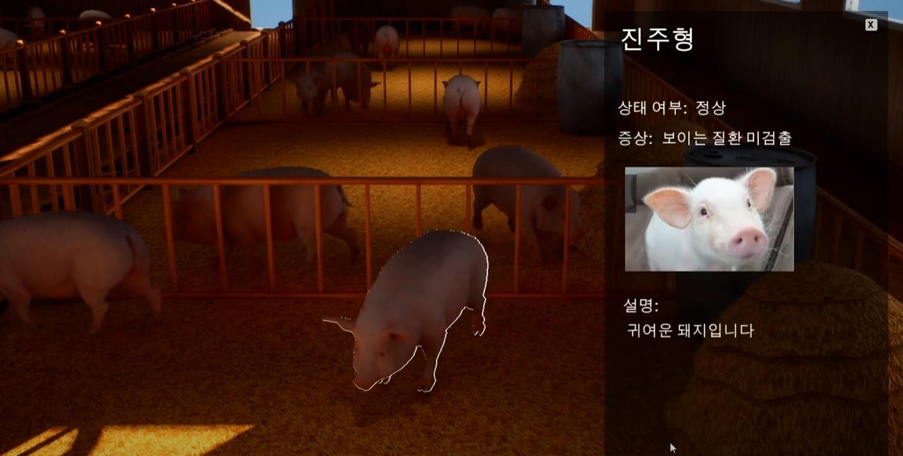

# 슬기로운 돼지 키우기 — 검사 결과 UI 프로토타입

[시연 영상 보기](https://www.youtube.com/watch?v=-oQ2TOpFXZE)

*돼지 개체 선택과 검사 결과를 보여주는 프로토타입 화면입니다. 카메라·UI 연결은 본인 담당이며, 화면의 검사 결과는 실제 의료 진단 성능을 의미하지 않습니다.*

## 개요

여러 축사 시점에서 돼지를 탐색하고 개체를 선택한 뒤, 검사 요청과 진행 상태를 거쳐 정상·비정상 상태와 의심 질환 정보를 보여주는 **2박 3일 프로토타입**입니다.

## 역할

과거 기여 기록에서 확인되는 본인 역할은 **카메라·UI 담당**입니다.

- 축사 시점 전환으로 개체를 탐색하는 카메라 흐름 구성
- 아웃라인·이름으로 선택 개체를 구분하는 UI 연결
- 검사 요청, 개체별 로딩 상태와 결과 패널을 하나의 사용자 흐름으로 연결

## 영상에서 확인되는 기능

- 여러 축사 시점 전환과 돼지 탐색
- 아웃라인·이름을 이용한 선택 개체 표시
- 검사 요청과 개체별 로딩 진행 상태
- 정상·비정상 상태, 의심 질환, 참고 이미지와 설명을 표시하는 결과 패널

## 근거와 한계

- 공개 근거: 위 시연 영상과 과거 포트폴리오의 `카메라·UI 담당` 기록
- 프로젝트 소스를 별도로 감사하지 않아 검사 데이터의 생성 방식이나 내부 알고리즘은 기재하지 않았습니다.
- 실시간 AI 질병 진단, 의료적 정확도와 현장 적용을 주장하지 않습니다.
- 제한된 기간의 UI 프로토타입이며 상용 서비스·의료기기로 표현하지 않습니다.
