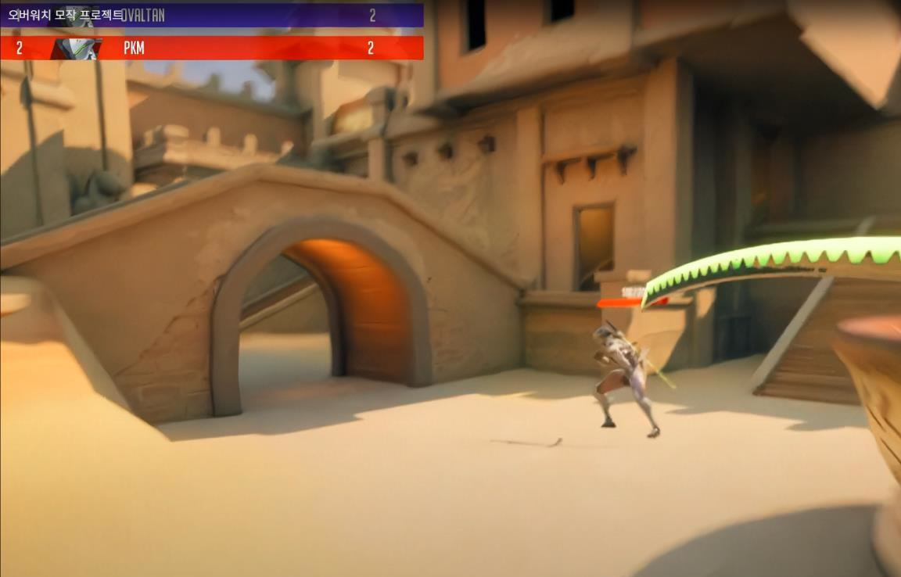
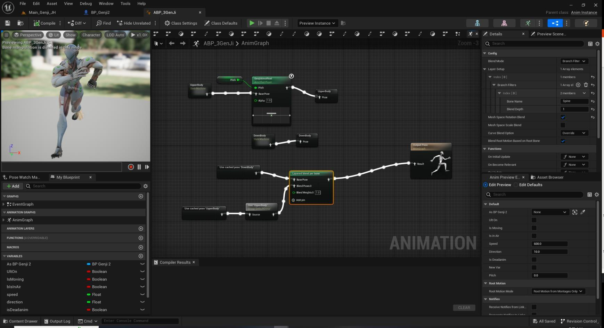
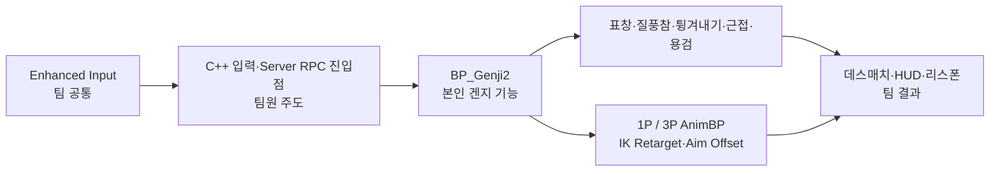

# 오버워치 모작 — 겐지 전투·애니메이션 | 상세 설명

[← 전체 프로젝트 목록](../../README.md)

프로젝트 소개부터 기능별 구현과 검증 범위까지 한 페이지에서 읽을 수 있도록 정리했습니다.

## 목차

- [프로젝트 소개·역할·전체 기능](#section-1)
- [겐지 기능 상세](#section-2)

---

## 프로젝트 소개·역할·전체 기능

> 비상업적 학습 목적으로 제작한 팀 프로젝트입니다. 원작 `Overwatch`와 캐릭터·상표의 권리는 Blizzard Entertainment에 있습니다.

[시연 영상 보기](https://youtu.be/fYp8vJ2BdDE)

*시연 영상의 겐지 플레이 장면입니다. 겐지 기능에는 본인 기여가 포함되며, 맵·HUD·공통 네트워크 흐름은 팀 결과입니다.*

### 프로젝트 개요

| 항목 | 내용 |
|---|---|
| 개발 기간 | 2023.08 |
| 구성 | 7인 팀 프로젝트 |
| 개발 당시 엔진 | Unreal Engine 5.2 |
| 본인 역할 | 겐지 전투 기능, 1인칭·3인칭 애니메이션 구성, 팀 네트워크 기반과의 연동 |
| 팀 결과 | Listen Server 기반 겐지·트레이서 데스매치 프로토타입 |

Blueprint로 겐지의 표창·질풍참·튕겨내기·근접 공격·용검을 구성하고, 별도의 1인칭·3인칭 Animation Blueprint와 IK Retargeter를 전투 상태에 연결했습니다. 공통 C++ 캐릭터와 Server RPC·Replication 기반은 팀원이 주도했으며, 본인은 그 진입점에 겐지 Blueprint 이벤트와 일부 상태를 연동했습니다.

### 핵심 기여

- 좌·우클릭 표창, 질풍참, 튕겨내기, 근접 공격과 용검의 시작·공격·종료 흐름 구성
- `PlayerAttack`, `DashCollision`, `ReflectCollision`, `pyochang` 등 스킬별 충돌 규칙을 겐지 기능에 연결
- 1인칭 `ABP_Genji`와 3인칭 `ABP_3GenJi`를 분리하고 IK Retargeter, Blend Space, Aim Offset, Montage를 조합
- 팀의 입력·Server RPC·Replication 기반에 겐지 스킬 이벤트와 일부 전투 상태 연동

*겐지 애니메이션 구성 화면입니다. 원본 애니메이션 제작이 아니라 리타기팅, 상태머신·블렌딩 구성과 전투 기능 연결이 본인 기여입니다.*

### 구현 근거

공개 저장소 기준 상대 경로만 표기합니다.

- 겐지 중심 Blueprint: `Content/JJH/blueprint/BP_Genji2.uasset`
- 표창: `Content/JJH/blueprint/BP_Pyochang.uasset` 및 좌·우 투사체 변형
- 튕겨내기: `Content/JJH/blueprint/Reflect.uasset`, `Content/JJH/blueprint/TracerReflect.uasset`
- 1인칭·3인칭 AnimBP: `Content/JJH/Animation/ABP_Genji.uasset`, `Content/JJH/Animation/ABP_3GenJi.uasset`
- IK: `Content/JJH/Retarget/IK_Genji.uasset`, `Content/JJH/Retarget/IK_3Genji.uasset`, `Content/JJH/Retarget/NewIKRetargeter.uasset`
- Aim Offset: `Content/JJH/Animation/GenjiAimoffset.uasset`
- 충돌 프로필: `Config/DefaultEngine.ini`
- 팀 공통 입력·RPC 기반: `Source/OValTan/OValTanCharacter.h`, `Source/OValTan/OValTanCharacter.cpp`

스킬별 흐름과 소유권 구분은 [겐지 기능 상세](GENJI_FEATURES.md)에 정리했습니다.

### 시연 구간

| 구간 | 확인할 수 있는 내용 | 구분 |
|---|---|---|
| 00:37–03:44 | 겐지 1인칭 조작과 전투 스킬 | 본인 핵심 기여가 포함된 장면 |
| 03:45–04:35 | 트레이서 조작과 스킬 | 팀원 기여 |
| 04:36–07:08 | 겐지·트레이서 대전, HUD·점수·사망·리스폰 | 본인 기능이 포함된 팀 결과 |
| 07:09–07:23 | 경기 종료 연출 | 팀 결과 |

### 기여 범위와 한계

- 본인 구현으로 설명하는 범위는 겐지 Blueprint 전투, 애니메이션 리타기팅·상태 구성, 스킬별 충돌 연결과 팀 네트워크 기반 연동입니다.
- 트레이서 기능, 공통 C++ 캐릭터, PlayerController·GameState, 로비·세션과 공통 UI는 팀원이 주도했습니다.
- 모든 전투 상태가 완전한 서버 권위 구조로 검증됐다고 주장하지 않습니다.
- 지연·동기화·성능의 정량 측정 기록은 없으며, 상용 수준 네트워크 완성도를 의미하지 않습니다.
- Blueprint 자산은 바이너리이므로 자산 경로, 작성 이력, 설정과 시연 영상을 함께 근거로 사용했습니다.

---

## 겐지 기능 상세

이 문서는 오버워치 모작 프로젝트에서 본인이 담당한 겐지 전투·애니메이션과 팀 공통 기반의 경계를 설명합니다. [전체 시연 영상](https://youtu.be/fYp8vJ2BdDE)에서 00:37–03:44는 겐지 조작과 스킬, 04:36–07:08은 팀 데스매치 결과를 확인할 수 있습니다.

### 구조와 기여 경계

- **본인:** 겐지 스킬 Blueprint, 겐지 투사체·반사 자산, 스킬별 충돌 연결, 1인칭·3인칭 애니메이션 구성
- **팀원 주도:** 공통 C++ 캐릭터, 입력과 Server RPC·Replication 기반, PlayerController·GameState, 로비·세션, 트레이서
- **협업 결과:** 겐지와 트레이서가 대결하는 Listen Server 데스매치와 HUD·점수·사망·리스폰 흐름

### 1. 표창 — 좌·우클릭 공격

`BP_Genji2`에서 좌·우 공격 입력을 서로 다른 표창 발사 흐름에 연결하고, 표창 Blueprint의 Overlap 결과를 피격·피해·킬 흐름에 연결했습니다. 투사체와 캐릭터 이동·다른 공격 판정이 불필요하게 간섭하지 않도록 표창용 충돌 프로필을 사용했습니다.

**근거 자산**

- `Content/JJH/blueprint/BP_Genji2.uasset`
- `Content/JJH/blueprint/BP_Pyochang.uasset`
- `Content/JJH/blueprint/BP_PyochangLeft.uasset`
- `Content/JJH/blueprint/BP_PyochangRight.uasset`
- `Config/DefaultEngine.ini`의 `pyochang`·`pyochangCollision`

**설명 범위**

좌·우클릭 표창의 발사 방식과 충돌·피격 연결은 설명할 수 있지만, 모든 판정이 서버 권위 방식으로 완결됐거나 지연 환경에서 검증됐다고 단정하지 않습니다.

### 2. 질풍참 — 이동과 공격 판정 분리

전방으로 빠르게 이동하며 피해를 주는 질풍참을 겐지 전투 흐름에 연결했습니다. 대시 이동과 일반 캐릭터·표창·반사 판정이 서로 간섭하지 않도록 `DashCollision` 프로필을 분리해 사용했습니다.

**근거 자산**

- `Content/JJH/blueprint/BP_Genji2.uasset`
- `Config/DefaultEngine.ini`의 `DashCollision`

**설명 범위**

대시 위치와 이동 길이를 포함한 일부 상태가 팀의 복제 흐름에 연결돼 있지만, 네트워크 예측·보간이나 서버 재조정까지 완성했다는 의미는 아닙니다.

### 3. 튕겨내기 — 투사체 유형별 반사

반사 전용 충돌 영역에서 겐지 표창과 트레이서 투사체를 구분하고, 각 투사체의 방향과 판정이 바뀌도록 구성했습니다. 캐릭터별로 다른 투사체를 하나의 겐지 방어 기능에서 처리해야 했던 협업 지점입니다.

**근거 자산**

- `Content/JJH/blueprint/Reflect.uasset`
- `Content/JJH/blueprint/TracerReflect.uasset`
- `Content/JJH/blueprint/BP_Pyochang.uasset`
- `Config/DefaultEngine.ini`의 `ReflectCollision`·`reflectCollision`

**기여 구분**

겐지의 반사 처리와 트레이서 투사체 대응 자산은 본인 범위입니다. 트레이서의 전체 공격·캐릭터 구현은 팀원 범위입니다.

### 4. 근접 공격

근접 공격 입력을 겐지 Blueprint 이벤트와 공격 Montage에 연결하고, 공격 타이밍에 맞춰 피격 흐름이 실행되도록 구성했습니다.

**근거 자산**

- `Content/FirstPerson/Input/Actions/IA_MeleeAttack.uasset`
- `Content/JJH/blueprint/BP_Genji2.uasset`
- `Content/JJH/Animation/G_MeleeAttack_Montage.uasset`
- `Content/JJH/Animation/G_Melee_Montage.uasset`

입력 Action과 공통 C++ 바인딩은 팀 기반이며, 본인 기여는 해당 입력 이후 실행되는 겐지 Blueprint·애니메이션 연결입니다.

### 5. 용검 — 시작·공격·종료 상태

궁극기 입력 이후 용검 시작, 공격, 종료로 이어지는 상태와 애니메이션을 겐지 Blueprint에 연결했습니다. 용검 전용 Montage와 효과를 실제 전투 상태에 맞춰 전환하도록 구성했습니다.

**근거 자산**

- `Content/FirstPerson/Input/Actions/IA_Ultimate.uasset`
- `Content/JJH/blueprint/BP_Genji2.uasset`
- `Content/JJH/Animation/G_BladeStart_Montage.uasset`
- `Content/JJH/Animation/G_BladeAttack_Montage.uasset`
- `Content/JJH/Animation/G_BladeEnd_Montage.uasset`

궁극기 상태·딜레이와 게이지는 팀 공통 상태 및 복제 흐름과 함께 동작합니다. 전체 게이지·HUD·게임 규칙을 단독 구현했다고 표현하지 않습니다.

### 6. 1인칭·3인칭 Animation Blueprint

로컬 플레이어는 손과 무기를 중심으로 보여야 하고, 다른 플레이어에게는 전신 이동·공격이 보여야 합니다. 이를 위해 표현을 두 경로로 나눴습니다.

| 구분 | 구성 | 목적 |
|---|---|---|
| 1인칭 | `ABP_Genji` | 로컬 화면의 손·무기 중심 Idle·Move·Jump와 공격 표현 |
| 3인칭 | `ABP_3GenJi` | 원격 캐릭터의 전신 이동과 상·하체 전투 상태 표현 |
| 공통 연결 | Blend Space, Aim Offset, Layered Bone Blend, Montage | 이동 방향·카메라 Pitch·공격 상태 결합 |

**근거 자산**

- `Content/JJH/Animation/ABP_Genji.uasset`
- `Content/JJH/Animation/ABP_3GenJi.uasset`
- `Content/JJH/Animation/NewBlendSpace.uasset`
- `Content/JJH/Animation/GenjiAimoffset.uasset`

원본 애니메이션을 직접 제작했다는 주장이 아닙니다. 본인 기여는 상태머신·블렌딩 구성과 전투 기능 연결입니다.

### 7. IK Rig·Retargeter

1인칭과 3인칭에서 사용하는 서로 다른 Skeleton 사이에 애니메이션을 옮기기 위해 IK Rig와 IK Retargeter를 구성했습니다. 리타기팅한 결과를 각 AnimBP와 공격 Montage 흐름에 연결했습니다.

**근거 자산**

- `Content/JJH/Retarget/IK_Genji.uasset`
- `Content/JJH/Retarget/IK_3Genji.uasset`
- `Content/JJH/Retarget/NewIKRetargeter.uasset`

리타기팅 설정과 적용이 본인 범위이며, 원본 모델·Skeleton·모션의 제작 소유권을 주장하지 않습니다.

### 8. 입력·네트워크 연동의 기여 구분

Enhanced Input의 공격·스킬 Action은 팀 공통 C++ 캐릭터에서 Server RPC 진입점으로 바인딩됩니다. 본인은 그 기반 위에 겐지 Blueprint 이벤트를 연결하고, 투사체·대시·궁극기 등 일부 전투 상태의 Replication·OnRep·서버 분기를 적용했습니다.

**팀 공통 기반 근거**

- `Content/FirstPerson/Input/IMC_Default.uasset`
- `Content/FirstPerson/Input/Actions/IA_Attack1.uasset`
- `Content/FirstPerson/Input/Actions/IA_Attack2.uasset`
- `Content/FirstPerson/Input/Actions/IA_Skill1.uasset`
- `Content/FirstPerson/Input/Actions/IA_Skill2.uasset`
- `Content/FirstPerson/Input/Actions/IA_Ultimate.uasset`
- `Source/OValTan/OValTanCharacter.h`
- `Source/OValTan/OValTanCharacter.cpp`

**팀원이 주도한 네트워크 범위**

- 공통 Server RPC·Replication 프레임워크
- `Source/OValTan/NetPlayerController.h`, `Source/OValTan/NetPlayerController.cpp`
- `Source/OValTan/NetGameInstance.h`, `Source/OValTan/NetGameInstance.cpp`
- 로비·세션, 캐릭터 선택, 공통 점수·사망·리스폰 흐름

---

[← 전체 프로젝트 목록](../../README.md)
