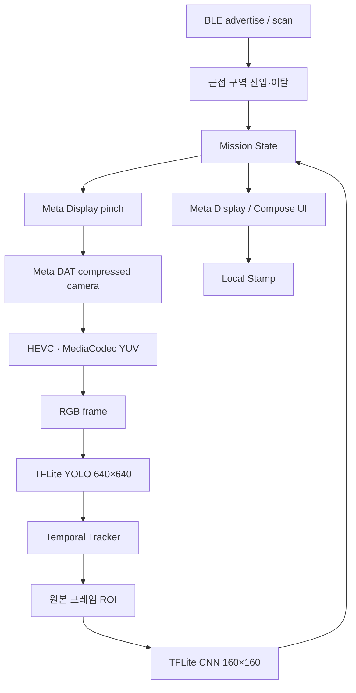

# SmartGlassAR 팀 아키텍처

이 문서는 최종 팀 소스에 존재하는 계층과 실행 흐름을 설명합니다. 아래 모듈은 팀 결과이며, 특정 비전 모듈이나 최종 UI를 개인 단독 구현으로 귀속하지 않습니다.

## 최종 실행 흐름

사용자 입력과 카메라 프레임은 미션 상태를 무조건 전진시키지 않습니다. 근접 구역, 프레임 해석, 시간축 안정화, CNN 재검증과 상호작용 조건을 거친 뒤 UI와 저장으로 전달되는 구조입니다.

## 계층별 소스 지도

| 계층 | 팀 소스의 역할 | 대표 상대 경로 |
|---|---|---|
| 앱 조합 | 런타임 구현과 화면의 조합 | `app/src/main/java/com/example/smartglassar/MainActivity.kt` |
| 카메라 계약 | 카메라 공급자와 소비자의 프레임·상태 계약 | `app/src/main/java/com/example/smartglassar/camera/HOCameraFrameSource.kt` |
| CameraX 공급자 | 휴대폰 카메라 기준 구현 | `app/src/main/java/com/example/smartglassar/camera/HOCameraXFrameSource.kt` |
| Meta DAT 공급자 | 스마트글라스 압축 스트림 입력 | `app/src/main/java/com/example/smartglassar/camera/HODatCameraFrameSource.kt` |
| 영상 디코딩 | HEVC를 MediaCodec 프레임으로 변환 | `app/src/main/java/com/example/smartglassar/camera/HODatHevcFrameDecoder.kt` |
| 색상 변환 | DAT YUV420 프레임을 RGB로 변환 | `app/src/main/java/com/example/smartglassar/vision/HODatYuv420FrameRgbConverter.kt` |
| 1차 검출 | TFLite YOLO 실행 | `app/src/main/java/com/example/smartglassar/vision/HOTfliteYoloDetector.kt` |
| 전·후처리 | letterbox 입력과 검출 좌표 복원 | `app/src/main/java/com/example/smartglassar/vision/HOYoloPreprocessor.kt`, `app/src/main/java/com/example/smartglassar/vision/HOYoloOutputParser.kt` |
| 시간축 안정화 | 연속 프레임 후보 추적 | `app/src/main/java/com/example/smartglassar/vision/HOLandmarkTracker.kt` |
| ROI·재검증 | 같은 원본 프레임 crop과 TFLite CNN | `app/src/main/java/com/example/smartglassar/vision/HORoiCropper.kt`, `app/src/main/java/com/example/smartglassar/vision/HOTfliteCnnClassifier.kt` |
| 미션 조정 | 비전 결과를 미션 이벤트로 변환 | `app/src/main/java/com/example/smartglassar/mission/HOVisionMissionCoordinator.kt` |
| 상태·저장 | 미션 전이와 완료 스탬프 | `app/src/main/java/com/example/smartglassar/mission/HOMissionStateController.kt`, `app/src/main/java/com/example/smartglassar/mission/HOStampRepository.kt` |
| 화면 | 휴대폰 탐색·미션 안내 | `app/src/main/java/com/example/smartglassar/ui/HOPhoneCameraSearch.kt`, `app/src/main/java/com/example/smartglassar/ui/HOZoneMissionGuide.kt` |

## 핵심 데이터 흐름

### 1. 교체 가능한 프레임 공급자

`HOCameraFrameSource`를 경계로 두고 CameraX와 Meta DAT 공급자를 분리했습니다. 비전 파이프라인이 특정 카메라 API를 직접 소유하지 않게 하려는 팀 설계입니다. 최종 `MainActivity` 경로는 Meta DAT를 사용하며, CameraX가 최종 스마트글라스 입력이라고 설명하지 않습니다.

CameraX 구현은 최신 프레임 우선 처리와 프레임 수명 정리 규칙을 담고 있습니다. DAT 구현은 압축 카메라 데이터를 받아 HEVC·YUV·RGB 변환 단계로 전달합니다.

### 2. YOLO 좌표 계약

팀 소스의 YOLO 흐름은 다음 단계를 분리합니다.

1. 입력 프레임 방향을 RGB 기준으로 정리합니다.
2. 종횡비를 유지한 640×640 letterbox 입력을 만듭니다.
3. TFLite 추론 결과에서 후보를 읽고 중복을 제거합니다.
4. padding과 scale을 역산해 box를 원본 프레임 좌표로 복원합니다.

전처리 metadata나 tensor 계약이 맞지 않을 때 추론을 강행하지 않도록 한 것은, 잘못 해석한 결과가 미션 상태를 진행시키는 것을 막기 위한 선택입니다.

관련 단위 테스트는 `app/src/test/java/com/example/smartglassar/vision/HOTfliteYoloAndNmsTest.kt`에 있습니다.

### 3. 시간축 안정화와 같은 프레임 ROI

한 프레임의 순간 검출을 완료 조건으로 쓰지 않고, `HOLandmarkTracker`가 클래스·신뢰도·IoU·연속 프레임·timestamp 조건을 확인합니다. 최종 팀 소스의 기준은 연속 3프레임 안정화입니다.

안정화 뒤에는 검출 결과의 프레임과 crop 대상 프레임이 같은지 확인합니다. 비동기 처리 중 더 최신 프레임을 잘못 crop하는 것을 막고, 원본 좌표 box를 경계 안으로 제한한 뒤 160×160 CNN 입력으로 바꿉니다.

관련 테스트:

- `app/src/test/java/com/example/smartglassar/vision/HOLandmarkTrackerTest.kt`
- `app/src/test/java/com/example/smartglassar/vision/HORoiCropperAndVlmRequestTest.kt`
- `app/src/test/java/com/example/smartglassar/vision/HOTfliteCnnClassifierTest.kt`

### 4. 미션 상태와 UI·저장

`HOVisionMissionCoordinator`는 프레임 처리 결과를 미션 이벤트로 정리하고, `HOMissionStateController`는 구역 진입·카메라 준비·검출 안정화·재검증·상호작용·완료 같은 상태 전이를 관리합니다. 화면은 상태를 표시하고, 완료 결과는 `HOStampRepository`의 로컬 기록으로 이어집니다.

관련 테스트:

- `app/src/test/java/com/example/smartglassar/mission/HOVisionMissionCoordinatorTest.kt`
- `app/src/test/java/com/example/smartglassar/mission/HOMissionStateControllerTest.kt`
- `app/src/test/java/com/example/smartglassar/mission/HOStampRepositoryTest.kt`

## 설계 선택과 트레이드오프

| 선택 | 얻은 점 | 남은 검증 |
|---|---|---|
| Camera source 계약 | 휴대폰 기준선과 Meta DAT 입력을 같은 소비 경계에 연결 | 실제 DAT 장시간 입력 안정성 |
| 최신 프레임 우선 | 처리 지연이 누적되는 것을 억제 | 프레임 유실이 미션 경험에 미치는 영향 |
| letterbox 후 원본 좌표 복원 | 종횡비를 유지하면서 ROI 좌표 일관성 확보 | 기기별 orientation·stride 조합 |
| 시간축 Tracker | 단일 프레임 오검출로 인한 상태 전이 억제 | 임계값별 현장 정확도 |
| 같은 프레임 ROI + CNN | 검출과 crop의 시간 불일치 방지, 2단계 확인 | holdout precision/recall과 지연 |
| 상태 컨트롤러 분리 | 비전 실패와 UI 상태 전이를 구분 | 실제 BLE·카메라·Display 전체 체인 |

