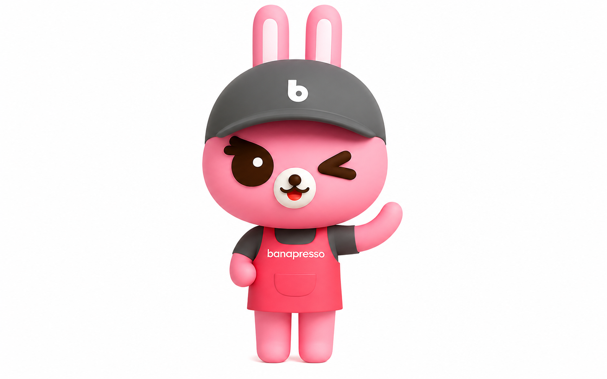
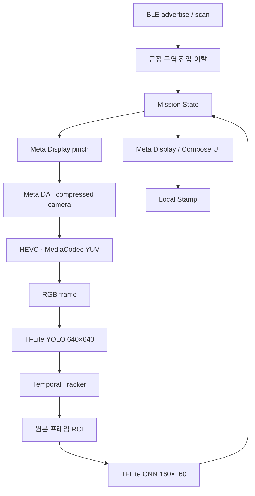

# SmartGlassAR — 스마트글라스 스탬프 투어 | 상세 설명

[← 전체 프로젝트 목록](../../README.md)

프로젝트 소개부터 기능별 구현과 검증 범위까지 한 페이지에서 읽을 수 있도록 정리했습니다.

## 목차

- [프로젝트 소개·역할·전체 기능](#section-1)
- [SmartGlassAR 팀 아키텍처](#section-2)
- [SmartGlassAR 기여와 검증](#section-3)

---

<a id="section-1"></a>

## 프로젝트 소개·역할·전체 기능

> 적용할 수 없던 Unity 미러링 전제를 제거하고, Android/Kotlin 앱과 Meta 연동 중심으로 개발 파이프라인을 다시 구성한 4인 팀 프로젝트입니다.

[시연 영상 보기](https://youtu.be/yOnPj3VstqE)



*팀 UI 시각 자산이며 런타임 캡처나 개인 구현 증빙이 아닙니다.*

### 프로젝트 개요

| 항목 | 내용 |
|---|---|
| 과정 | MDIA 스마트 글래스 활용 AI 기반 가상융합 콘텐츠 제작과정 |
| 교육 기간 | 2026.06.09–08.04 |
| 개발 확인 기간 | 2026.07.20–08.02 · 로컬 Git 기록 기준 |
| 구성 | 4인 팀 프로젝트 |
| 최종 플랫폼 | Android/Kotlin 단일 앱 · Android API 31 이상 |
| 팀 기술 | Meta Wearables DAT, BLE, MediaCodec, TensorFlow Lite, Jetpack Compose |
| 개발 방식 | CLI·MCP를 활용한 AI 보조 개발, Task 분할, Git 협업, 자동 테스트·검증 문서 |

관광지의 근접 구역에 들어가면 미션을 시작하고, 스마트글라스 카메라로 대상을 찾은 뒤, 팀 비전 파이프라인이 검출·재검증한 결과를 미션과 스탬프 UI에 연결하는 프로토타입입니다. 최종 화면은 스마트글라스 Display와 Android Compose UI이며, 현실 공간에 3D 객체를 정합하는 AR 오버레이로 표현하지 않습니다.

### 방향을 바꾼 이유

초기에는 Unity 앱을 Android 휴대폰에서 실행하고 그 화면을 스마트글라스에 미러링할 계획이었습니다. 개발 중 사용한 Meta Ray-Ban·SDK 환경에서 목표한 미러링 방식을 적용할 수 없음을 확인해, Unity를 최종 런타임에서 제외하고 Android/Kotlin 앱·Meta 입력·Display를 중심으로 기획과 파이프라인을 다시 구성했습니다.

이 제약은 당시 사용한 기기·SDK와 목표 방식에 한정합니다. “모든 스마트글라스는 휴대폰 미러링을 지원하지 않는다”는 일반화가 아닙니다.

### 본인 기여와 팀 결과

| 구분 | 범위 |
|---|---|
| 본인 | 초기안의 기술 제약 확인, Android/Kotlin 방향 전환과 파이프라인 재구성 참여, AI 생성 기획·구현안 교차검증, 필요한 기능·흐름 조정, Task 분할과 Git 충돌 조율, 파이프라인을 따라 디버그·수정 참여 |
| 팀 결과 | Meta DAT·HEVC 카메라 처리, BLE, YOLO·Tracker·ROI·CNN, 미션 상태, Compose·Meta Display UI, 로컬 스탬프 저장이 연결된 최종 소스와 시연 |
| AI 보조 | 기획안·구현안·문서 초안을 생성하고, 팀이 요구사항·소스·테스트 결과와 대조해 수정 |

CameraX, YOLO, Tracker, ROI, CNN 또는 최종 UI를 본인의 단독 구현으로 설명하지 않습니다. 상세 기술 문서는 팀 최종 소스의 구조를 설명하는 자료이며, 개인 소유권 주장은 위 표의 범위를 넘지 않습니다.

### 팀 최종 파이프라인

```text
BLE 근접 구역
  → 미션 상태
  → Meta Display 입력
  → Meta DAT 카메라·HEVC 디코딩
  → TFLite YOLO 검출
  → 시간축 Tracker 안정화
  → 같은 원본 프레임 ROI
  → TFLite CNN 재검증
  → 미션·Display / Compose UI
  → 로컬 스탬프 저장
```

계층과 데이터 흐름은 [팀 아키텍처](ARCHITECTURE.md), 개인 기여 범위·AI 협업 방식·검증의 시점 차이는 [기여와 검증](CONTRIBUTION_AND_VALIDATION.md)에 정리했습니다.

### 시연에서 확인할 수 있는 것

| 구간 | 화면에서 확인되는 팀 결과 |
|---|---|
| 00:05–00:30 | 현장 이동과 탐색 흐름 |
| 00:37–01:15 | 토끼 대상과 검출 시각화 |
| 01:29 이후 | 미션 완료와 스탬프 UI |

영상은 사용자 흐름을 보여주지만, 촬영 빌드와 최종 소스의 동일성이나 BLE 거리·모델 정확도·발열·배터리 성능을 증명하지는 않습니다.

### 저장된 검증 기록

`Assets/Reports/18-AutomatedValidationReport.md`의 2026.07.26 실행 기록에는 다음 결과가 남아 있습니다.

- JVM 단위 테스트 141개, 실패·오류·skip 0개
- Debug APK 생성
- unsigned Release APK 생성
- Release DEX에서 debug manual-event gateway 제외 검사 통과

이 기록은 2026.08.02 최종 Meta DAT·UI 변경보다 앞선 시점의 팀 검증입니다. 최종 HEAD 전체가 같은 조건으로 다시 통과했다고 확대하지 않습니다.

### 구현 근거

원 프로젝트 기준 상대 경로입니다.

- Android 설정·의존성: `app/build.gradle.kts`
- 앱 조합 진입점: `app/src/main/java/com/example/smartglassar/MainActivity.kt`
- 카메라 계층: `app/src/main/java/com/example/smartglassar/camera/`
- 비전 계층: `app/src/main/java/com/example/smartglassar/vision/`
- 미션·저장: `app/src/main/java/com/example/smartglassar/mission/`
- 모바일 UI: `app/src/main/java/com/example/smartglassar/ui/`
- JVM 테스트: `app/src/test/java/com/example/smartglassar/`
- 작업·검증 문서: `Assets/Tasks/`, `Assets/Checklists/`, `Assets/Reports/18-AutomatedValidationReport.md`

### 현재 한계

- 2026.08.02 최종 소스에서 단위·계측·릴리스 게이트를 새로 실행한 결과는 확인되지 않았습니다.
- 최종 Meta DAT 경로의 연결 기기 통합 검증과 실제 현장 BLE·카메라 전체 체인 측정은 남아 있습니다.
- 모델 precision/recall, 장시간 발열·배터리, 배포 서명 검증 수치는 없습니다.
- 기존 Release APK는 unsigned이므로 배포 완료 제품으로 표현하지 않습니다.

---

<a id="section-2"></a>

## SmartGlassAR 팀 아키텍처

이 문서는 최종 팀 소스에 존재하는 계층과 실행 흐름을 설명합니다. 아래 모듈은 팀 결과이며, 특정 비전 모듈이나 최종 UI를 개인 단독 구현으로 귀속하지 않습니다.

### 최종 실행 흐름



사용자 입력과 카메라 프레임은 미션 상태를 무조건 전진시키지 않습니다. 근접 구역, 프레임 해석, 시간축 안정화, CNN 재검증과 상호작용 조건을 거친 뒤 UI와 저장으로 전달되는 구조입니다.

### 계층별 소스 지도

| 계층 | 팀 소스의 역할 | 대표 상대 경로 |
|---|---|---|
| 앱 조합 | 런타임 구현과 화면의 조합 | `app/src/main/java/com/example/smartglassar/MainActivity.kt` |
| 카메라 계약 | 카메라 공급자와 소비자의 프레임·상태 계약 | `app/src/main/java/com/example/smartglassar/camera/HOCameraFrameSource.kt` |
| CameraX 공급자 | 휴대폰 카메라 기준 구현 | `app/src/main/java/com/example/smartglassar/camera/HOCameraXFrameSource.kt` |
| Meta DAT 공급자 | 스마트글라스 압축 스트림 입력 | `app/src/main/java/com/example/smartglassar/camera/HODatCameraFrameSource.kt` |
| 영상 디코딩 | HEVC를 MediaCodec 프레임으로 변환 | `app/src/main/java/com/example/smartglassar/camera/HODatHevcFrameDecoder.kt` |
| 색상 변환 | DAT YUV420 프레임을 RGB로 변환 | `app/src/main/java/com/example/smartglassar/vision/HODatYuv420FrameRgbConverter.kt` |
| 1차 검출 | TFLite YOLO 실행 | `app/src/main/java/com/example/smartglassar/vision/HOTfliteYoloDetector.kt` |
| 전·후처리 | letterbox 입력과 검출 좌표 복원 | `app/src/main/java/com/example/smartglassar/vision/HOYoloPreprocessor.kt`, `app/src/main/java/com/example/smartglassar/vision/HOYoloOutputParser.kt` |
| 시간축 안정화 | 연속 프레임 후보 추적 | `app/src/main/java/com/example/smartglassar/vision/HOLandmarkTracker.kt` |
| ROI·재검증 | 같은 원본 프레임 crop과 TFLite CNN | `app/src/main/java/com/example/smartglassar/vision/HORoiCropper.kt`, `app/src/main/java/com/example/smartglassar/vision/HOTfliteCnnClassifier.kt` |
| 미션 조정 | 비전 결과를 미션 이벤트로 변환 | `app/src/main/java/com/example/smartglassar/mission/HOVisionMissionCoordinator.kt` |
| 상태·저장 | 미션 전이와 완료 스탬프 | `app/src/main/java/com/example/smartglassar/mission/HOMissionStateController.kt`, `app/src/main/java/com/example/smartglassar/mission/HOStampRepository.kt` |
| 화면 | 휴대폰 탐색·미션 안내 | `app/src/main/java/com/example/smartglassar/ui/HOPhoneCameraSearch.kt`, `app/src/main/java/com/example/smartglassar/ui/HOZoneMissionGuide.kt` |

### 핵심 데이터 흐름

#### 1. 교체 가능한 프레임 공급자

`HOCameraFrameSource`를 경계로 두고 CameraX와 Meta DAT 공급자를 분리했습니다. 비전 파이프라인이 특정 카메라 API를 직접 소유하지 않게 하려는 팀 설계입니다. 최종 `MainActivity` 경로는 Meta DAT를 사용하며, CameraX가 최종 스마트글라스 입력이라고 설명하지 않습니다.

CameraX 구현은 최신 프레임 우선 처리와 프레임 수명 정리 규칙을 담고 있습니다. DAT 구현은 압축 카메라 데이터를 받아 HEVC·YUV·RGB 변환 단계로 전달합니다.

#### 2. YOLO 좌표 계약

팀 소스의 YOLO 흐름은 다음 단계를 분리합니다.

1. 입력 프레임 방향을 RGB 기준으로 정리합니다.
2. 종횡비를 유지한 640×640 letterbox 입력을 만듭니다.
3. TFLite 추론 결과에서 후보를 읽고 중복을 제거합니다.
4. padding과 scale을 역산해 box를 원본 프레임 좌표로 복원합니다.

전처리 metadata나 tensor 계약이 맞지 않을 때 추론을 강행하지 않도록 한 것은, 잘못 해석한 결과가 미션 상태를 진행시키는 것을 막기 위한 선택입니다.

관련 단위 테스트는 `app/src/test/java/com/example/smartglassar/vision/HOTfliteYoloAndNmsTest.kt`에 있습니다.

#### 3. 시간축 안정화와 같은 프레임 ROI

한 프레임의 순간 검출을 완료 조건으로 쓰지 않고, `HOLandmarkTracker`가 클래스·신뢰도·IoU·연속 프레임·timestamp 조건을 확인합니다. 최종 팀 소스의 기준은 연속 3프레임 안정화입니다.

안정화 뒤에는 검출 결과의 프레임과 crop 대상 프레임이 같은지 확인합니다. 비동기 처리 중 더 최신 프레임을 잘못 crop하는 것을 막고, 원본 좌표 box를 경계 안으로 제한한 뒤 160×160 CNN 입력으로 바꿉니다.

관련 테스트:

- `app/src/test/java/com/example/smartglassar/vision/HOLandmarkTrackerTest.kt`
- `app/src/test/java/com/example/smartglassar/vision/HORoiCropperAndVlmRequestTest.kt`
- `app/src/test/java/com/example/smartglassar/vision/HOTfliteCnnClassifierTest.kt`

#### 4. 미션 상태와 UI·저장

`HOVisionMissionCoordinator`는 프레임 처리 결과를 미션 이벤트로 정리하고, `HOMissionStateController`는 구역 진입·카메라 준비·검출 안정화·재검증·상호작용·완료 같은 상태 전이를 관리합니다. 화면은 상태를 표시하고, 완료 결과는 `HOStampRepository`의 로컬 기록으로 이어집니다.

관련 테스트:

- `app/src/test/java/com/example/smartglassar/mission/HOVisionMissionCoordinatorTest.kt`
- `app/src/test/java/com/example/smartglassar/mission/HOMissionStateControllerTest.kt`
- `app/src/test/java/com/example/smartglassar/mission/HOStampRepositoryTest.kt`

### 설계 선택과 트레이드오프

| 선택 | 얻은 점 | 남은 검증 |
|---|---|---|
| Camera source 계약 | 휴대폰 기준선과 Meta DAT 입력을 같은 소비 경계에 연결 | 실제 DAT 장시간 입력 안정성 |
| 최신 프레임 우선 | 처리 지연이 누적되는 것을 억제 | 프레임 유실이 미션 경험에 미치는 영향 |
| letterbox 후 원본 좌표 복원 | 종횡비를 유지하면서 ROI 좌표 일관성 확보 | 기기별 orientation·stride 조합 |
| 시간축 Tracker | 단일 프레임 오검출로 인한 상태 전이 억제 | 임계값별 현장 정확도 |
| 같은 프레임 ROI + CNN | 검출과 crop의 시간 불일치 방지, 2단계 확인 | holdout precision/recall과 지연 |
| 상태 컨트롤러 분리 | 비전 실패와 UI 상태 전이를 구분 | 실제 BLE·카메라·Display 전체 체인 |

### 해석 제한

- 파일과 테스트의 존재는 팀 소스 구조의 근거이지 개인 구현 소유권의 근거가 아닙니다.
- 임계값과 모델 구조가 코드에 존재해도 실제 현장 정확도를 증명하지 않습니다.
- 최종 출력은 Meta Display·Compose 카드와 안내 화면입니다. 공간 정합 3D AR 렌더링으로 설명하지 않습니다.
- 저장된 자동 검증과 최종 2026.08.02 소스 사이의 시점 차이는 [기여와 검증](CONTRIBUTION_AND_VALIDATION.md#검증-기록과-시점)에 따로 표시합니다.

---

<a id="section-3"></a>

## SmartGlassAR 기여와 검증

### 개인 기여의 최신 범위

본인 기여는 다음 범위로 한정합니다.

1. 사용한 Meta Ray-Ban·SDK 환경에서 초기 Unity→Android 휴대폰→스마트글라스 미러링 경로가 목표 방식에 적용되지 않음을 확인했습니다.
2. 팀과 기획을 수정하고 Unity를 최종 런타임에서 제외해 Android/Kotlin·Meta 연동 중심으로 파이프라인을 다시 구성했습니다.
3. AI가 만든 기획안과 구현안을 요구 기능·현재 소스·실행 흐름과 교차검증하고, 빠진 기능과 파이프라인 단계를 조정했습니다.
4. 작업을 Task로 나누고 Git 동시 수정·충돌을 조율했습니다.
5. 정리한 파이프라인을 따라 문제를 확인하고 디버그·수정에 참여했습니다.

CameraX, Meta DAT·HEVC, YOLO, Tracker, ROI, CNN, Compose·Meta Display UI의 개별 구현을 본인의 단독 성과로 주장하지 않습니다. 이 모듈들은 최종 팀 소스와 팀 결과를 설명할 때만 사용합니다.

### 문제 해결 1 — 실행할 수 없는 전제 제거

#### 문제

초기 기획은 Unity 앱 화면을 Android 휴대폰에서 스마트글라스로 미러링하는 흐름에 의존했습니다. 개발에 사용한 기기와 SDK에서는 목표한 방식이 적용되지 않았기 때문에, 이 전제를 유지하면 핵심 사용자 흐름을 검증할 수 없었습니다.

#### 판단과 행동

- 기기·SDK 환경에 한정된 제약인지 먼저 구분했습니다.
- 미러링을 전제로 한 화면과 기능 목록을 다시 검토했습니다.
- Unity를 최종 앱에서 제외하고 Android/Kotlin을 호스트로 선택했습니다.
- Meta 입력·Display와 온디바이스 비전을 한 앱의 파이프라인으로 연결하도록 Task 순서를 재구성했습니다.

#### 결과

팀 최종 소스에는 Android/Kotlin 단일 코드베이스에서 Meta 입력, 팀 비전 모듈, 미션 상태와 UI로 이어지는 경로가 남았습니다. 다만 최종 소스의 실기기 전체 체인 재현까지 완료됐다는 의미는 아닙니다.

### 문제 해결 2 — AI 결과를 팀 작업으로 통합

AI 보조 개발에서는 생성 속도보다 “현재 프로젝트에서 실행되는가”를 기준으로 삼았습니다.

```text
요구 기능 확인
  → AI 기획·구현안 생성
  → 기존 소스·SDK 제약과 교차검증
  → Task와 소유 경로 분리
  → 팀 변경 통합·Git 충돌 조율
  → 파이프라인 단계별 디버그
  → 테스트·보고서와 실제 결과 대조
```

- 기획 문장을 구현 단위와 완료 조건으로 다시 나눴습니다.
- AI가 제안한 기술이 현재 SDK·앱 구조에서 유효한지 확인했습니다.
- 동시에 수정할 가능성이 큰 파일은 작업 순서와 담당 범위를 조율했습니다.
- 정리한 파이프라인을 따라 문제를 확인하고 디버그·수정에 참여했습니다.
- 자동 테스트가 통과해도 실제 기기·현장 검증을 대체하지 않는다고 구분했습니다.

이 문서는 AI가 모든 구현을 자동으로 완성했다거나, 본인이 팀 비전 모듈 전체를 직접 작성했다는 근거로 사용하지 않습니다.

### 검증 기록과 시점

#### 저장된 2026.07.26 팀 게이트

`Assets/Reports/18-AutomatedValidationReport.md`에는 다음 실행 결과가 기록돼 있습니다.

| 항목 | 저장된 결과 |
|---|---|
| `:app:testDebugUnitTest` | 141 tests · failure 0 · error 0 · skipped 0 |
| `:app:assembleDebug` | Debug APK 생성 |
| `:app:assembleRelease` | unsigned Release APK 생성 |
| Release DEX 검사 | debug manual-event gateway 제외 통과 |

이 결과는 JVM 로직, 빌드 가능성, debug 전용 진입점의 release 격리를 확인하는 근거입니다. 당시 연결된 API 31 이상 기기·에뮬레이터가 없어 connected instrumentation과 물리 현장 게이트는 실행되지 않았습니다.

#### 최종 소스와의 시간 차이

```text
2026.07.26 저장된 자동 검증
  ↓ 이후 팀 변경
2026.08.02 Meta DAT·최종 UI가 포함된 소스 상태
  ↓
최종 HEAD 전체 재실행 결과는 미확인
```

따라서 7월 26일의 141개 통과 기록을 8월 2일 최종 통합의 완전한 검증으로 사용하지 않습니다. 현재 소스에 더 많은 테스트가 선언돼 있어도, 새 실행 결과가 없으면 통과 수치에 더하지 않습니다.

### 영상으로 확인한 팀 결과

[스마트글라스 스탬프투어 시연](https://youtu.be/yOnPj3VstqE)

| 구간 | 확인 내용 | 증명하지 않는 것 |
|---|---|---|
| 00:05–00:30 | 현장 이동·탐색 흐름 | BLE 거리 정확도, 장시간 연결 안정성 |
| 00:37–01:15 | 토끼 대상과 검출 시각화 | 모델 precision/recall, 최종 소스와 촬영 빌드 일치 |
| 01:29 이후 | 완료·스탬프 UI | 배포 서명, 발열·배터리 성능 |

영상의 기능은 팀 결과입니다. 개인 기여 범위는 이 화면을 가능하게 한 방향 전환, AI 결과 교차검증, Task·Git 조율, 파이프라인 디버그 참여로 설명합니다.

### 근거 파일 지도

| 확인하려는 내용 | 상대 경로 |
|---|---|
| 플랫폼·의존성 | `app/build.gradle.kts` |
| 최종 앱 조합 | `app/src/main/java/com/example/smartglassar/MainActivity.kt` |
| 팀 카메라 계층 | `app/src/main/java/com/example/smartglassar/camera/` |
| 팀 비전 계층 | `app/src/main/java/com/example/smartglassar/vision/` |
| 팀 미션·저장 계층 | `app/src/main/java/com/example/smartglassar/mission/` |
| 팀 UI 계층 | `app/src/main/java/com/example/smartglassar/ui/` |
| Task 설계 | `Assets/Tasks/` |
| 완료 조건 | `Assets/Checklists/` |
| 저장된 팀 검증 | `Assets/Reports/18-AutomatedValidationReport.md` |

### 아직 검증하지 못한 것

- 최종 Meta DAT·UI 소스의 API 31 이상 connected instrumentation 재실행
- 실제 현장 BLE·카메라·Display 전체 체인의 반복 성공률
- 모델 holdout precision/recall과 오탐·미탐 분석
- 15분·30분 장시간 발열, 배터리, 프레임 지연
- 서명된 Release APK와 배포 절차
- 시연 영상 빌드와 최종 소스 revision의 정확한 일치

위 항목은 향후 검증 계획이며 완료 성과로 표기하지 않습니다.

---

[← 전체 프로젝트 목록](../../README.md)
