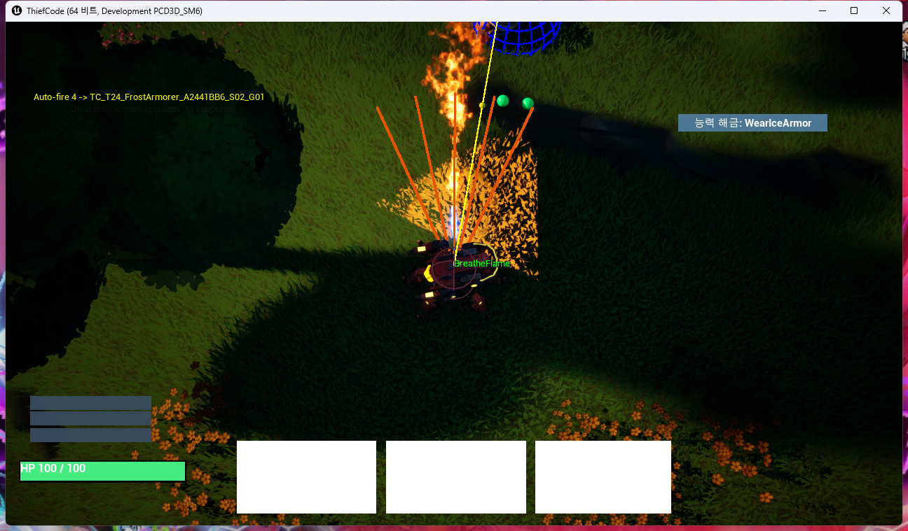
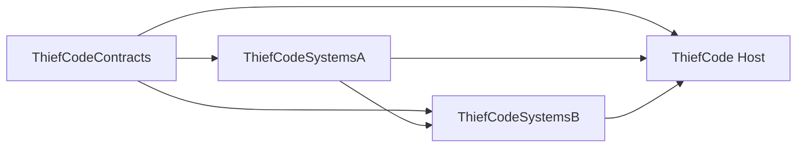
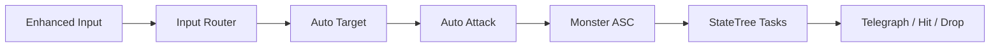
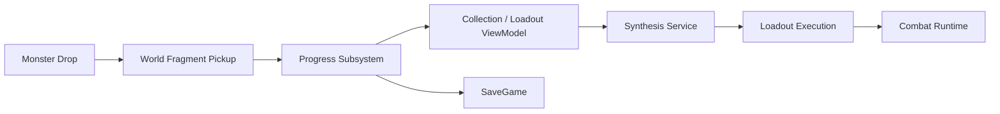
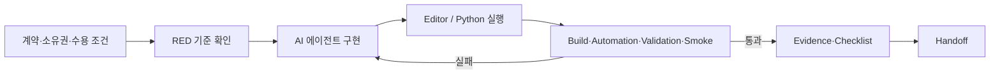
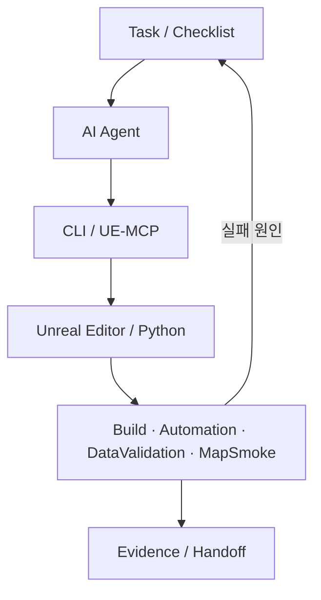

# ThiefCode — AI 에이전트 기반 정수 로그라이트 | 상세 설명

[← 전체 프로젝트 목록](../../README.md)

프로젝트 소개부터 기능별 구현과 검증 범위까지 한 페이지에서 읽을 수 있도록 정리했습니다.

## 목차

- [프로젝트 소개·역할·전체 기능](#section-1)
- [ThiefCode 게임플레이 아키텍처](#section-2)
- [ThiefCode 하네스와 검증](#section-3)

---

<a id="section-1"></a>

## 프로젝트 소개·역할·전체 기능

> AI 에이전트를 주된 구현 수단으로 사용하고, 작업 계약·도구 경계·자동 검증·증빙 인계를 묶은 하네스로 결과를 통제한 Unreal Engine 프로토타입입니다.




### 프로젝트 개요

| 항목 | 내용 |
|---|---|
| 확인된 작업 기간 | 2026.08.10–08.27 · 로컬 작업 기록 기준 |
| 형태 | 2인 팀 · AI 에이전트 중심 개발 |
| 장르 | 쿼터뷰 액션 로그라이트 |
| 핵심 규칙 | 몬스터가 떨어뜨린 `[언제]`와 `[무엇을]` 조각을 장착·합성해 전투 로직 구성 |
| 기술 | Unreal Engine 5.8, C++, GAS, StateTree, Enhanced Input, UMG, Niagara |
| 개발 도구 | CLI, UE-MCP, Python Editor Scripting, Automation Test, Data Validation, Pixel Streaming 2, Diversion |
| 실행 산출물 | Win64 Development 패키지 확인 |

이 프로젝트에서 강조하는 것은 “AI가 코드를 만들었다”는 사실만이 아닙니다. 모호한 요구를 실행 가능한 Task와 Checklist로 바꾸고, 에이전트가 수정할 모듈과 사용할 도구를 제한한 뒤, 에디터·테스트·패키지 결과로 통과 여부를 판정하는 개발 방식이 핵심입니다.

### 기여와 소유권

| 구분 | 범위 |
|---|---|
| 본인 | 하네스 규칙 설계, 기능 계약과 작업 경계 정의, 에이전트 작업 통합, 검증 게이트 구성·실행, Evidence/Handoff 기준 운영 |
| 2인 팀 결과 | 게임 규칙과 콘텐츠 방향, 전투·진행·UI가 연결된 플레이 가능한 프로토타입 |
| AI 에이전트 | 지정된 Task·도구·소유 경로 안에서 코드와 에셋을 생성·수정하고 반복 검증 수행 |
| 외부 기술 | Unreal Engine 및 엔진 플러그인·프레임워크 |

AI가 모든 코드와 에셋을 무인으로 완성했다고 주장하지 않습니다. 본인의 핵심 역량은 에이전트의 출력이 다시 실행되고 검증되며 다음 작업자에게 인계될 수 있도록 개발 환경을 구조화한 것입니다.

### 구현된 플레이 루프

```text
이동·마우스 조준
  → 자동 표적 선택·공격 / 대시
  → GAS·StateTree 기반 몬스터 행동과 공격 예고
  → 조각 드롭·획득
  → [언제] + [무엇을] 장착 또는 지정 합성
  → SaveGame 진행도·로드아웃 반영
  → HUD·미니맵·체크포인트로 다음 전투 진행
```

- 자동 조준·자동 공격과 대시를 연결한 쿼터뷰 전투
- GAS 능력과 StateTree 태스크를 사용하는 몬스터 및 텔레그래프
- 조각 획득, 수집 상태, 지정 합성, 패시브·액티브 로드아웃
- 체크포인트, 스폰·드롭, 진행도 저장
- HUD, 수집·합성 메뉴, 미니맵과 런타임 가림 처리
- 해커톤 제출 경로를 위한 Pixel Streaming 웹 실행 구성

세부 책임과 파일 관계는 [게임플레이 아키텍처](GAMEPLAY_ARCHITECTURE.md), AI 작업을 안정화한 방법과 실제 게이트 결과는 [하네스와 검증](HARNESS_AND_VALIDATION.md)에 정리했습니다.

---

<a id="section-2"></a>

## ThiefCode 게임플레이 아키텍처

이 문서는 AI 작업 방식과 별개로, 현재 소스에 남아 있는 런타임 구조와 게임 데이터 흐름을 설명합니다. 기능 전체는 2인 팀과 AI 에이전트가 함께 만든 결과이며, 개인 기여는 [README의 소유권 표](README.md#기여와-소유권)를 기준으로 합니다.

### 네 개 런타임 모듈

| 모듈 | 책임 | 대표 근거 |
|---|---|---|
| `ThiefCodeContracts` | 모듈 사이에서 공유할 타입, 포트, 이벤트 계약 | `ThiefCode/Source/ThiefCodeContracts/Public/` |
| `ThiefCodeSystemsA` | 입력, 자동 표적·공격, 스크립트·로드아웃 실행, 월드 획득, 메뉴 셸 | `ThiefCode/Source/ThiefCodeSystemsA/Public/` |
| `ThiefCodeSystemsB` | 몬스터 AI·GAS, 드롭, 진행도·저장, 합성, 수집 ViewModel | `ThiefCode/Source/ThiefCodeSystemsB/Public/` |
| `ThiefCode` | 실제 플레이어·HUD·미니맵과 최종 Composition | `ThiefCode/Source/ThiefCode/Public/`, `ThiefCode/Source/ThiefCode/Private/Composition/` |

현재 `Build.cs` 기준 의존 관계는 다음과 같습니다.



초기 의도만 보고 SystemsA와 SystemsB가 완전히 독립적이라고 설명하지 않습니다. 실제 `ThiefCodeSystemsB.Build.cs`에는 `ThiefCodeSystemsA` 의존성이 있으며, Host가 세 모듈을 조합합니다.

### 계약에서 실행까지

#### 1. 공유 계약

- 작업 결과와 안정 식별자: `ThiefCode/Source/ThiefCodeContracts/Public/Core/TCOperationTypes.h`
- 전투 포트: `ThiefCode/Source/ThiefCodeContracts/Public/Combat/TCCombatPorts.h`
- 진행도 포트: `ThiefCode/Source/ThiefCodeContracts/Public/Progress/TCProgressPorts.h`
- 합성 포트: `ThiefCode/Source/ThiefCodeContracts/Public/Synthesis/TCSynthesisPort.h`
- 스크립트 런타임 계약: `ThiefCode/Source/ThiefCodeContracts/Public/Script/TCScriptRuntime.h`
- 게임플레이 이벤트: `ThiefCode/Source/ThiefCodeContracts/Public/Events/TCGameplayEvents.h`
- UI 포트: `ThiefCode/Source/ThiefCodeContracts/Public/UI/TCMenuPorts.h`

공유 계약을 별도 모듈에 두어, 에이전트가 다른 시스템의 구현 세부를 직접 참조하기보다 명시된 타입과 포트를 통해 연결하도록 했습니다.

#### 2. 전투 흐름



| 기능 | 책임이 드러나는 파일 |
|---|---|
| 입력 라우팅 | `ThiefCode/Source/ThiefCodeSystemsA/Public/Player/TCInputRouterComponent.h` |
| 자동 표적 선택 | `ThiefCode/Source/ThiefCodeSystemsA/Public/Player/TCAutoTargetComponent.h` |
| 자동 공격 | `ThiefCode/Source/ThiefCodeSystemsA/Public/Combat/TCAutoAttackComponent.h` |
| 몬스터 능력 시스템 | `ThiefCode/Source/ThiefCodeSystemsB/Public/GAS/TCMonsterAbilitySystemComponent.h` |
| 몬스터 Pawn·StateTree 태스크 | `ThiefCode/Source/ThiefCodeSystemsB/Public/AI/TCMonsterPawn.h`, `ThiefCode/Source/ThiefCodeSystemsB/Public/AI/TCMonsterStateTreeTasks.h` |

전투 입력, 표적 선정, 공격 실행을 컴포넌트로 분리해 각 단계의 실패 원인과 교체 범위를 좁혔습니다. 몬스터 측은 GAS의 능력·태그와 StateTree의 행동 전이를 결합하고, 공격 전 예고와 실제 판정 사이의 상태를 관찰할 수 있게 구성했습니다.

#### 3. 조각·합성·진행도 흐름



| 기능 | 책임이 드러나는 파일 |
|---|---|
| 드롭 서비스 | `ThiefCode/Source/ThiefCodeSystemsB/Public/Loot/TCLootService.h` |
| 월드 조각 획득 | `ThiefCode/Source/ThiefCodeSystemsA/Public/World/TCWorldFragmentPickup.h` |
| 진행도·저장 | `ThiefCode/Source/ThiefCodeSystemsB/Public/Progress/TCProgressSubsystem.h`, `ThiefCode/Source/ThiefCodeSystemsB/Public/Progress/TCProgressSaveGame.h` |
| 지정 합성 | `ThiefCode/Source/ThiefCodeSystemsB/Public/Synthesis/TCSynthesisService.h` |
| 수집·합성 상태 | `ThiefCode/Source/ThiefCodeSystemsB/Public/UI/TCCollectionSynthesisViewModel.h` |
| 로드아웃 표시·실행 | `ThiefCode/Source/ThiefCodeSystemsA/Public/UI/TCLoadoutViewModel.h`, `ThiefCode/Source/ThiefCodeSystemsA/Public/Script/TCLoadoutExecutionComponent.h` |

획득 상태와 UI 표시를 직접 결합하지 않고 Progress·Synthesis 서비스와 ViewModel 사이를 나눴습니다. 저장 가능한 안정 식별자를 기준으로 조각과 로드아웃을 다루어, 월드 Actor의 수명과 영구 진행 데이터를 분리하는 선택입니다.

#### 4. Host 구성과 런타임 UI

- 플레이어 조합: `ThiefCode/Source/ThiefCode/Public/Prototype/TCPrototypePlayer.h`
- HUD: `ThiefCode/Source/ThiefCode/Public/UI/TCGameHUDWidget.h`
- 미니맵: `ThiefCode/Source/ThiefCode/Public/World/TCMinimapRuntime.h`
- 체크포인트: `ThiefCode/Source/ThiefCodeSystemsA/Public/World/TCCheckpoint.h`
- 메뉴 진입과 상태: `ThiefCode/Source/ThiefCodeSystemsA/Public/UI/TCMenuShellSubsystem.h`

Host는 모듈의 실제 구현을 플레이어와 월드에 조합합니다. UMG/WBP는 표시·레이아웃·모션을 담당하고, 진행도와 합성의 권한은 C++ 서비스·포트에 두는 것이 작업 표준의 원칙입니다. 이 경계 덕분에 UI 에셋을 다시 생성해도 핵심 상태 규칙이 함께 이동하지 않도록 했습니다.

### 주요 설계 선택

| 선택 | 이유 | 남은 비용 |
|---|---|---|
| Contracts 우선 | 에이전트 사이의 입력·출력과 변경 영향을 먼저 고정 | 잘못 설계한 계약을 바꾸면 여러 모듈 수정 필요 |
| 컴포넌트 단위 전투 | 입력·선정·공격을 분리해 교체와 테스트 범위 축소 | 런타임 조합과 수명 관리가 필요 |
| 안정 식별자 기반 진행 | SaveGame과 월드 객체 수명 분리 | 데이터 마이그레이션 정책 필요 |
| C++ 권한 + WBP 표현 | 자동 생성 UI가 게임 규칙을 소유하지 않게 제한 | ViewModel·바인딩 코드가 늘어남 |
| 텔레그래프와 판정 분리 | 플레이어에게 반응 시간을 주고 상태를 관측 | 애니메이션·능력 취소 시 동기화 고려 필요 |

### 설명 범위와 한계

- 이 문서는 현재 파일과 모듈 관계를 설명하며, 모든 기능의 작성자를 개인으로 귀속하지 않습니다.
- 바이너리 에셋의 내부 그래프는 이 문서의 파일명만으로 증명하지 않습니다.
- 저장 데이터 마이그레이션, 장시간 세션, 대규모 몬스터 수에 대한 정량 검증은 확인되지 않았습니다.
- Pixel Streaming 성능과 최종 릴리스 상태는 [하네스와 검증](HARNESS_AND_VALIDATION.md#실제-저장-결과)에서 별도로 구분합니다.

---

<a id="section-3"></a>

## ThiefCode 하네스와 검증

### 해결하려 한 문제

AI 에이전트는 구현 속도를 높일 수 있지만, 요구 해석·수정 범위·에디터 상태·에셋 생성 결과가 매 실행마다 달라질 수 있습니다. ThiefCode에서는 프롬프트만으로 품질을 기대하지 않고 다음 항목을 하네스에 넣었습니다.

- 무엇을 바꿀지: Task의 입력·출력과 수용 조건
- 누가 어디를 바꿀지: 모듈·파일 소유권과 쓰기 경로
- 어떤 도구를 쓸지: CLI, UE-MCP, Editor Python 진입점
- 어떻게 통과시킬지: 빌드, 자동화 테스트, Data Validation, Map Smoke, 패키지 검사
- 무엇을 남길지: Evidence, Checklist, Handoff, 알려진 위험

작업 표준의 기준 파일은 `Assets/UITasks/TASK_EXECUTION_STANDARD.md`입니다.

### 한 Task의 실행 흐름



1. Task에 허용된 입력, 산출물, 쓰기 경로, 완료 조건을 고정합니다.
2. 구현 전 실패 기준 또는 부재 상태를 RED로 확인합니다.
3. 에이전트는 소유 경로 안에서 최소 변경을 수행합니다.
4. 에셋 생성 스크립트는 두 번 실행하고 두 번째 semantic diff가 0인지 확인합니다.
5. 코드·에셋·맵·패키지 게이트를 실행 결과로 판정합니다.
6. 변경 경로, 테스트, 남은 위험, 다음 시작 조건을 Handoff에 기록합니다.

이 방식은 에이전트의 “완료했다”는 응답을 완료 근거로 사용하지 않습니다. 저장된 실행 결과가 수용 조건을 충족해야 다음 상태로 이동합니다.

### 도구 경계



- C++ 변경은 모듈 소유권과 Contracts 의존 관계를 먼저 확인합니다.
- 에디터 에셋 변경은 Python 또는 제한된 MCP 도구를 통해 반복 가능한 경로로 만듭니다.
- WBP는 표현을 담당하고, 게임 상태 권한은 C++ 서비스·포트에 둡니다.
- 작업 중 열린 에디터, 쓰기 충돌, 기준 revision/hash를 기록해 환경 차이를 추적합니다.
- 실패 전제나 시간이 충족되지 않으면 `BLOCKED`로 닫고 통과 기록을 만들지 않습니다.


[← 전체 프로젝트 목록](../../README.md)
