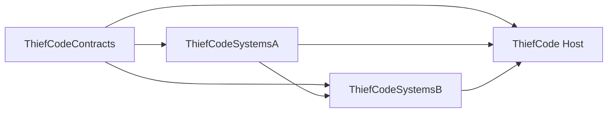
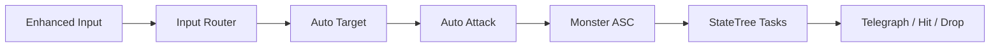
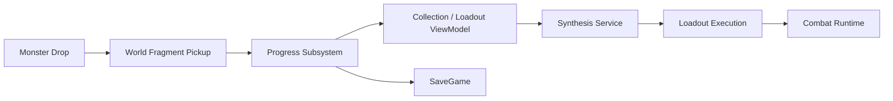

# ThiefCode 게임플레이 아키텍처

이 문서는 AI 작업 방식과 별개로, 현재 소스에 남아 있는 런타임 구조와 게임 데이터 흐름을 설명합니다. 기능 전체는 2인 팀과 AI 에이전트가 함께 만든 결과이며, 개인 기여는 [README의 소유권 표](README.md#기여와-소유권)를 기준으로 합니다.

## 네 개 런타임 모듈

| 모듈 | 책임 | 대표 근거 |
|---|---|---|
| `ThiefCodeContracts` | 모듈 사이에서 공유할 타입, 포트, 이벤트 계약 | `ThiefCode/Source/ThiefCodeContracts/Public/` |
| `ThiefCodeSystemsA` | 입력, 자동 표적·공격, 스크립트·로드아웃 실행, 월드 획득, 메뉴 셸 | `ThiefCode/Source/ThiefCodeSystemsA/Public/` |
| `ThiefCodeSystemsB` | 몬스터 AI·GAS, 드롭, 진행도·저장, 합성, 수집 ViewModel | `ThiefCode/Source/ThiefCodeSystemsB/Public/` |
| `ThiefCode` | 실제 플레이어·HUD·미니맵과 최종 Composition | `ThiefCode/Source/ThiefCode/Public/`, `ThiefCode/Source/ThiefCode/Private/Composition/` |

현재 `Build.cs` 기준 의존 관계는 다음과 같습니다.

초기 의도만 보고 SystemsA와 SystemsB가 완전히 독립적이라고 설명하지 않습니다. 실제 `ThiefCodeSystemsB.Build.cs`에는 `ThiefCodeSystemsA` 의존성이 있으며, Host가 세 모듈을 조합합니다.

## 계약에서 실행까지

### 1. 공유 계약

- 작업 결과와 안정 식별자: `ThiefCode/Source/ThiefCodeContracts/Public/Core/TCOperationTypes.h`
- 전투 포트: `ThiefCode/Source/ThiefCodeContracts/Public/Combat/TCCombatPorts.h`
- 진행도 포트: `ThiefCode/Source/ThiefCodeContracts/Public/Progress/TCProgressPorts.h`
- 합성 포트: `ThiefCode/Source/ThiefCodeContracts/Public/Synthesis/TCSynthesisPort.h`
- 스크립트 런타임 계약: `ThiefCode/Source/ThiefCodeContracts/Public/Script/TCScriptRuntime.h`
- 게임플레이 이벤트: `ThiefCode/Source/ThiefCodeContracts/Public/Events/TCGameplayEvents.h`
- UI 포트: `ThiefCode/Source/ThiefCodeContracts/Public/UI/TCMenuPorts.h`

공유 계약을 별도 모듈에 두어, 에이전트가 다른 시스템의 구현 세부를 직접 참조하기보다 명시된 타입과 포트를 통해 연결하도록 했습니다.

### 2. 전투 흐름

| 기능 | 책임이 드러나는 파일 |
|---|---|
| 입력 라우팅 | `ThiefCode/Source/ThiefCodeSystemsA/Public/Player/TCInputRouterComponent.h` |
| 자동 표적 선택 | `ThiefCode/Source/ThiefCodeSystemsA/Public/Player/TCAutoTargetComponent.h` |
| 자동 공격 | `ThiefCode/Source/ThiefCodeSystemsA/Public/Combat/TCAutoAttackComponent.h` |
| 몬스터 능력 시스템 | `ThiefCode/Source/ThiefCodeSystemsB/Public/GAS/TCMonsterAbilitySystemComponent.h` |
| 몬스터 Pawn·StateTree 태스크 | `ThiefCode/Source/ThiefCodeSystemsB/Public/AI/TCMonsterPawn.h`, `ThiefCode/Source/ThiefCodeSystemsB/Public/AI/TCMonsterStateTreeTasks.h` |

전투 입력, 표적 선정, 공격 실행을 컴포넌트로 분리해 각 단계의 실패 원인과 교체 범위를 좁혔습니다. 몬스터 측은 GAS의 능력·태그와 StateTree의 행동 전이를 결합하고, 공격 전 예고와 실제 판정 사이의 상태를 관찰할 수 있게 구성했습니다.

### 3. 조각·합성·진행도 흐름

| 기능 | 책임이 드러나는 파일 |
|---|---|
| 드롭 서비스 | `ThiefCode/Source/ThiefCodeSystemsB/Public/Loot/TCLootService.h` |
| 월드 조각 획득 | `ThiefCode/Source/ThiefCodeSystemsA/Public/World/TCWorldFragmentPickup.h` |
| 진행도·저장 | `ThiefCode/Source/ThiefCodeSystemsB/Public/Progress/TCProgressSubsystem.h`, `ThiefCode/Source/ThiefCodeSystemsB/Public/Progress/TCProgressSaveGame.h` |
| 지정 합성 | `ThiefCode/Source/ThiefCodeSystemsB/Public/Synthesis/TCSynthesisService.h` |
| 수집·합성 상태 | `ThiefCode/Source/ThiefCodeSystemsB/Public/UI/TCCollectionSynthesisViewModel.h` |
| 로드아웃 표시·실행 | `ThiefCode/Source/ThiefCodeSystemsA/Public/UI/TCLoadoutViewModel.h`, `ThiefCode/Source/ThiefCodeSystemsA/Public/Script/TCLoadoutExecutionComponent.h` |

획득 상태와 UI 표시를 직접 결합하지 않고 Progress·Synthesis 서비스와 ViewModel 사이를 나눴습니다. 저장 가능한 안정 식별자를 기준으로 조각과 로드아웃을 다루어, 월드 Actor의 수명과 영구 진행 데이터를 분리하는 선택입니다.

### 4. Host 구성과 런타임 UI

- 플레이어 조합: `ThiefCode/Source/ThiefCode/Public/Prototype/TCPrototypePlayer.h`
- HUD: `ThiefCode/Source/ThiefCode/Public/UI/TCGameHUDWidget.h`
- 미니맵: `ThiefCode/Source/ThiefCode/Public/World/TCMinimapRuntime.h`
- 체크포인트: `ThiefCode/Source/ThiefCodeSystemsA/Public/World/TCCheckpoint.h`
- 메뉴 진입과 상태: `ThiefCode/Source/ThiefCodeSystemsA/Public/UI/TCMenuShellSubsystem.h`

Host는 모듈의 실제 구현을 플레이어와 월드에 조합합니다. UMG/WBP는 표시·레이아웃·모션을 담당하고, 진행도와 합성의 권한은 C++ 서비스·포트에 두는 것이 작업 표준의 원칙입니다. 이 경계 덕분에 UI 에셋을 다시 생성해도 핵심 상태 규칙이 함께 이동하지 않도록 했습니다.

## 주요 설계 선택

| 선택 | 이유 | 남은 비용 |
|---|---|---|
| Contracts 우선 | 에이전트 사이의 입력·출력과 변경 영향을 먼저 고정 | 잘못 설계한 계약을 바꾸면 여러 모듈 수정 필요 |
| 컴포넌트 단위 전투 | 입력·선정·공격을 분리해 교체와 테스트 범위 축소 | 런타임 조합과 수명 관리가 필요 |
| 안정 식별자 기반 진행 | SaveGame과 월드 객체 수명 분리 | 데이터 마이그레이션 정책 필요 |
| C++ 권한 + WBP 표현 | 자동 생성 UI가 게임 규칙을 소유하지 않게 제한 | ViewModel·바인딩 코드가 늘어남 |
| 텔레그래프와 판정 분리 | 플레이어에게 반응 시간을 주고 상태를 관측 | 애니메이션·능력 취소 시 동기화 고려 필요 |

## 설명 범위와 한계

- 이 문서는 현재 파일과 모듈 관계를 설명하며, 모든 기능의 작성자를 개인으로 귀속하지 않습니다.
- 바이너리 에셋의 내부 그래프는 이 문서의 파일명만으로 증명하지 않습니다.
- 저장 데이터 마이그레이션, 장시간 세션, 대규모 몬스터 수에 대한 정량 검증은 확인되지 않았습니다.
- Pixel Streaming 성능과 최종 릴리스 상태는 [하네스와 검증](HARNESS_AND_VALIDATION.md#실제-저장-결과)에서 별도로 구분합니다.
