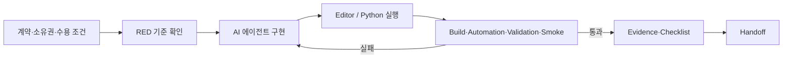
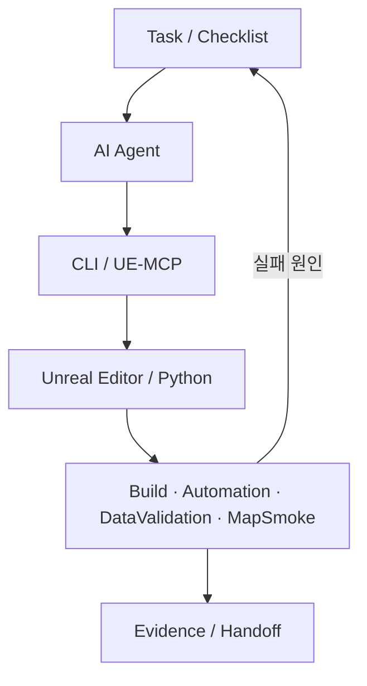

# ThiefCode 하네스와 검증

## 해결하려 한 문제

AI 에이전트는 구현 속도를 높일 수 있지만, 요구 해석·수정 범위·에디터 상태·에셋 생성 결과가 매 실행마다 달라질 수 있습니다. ThiefCode에서는 프롬프트만으로 품질을 기대하지 않고 다음 항목을 하네스에 넣었습니다.

- 무엇을 바꿀지: Task의 입력·출력과 수용 조건
- 누가 어디를 바꿀지: 모듈·파일 소유권과 쓰기 경로
- 어떤 도구를 쓸지: CLI, UE-MCP, Editor Python 진입점
- 어떻게 통과시킬지: 빌드, 자동화 테스트, Data Validation, Map Smoke, 패키지 검사
- 무엇을 남길지: Evidence, Checklist, Handoff, 알려진 위험

작업 표준의 기준 파일은 `Assets/UITasks/TASK_EXECUTION_STANDARD.md`입니다.

## 한 Task의 실행 흐름

1. Task에 허용된 입력, 산출물, 쓰기 경로, 완료 조건을 고정합니다.
2. 구현 전 실패 기준 또는 부재 상태를 RED로 확인합니다.
3. 에이전트는 소유 경로 안에서 최소 변경을 수행합니다.
4. 에셋 생성 스크립트는 두 번 실행하고 두 번째 semantic diff가 0인지 확인합니다.
5. 코드·에셋·맵·패키지 게이트를 실행 결과로 판정합니다.
6. 변경 경로, 테스트, 남은 위험, 다음 시작 조건을 Handoff에 기록합니다.

이 방식은 에이전트의 “완료했다”는 응답을 완료 근거로 사용하지 않습니다. 저장된 실행 결과가 수용 조건을 충족해야 다음 상태로 이동합니다.

## 도구 경계

- C++ 변경은 모듈 소유권과 Contracts 의존 관계를 먼저 확인합니다.
- 에디터 에셋 변경은 Python 또는 제한된 MCP 도구를 통해 반복 가능한 경로로 만듭니다.
- WBP는 표현을 담당하고, 게임 상태 권한은 C++ 서비스·포트에 둡니다.
- 작업 중 열린 에디터, 쓰기 충돌, 기준 revision/hash를 기록해 환경 차이를 추적합니다.
- 실패 전제나 시간이 충족되지 않으면 `BLOCKED`로 닫고 통과 기록을 만들지 않습니다.

대표 자동화 진입점은 `Scripts/BuildAndTest.ps1`, `Scripts/Editor/A/Task18_AuditComposition.py`, `Scripts/Editor/A/Task24_ComposeLushWorld.py`입니다.

## 실제 저장 결과

### T18 — 전체 구성과 패키지

`Assets/Evidence/T18/latest/gate-summary.json`의 저장 상태는 `PASS`입니다.

- Editor Build / Game Build
- Task18 Automation
- Data Validation
- Product Map Smoke
- Package 생성과 archive tree 검사
- Packaged QA harness와 evidence schema 검사
- package disposition

이 기록은 해당 시점 산출물에 대한 게이트 통과를 의미합니다. 현재 작업 트리와 같은 바이너리인지까지 자동으로 보장하지는 않습니다.

### T24 — 월드·미니맵·스폰

`Assets/Evidence/T24/latest/gate-summary.json`의 저장 상태는 `PASS`입니다.

| 항목 | 기록된 값 |
|---|---:|
| Task24 Automation | 5/5 통과 |
| Product Map Smoke | 1/1 통과 |
| Data Validation | 오류 0, 경고 0 |
| 스폰 지점 영역 검사 | 36/36 |
| NavMesh 포함 검사 | 36/36 |
| blocking overlap 검사 | 36/36 |

같은 기록의 PIE 최저 55.9225 FPS는 에디터 관측값입니다. 패키지 1080p60 성능 수치로 바꾸어 말하지 않습니다.

### T23 — strict 1080p60 최종 릴리스 게이트

`Assets/Evidence/T23/latest/gate-summary.json`은 다음처럼 별도로 기록돼 있습니다.

| 필드 | 상태 |
|---|---|
| Status | `BLOCKED_BY_STRICT_PREREQ_AND_TIME_BARRIER` |
| ReleaseVerdict | `FAIL` |
| Preflight | `BLOCKED` |
| Final | `BLOCKED` |

따라서 T18·T24의 기능 게이트 통과를 T23 최종 릴리스 통과로 합치지 않습니다. strict 1080p60 실시간 Pixel Streaming 3회 수용 결과가 없으므로 “1080p60 최적화 완료”라고 표현하지 않습니다.

## 문제 해결 사례

### 비결정적인 에셋 수정

에디터 에셋을 한 번 생성하는 것만으로는 같은 입력에서 같은 결과가 나오는지 알 수 없습니다. 에셋 authoring 스크립트를 재실행하고 두 번째 실행의 semantic diff가 0인지 확인하는 규칙을 두어, 반복 실행 때 자산이 계속 변하는 문제를 검출 대상으로 만들었습니다.

### 병렬 작업의 쓰기 충돌

여러 에이전트가 같은 파일을 바꾸지 않도록 Task마다 소유 모듈과 쓰기 경로를 제한했습니다. Handoff에는 실제 변경 경로와 남은 잠금을 기록해 다음 작업이 같은 상태를 다시 추정하지 않게 했습니다.

### 마감과 엄격한 성능 전제

필수 하드웨어·선행 게이트·측정 시간이 충족되지 않은 T23은 성공으로 보정하지 않고 `BLOCKED`와 `FAIL`을 남겼습니다. 기능 완성과 최종 릴리스 판정을 분리해, 마감 압박이 검증 사실을 바꾸지 않도록 한 선택입니다.

## 근거 파일 지도

| 확인하려는 내용 | 상대 경로 |
|---|---|
| 공통 작업 규칙 | `Assets/UITasks/TASK_EXECUTION_STANDARD.md` |
| 전체 구성 Task / Checklist | `Assets/Tasks/18-full-composition-standalone.md`, `Assets/Checklists/18-full-composition-standalone-checklist.md` |
| 월드 기능 Task / Checklist | `Assets/Tasks/24-lush-demo-world-features.md`, `Assets/Checklists/24-lush-demo-world-features-checklist.md` |
| 최종 릴리스 Task / Checklist | `Assets/Tasks/23-final-pixel-1080p60-release-gate.md`, `Assets/Checklists/23-final-pixel-1080p60-release-gate-checklist.md` |
| 각 결과 요약 | `Assets/Evidence/T18/latest/gate-summary.json`, `Assets/Evidence/T24/latest/gate-summary.json`, `Assets/Evidence/T23/latest/gate-summary.json` |
| 전체 구성 감사 스크립트 | `Scripts/Editor/A/Task18_AuditComposition.py` |
| 월드 구성 스크립트 | `Scripts/Editor/A/Task24_ComposeLushWorld.py` |

원본 로그 전체나 로컬 환경의 절대 경로는 공개 문서에 복사하지 않았습니다. 결과 수치는 요약 파일과 체크리스트에서 다시 확인할 수 있는 범위만 사용했습니다.
