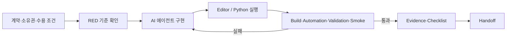
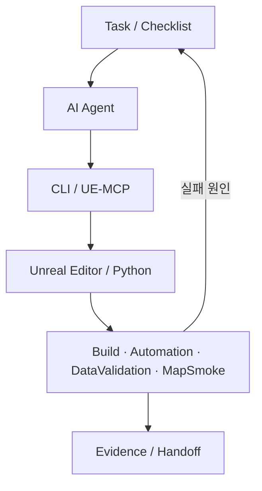

# ThiefCode 하네스와 검증

## 해결하려 한 문제

AI 에이전트는 구현 속도를 높일 수 있지만, 요구 해석·수정 범위·에디터 상태·에셋 생성 결과가 매 실행마다 달라질 수 있습니다. ThiefCode에서는 프롬프트만으로 품질을 기대하지 않고 다음 항목을 하네스에 넣었습니다.

- 무엇을 바꿀지: Task의 입력·출력과 수용 조건
- 누가 어디를 바꿀지: 모듈·파일 소유권과 쓰기 경로
- 어떤 도구를 쓸지: CLI, UE-MCP, Editor Python 진입점
- 어떻게 통과시킬지: 빌드, 자동화 테스트, Data Validation, Map Smoke, 패키지 검사
- 무엇을 남길지: Evidence, Checklist, Handoff, 알려진 위험

작업 표준의 기준 파일은 `Assets/UITasks/TASK_EXECUTION_STANDARD.md`입니다.

## 한 Task의 실행 흐름

1. Task에 허용된 입력, 산출물, 쓰기 경로, 완료 조건을 고정합니다.
2. 구현 전 실패 기준 또는 부재 상태를 RED로 확인합니다.
3. 에이전트는 소유 경로 안에서 최소 변경을 수행합니다.
4. 에셋 생성 스크립트는 두 번 실행하고 두 번째 semantic diff가 0인지 확인합니다.
5. 코드·에셋·맵·패키지 게이트를 실행 결과로 판정합니다.
6. 변경 경로, 테스트, 남은 위험, 다음 시작 조건을 Handoff에 기록합니다.

이 방식은 에이전트의 “완료했다”는 응답을 완료 근거로 사용하지 않습니다. 저장된 실행 결과가 수용 조건을 충족해야 다음 상태로 이동합니다.

## 도구 경계

- C++ 변경은 모듈 소유권과 Contracts 의존 관계를 먼저 확인합니다.
- 에디터 에셋 변경은 Python 또는 제한된 MCP 도구를 통해 반복 가능한 경로로 만듭니다.
- WBP는 표현을 담당하고, 게임 상태 권한은 C++ 서비스·포트에 둡니다.
- 작업 중 열린 에디터, 쓰기 충돌, 기준 revision/hash를 기록해 환경 차이를 추적합니다.
- 실패 전제나 시간이 충족되지 않으면 `BLOCKED`로 닫고 통과 기록을 만들지 않습니다.

